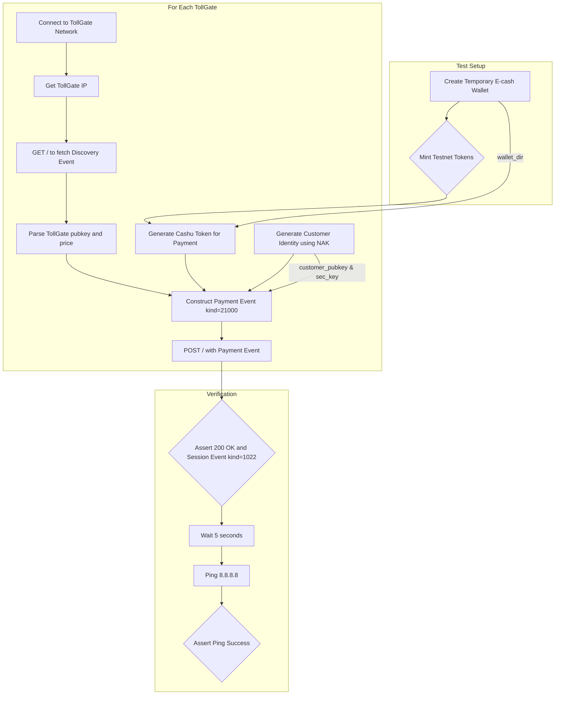

# E-Cash Payment Test Plan

## 1. Objective
Create a new Pytest test, `tests/test_ecash_payment.py`, to validate the end-to-end e-cash payment flow. The test will perform the following actions:
1.  Generate new testnet e-cash into a temporary wallet.
2.  Discover and connect to available TollGate networks.
3.  Fetch TollGate service details (discovery event).
4.  Pay the TollGate using the generated e-cash.
5.  Verify that internet connectivity is granted after a successful payment.

## 2. Test Workflow Diagram

## 3. Todo List

### Phase 1: Setup and Fixtures
- [x] **Create new test file**: Create `tests/test_ecash_payment.py`.
- [x] **Create wallet fixture**: In the new file, create a `pytest.fixture` named `ecash_wallet` with `scope="session"` that creates a temporary directory for a `cdk-cli` wallet.
- [x] **Create mint fixture**: Create a `pytest.fixture` named `funded_ecash_wallet` with `scope="session"` that depends on `ecash_wallet` and uses `cdk-cli mint` to add funds from a testnet mint (e.g., `https://nofees.testnut.cashu.space`).

### Phase 2: Test Implementation
- [x] **Define test function**: Create a test function `test_pay_tollgate_and_verify_connectivity` that accepts the `tollgate_networks` and `funded_ecash_wallet` fixtures.
- [x] **Iterate through TollGates**: Loop through each network provided by the `tollgate_networks` fixture.
- [x] **Connect to TollGate**: Inside the loop, use the `connect_to_network()` helper from `conftest.py` to connect to the TollGate.
- [x] **Fetch Discovery Event**: Perform an HTTP `GET` request to `http://<tollgate_ip>:2121/` and parse the `kind: 10021` JSON response.
- [x] **Extract Payment Details**: From the discovery event, extract the TollGate's `pubkey` and the `price_per_step` for the chosen testnet mint.
- [x] **Generate Customer Identity**: Use the `nak key generate` command to create a new random customer secret key and pubkey.
- [x] **Get Device Identifier**: Get the MAC address of the primary network interface (e.g., `wlp59s0`) to use as the device identifier.
- [x] **Create Cashu Token**: Use `cdk-cli send` to create a Cashu token for the exact amount specified in `price_per_step`.
- [x] **Construct Payment Event**: Use `nak event` to build and sign a `kind: 21000` Nostr event. The event must include:
    - The generated customer `pubkey`.
    - A `p` tag pointing to the TollGate's `pubkey`.
    - A `device-identifier` tag with the MAC address.
    - A `payment` tag containing the Cashu token.
- [x] **Send Payment**: `POST` the signed payment event (as JSON) to `http://<tollgate_ip>:2121/`.

### Phase 3: Verification
- [x] **Verify Payment Response**: Assert that the HTTP response code is `200 OK` and that the body contains a valid `kind: 1022` session event.
- [x] **Wait for Session Activation**: Add a `time.sleep(5)` to allow the session to become active.
- [x] **Verify Internet Connectivity**: Use `subprocess.run` to execute `ping -c 1 8.8.8.8`.
- [x] **Assert Ping Success**: Assert that the ping command returns an exit code of 0.