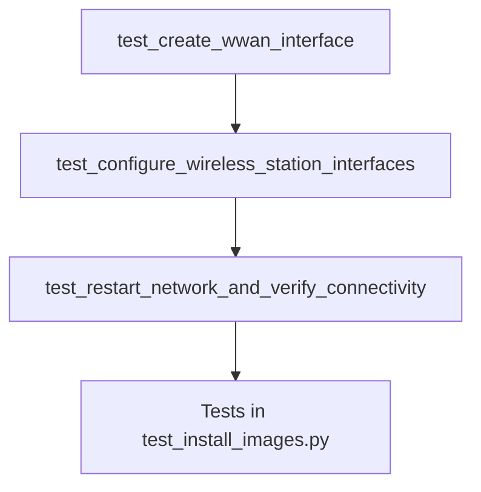

# Plan to Refactor Pytests for Network Configuration

This document outlines the plan to refactor the pytest suite to robustly handle network configuration on the target routers. The goal is to create a more modular, reliable, and maintainable test suite.

## 1. Problem Analysis

The current tests have revealed two primary issues:
1.  **Bash Syntax Errors**: The `uci` command fails because it's not in the default `PATH` for non-interactive SSH sessions. All `uci` commands must use the absolute path (`/sbin/uci`).
2.  **Missing `wwan` Interface**: The wireless station interfaces (`wifinet0`, `wifinet1`) are correctly associated with a `wwan` network, but the `wwan` network interface itself is not defined in the network configuration, preventing the router from obtaining an IP address and connecting to the internet.

## 2. Refactoring Strategy

The current `test_install_images.py` is doing too much. We will separate the network configuration and verification steps into their own dedicated test file. This will improve modularity and allow us to ensure the network is fully functional before running other tests that depend on it.

## 3. Detailed Plan

### Step 1: Create a Dedicated Network Configuration Test File

We will create a new file to house all network-related tests.

*   **Action**: Create a new file named `tests/test_network_configuration.py`.

### Step 2: Implement Granular Network Configuration Tests

We will create a series of ordered tests in the new file. Each test will have a single responsibility.

*   **`test_create_wwan_interface`**:
    *   **Responsibility**: Ensure the `wwan` interface exists.
    *   **Action**:
        1.  SSH into the router.
        2.  Check if `network.wwan` exists using `/sbin/uci show network.wwan`.
        3.  If it does not exist, create it using `/sbin/uci set network.wwan=interface` and `/sbin/uci set network.wwan.proto='dhcp'`.
        4.  Commit the changes with `/sbin/uci commit network`.
        5.  Verify the interface was created.

*   **`test_configure_wireless_station_interfaces`**:
    *   **Responsibility**: Configure `wifinet0` and `wifinet1` to connect to the upstream network.
    *   **Action**:
        1.  SSH into the router.
        2.  Use `/sbin/uci` to set the `ssid`, `key`, `encryption`, and `disabled` status for both `wifinet0` and `wifinet1`.
        3.  Commit the changes with `/sbin/uci commit wireless`.
        4.  Verify the settings were applied correctly using `/sbin/uci get`.

*   **`test_restart_network_and_verify_connectivity`**:
    *   **Responsibility**: Apply all network changes and verify internet access.
    *   **Action**:
        1.  SSH into the router.
        2.  Restart the network service using `/etc/init.d/network restart`.
        3.  Wait for the network to stabilize.
        4.  Verify internet connectivity by pinging an external address like `8.8.8.8`. The test will fail if the ping is unsuccessful.

### Step 3: Refactor `test_install_images.py`

The existing `test_install_images.py` will be simplified to only handle image installation, and it will depend on the successful completion of the network configuration tests.

*   **Action**:
    1.  Remove all network configuration and verification logic from `test_install_images.py`.
    2.  Use `pytest.mark.dependency` to make the tests in `test_install_images.py` dependent on the successful completion of the tests in `test_network_configuration.py`.

## 4. Execution Flow

The tests will run in the following order:

This ensures that we have a known-good, network-connected router before we proceed with any other tests that require network access.
