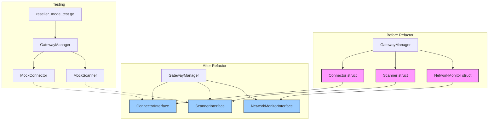

# Plan to Refactor and Fix Unit Tests

The current unit tests for `reseller_mode_test.go` are failing because the `GatewayManager` is tightly coupled to concrete implementations of its dependencies (like `Connector`, `Scanner`, etc.). To fix this, we will use Dependency Injection by introducing interfaces.

We've also identified duplicate scanner logic in `scanner.go` and `wireless_scanner.go`. We will consolidate this logic as the first step.

### TODO List

Here is the step-by-step plan:

- [x] **1. Consolidate Scanner Logic:**
    - Delete the redundant `src/wireless_gateway_manager/scanner.go`.
    - Rename `src/wireless_gateway_manager/wireless_scanner.go` to `src/wireless_gateway_manager/scanner.go`.
    - Add the static check `var _ ScannerInterface = (*Scanner)(nil)` to the new `scanner.go` to ensure it implements the `ScannerInterface`.

- [x] **2. Create `interfaces.go`:**
    - Create a new file `src/wireless_gateway_manager/interfaces.go` to define interfaces for each of the `GatewayManager`'s dependencies.

- [x] **3. Update `types.go`:**
    - Modify the `GatewayManager` struct in `src/wireless_gateway_manager/types.go` to use the new interface types instead of concrete struct pointers.

- [x] **4. Implement the Interfaces:**
    - Update `connector.go`, `network_monitor.go`, `scanner.go`, and `vendor_element_manager.go` to ensure their structs implicitly implement the new interfaces. We will add a static check in each file to guarantee compile-time safety.

- [x] **5. Update `wireless_gateway_manager.go`:**
    - Ensure the `Init` function correctly initializes the `GatewayManager` with the concrete types, which satisfy the new interfaces.

- [x] **6. Fix `reseller_mode_test.go`:**
    - The test file should now compile correctly since the mock objects will satisfy the interfaces required by the `GatewayManager` struct.

- [ ] **7. Run Tests:**
    - Execute the tests from within the `src/wireless_gateway_manager` directory to confirm that the refactoring is successful and all tests pass.

### Visual Plan (Mermaid Diagram)

This plan will decouple our components, making the codebase healthier and allowing us to fix the immediate testing issue.
