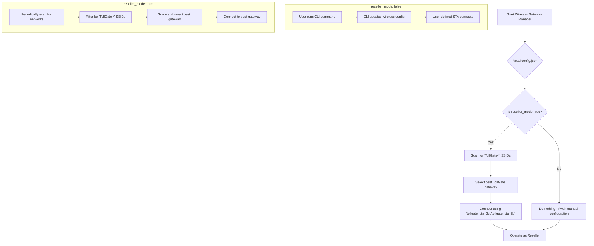

# Reseller Mode Implementation Plan

## High-Level Goal

Refactor the gateway selection logic to support two distinct operational modes: a "reseller mode" for automatically connecting to other `TollGate-` networks, and a "manual mode" for connecting to a single, user-defined upstream gateway. This will simplify the device's logic and make its behavior more predictable.

## Architectural Diagram (Mermaid)

## Detailed Plan

### Phase 1: Configuration Changes

- [x]  **Add `ResellerMode` to the `Config` struct in `src/config_manager/config_manager_config.go`:** This will allow the application to read the new `reseller_mode` flag from the `config.json` file.
- [x]  **Set the default value of `ResellerMode` to `false` in the `NewDefaultConfig` function:** This ensures that by default, the device will be in manual mode, which is the safer option.

### Phase 2: Core Logic Implementation

- [x]  **Modify `ScanWirelessNetworks` in `src/wireless_gateway_manager/wireless_gateway_manager.go` to check for `ResellerMode`:** The function will now read the `ResellerMode` flag from the configuration at the beginning of each scan.
- [x]  **If `ResellerMode` is `false`, the `ScanWirelessNetworks` function should log that it is in manual mode and take no further action:** This will prevent the device from automatically connecting to any networks when in manual mode.
- [x]  **If `ResellerMode` is `true`, modify the logic to only consider networks with SSIDs starting with "TollGate-":** This will ensure that the device only connects to other TollGate devices when in reseller mode.
- [x]  **Remove the logic that loads and checks against `/etc/tollgate/known_networks.json` from `src/wireless_gateway_manager/wireless_gateway_manager.go`:** This file is no longer needed, as the reseller mode will not use a list of known networks.

### Phase 3: Connection and Interface Management

- [x]  **In `src/wireless_gateway_manager/connector.go`, create new STA interfaces `tollgate_sta_2g` and `tollgate_sta_5g` if they don't exist:** This will ensure that the device has the necessary interfaces to connect to both 2.4GHz and 5GHz networks.
- [x]  **Modify the `Connect` function in `src/wireless_gateway_manager/connector.go` to select the appropriate interface (`tollgate_sta_2g` or `tollgate_sta_5g`) based on the gateway's band:** This will allow the device to connect to the correct network based on the band of the gateway.
- [x]  **Ensure that when connecting in `ResellerMode`, any other STA interfaces are disabled to prevent conflicts:** This will prevent the device from trying to connect to multiple networks at the same time.

### Phase 4: Cleanup and Testing

- [x]  **Remove the `loadKnownNetworks` function and any related code from `src/wireless_gateway_manager/wireless_gateway_manager.go`:** This will remove the now-unused code from the codebase.
- [x]  **Create a new test file, `src/wireless_gateway_manager/reseller_mode_test.go`, to specifically test the new `ResellerMode` logic:** This will ensure that the new functionality is working as expected.
- [x]  **Write unit tests to verify that the gateway selection logic correctly filters for `TollGate-` SSIDs when `ResellerMode` is on:** This will verify that the device is only connecting to other TollGate devices when in reseller mode.
- [x]  **Write unit tests to verify that the gateway selection logic does nothing when `ResellerMode` is off:** This will verify that the device is not automatically connecting to any networks when in manual mode.