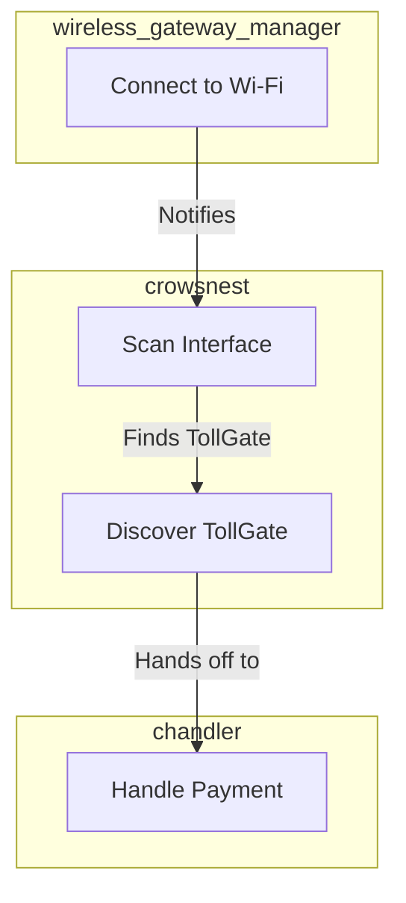

# Reseller Mode Payment Logic Design

## 1. Problem

The reseller router connects to an upstream TollGate's Wi-Fi but fails to purchase an internet session, resulting in a connection loop.

## 2. Root Cause

The `wireless_gateway_manager` module, which handles the Wi-Fi connection, does not trigger the payment and discovery flow after connecting. The existing `crowsnest` and `chandler` modules, which handle discovery and payment, are not being invoked.

## 3. Proposed Solution

The solution is to integrate the `wireless_gateway_manager` with the `crowsnest` module. After a successful Wi-Fi connection, the `wireless_gateway_manager` will notify `crowsnest` to scan the new interface. This will trigger the existing discovery and payment logic, allowing the reseller router to purchase an internet session.

### 3.1. Architectural Changes

### 3.2. Implementation Steps

1.  **Add a `ScanInterface` function to the `Crowsnest` interface.** This new function will allow other modules to trigger a scan on a specific network interface.

2.  **Add a `crowsnest` field to the `GatewayManager` struct.** This will allow the `wireless_gateway_manager` to call the new `ScanInterface` function.

3.  **Update the `Init` function in `wireless_gateway_manager.go` to accept a `crowsnest` instance.** The `crowsnest` instance will be stored in the `GatewayManager` struct.

4.  **Modify the `ScanWirelessNetworks` function in `wireless_gateway_manager.go` to call `crowsnest.ScanInterface` after a successful connection.** This will trigger the discovery and payment flow.

5.  **Implement the `ScanInterface` function in `crowsnest.go`.** This function will perform a scan on the specified interface and hand off any discovered TollGates to the `chandler` module.

## 4. State Synchronization with `resetChan`

### 4.1. Problem

A reconnection loop was caused by the `NetworkMonitor` being unaware of successful reconnections initiated by a separate, hotplug-driven flow. The `NetworkMonitor` would continue to see the connection as down and trigger disruptive scans, even after the `chandler` had successfully re-established a session.

### 4.2. Solution

A Go channel, `resetChan`, was introduced to create a direct communication path between the `chandler` (which confirms the connection) and the `NetworkMonitor` (which monitors it).

#### How it Works:

1.  **Signal on Success:** When the `chandler` successfully purchases a new session, it sends a signal on `resetChan`.
2.  **Reset Counters:** The `NetworkMonitor`, which is listening on this channel, receives the signal and immediately calls the `ResetConnectivityCounters()` function. This resets its internal `pingFailures` and `pingSuccesses` counters to zero.

This ensures the `NetworkMonitor`'s state is synchronized with the actual connection status, preventing it from acting on stale failure data.

#### Subsequent Connection Loss:

If the connection is lost again after a successful reset, the `NetworkMonitor` will function as intended:
- It will start incrementing the `pingFailures` counter from zero.
- Once the failure threshold is met, it will trigger a new recovery scan.

This change ensures the system is resilient and only triggers recovery actions when genuinely needed.