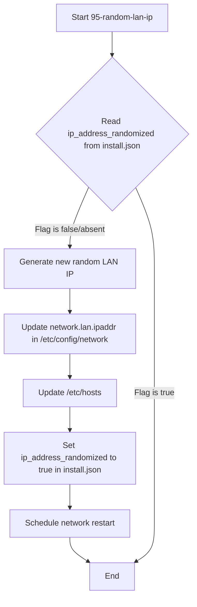

# High-Level Design Document (HLDD) - IP Randomization Enhancement

## 1. Problem Statement
The previous IP address randomization logic was overly complex, attempting to identify "default" IPs and storing the randomized IP in `install.json` in addition to `/etc/config/network`. This led to potential inconsistencies and unreliability. The goal is to simplify this process, ensuring that IP randomization occurs only if a flag in `install.json` indicates it hasn't been done, and to store the actual IP only in `/etc/config/network`.

## 2. Goal
Simplify the IP address randomization process to ensure it's performed only once and that the randomized status is clearly indicated. Specifically:
*   Randomize the IP address only if the `ip_address_randomized` flag in `/etc/tollgate/install.json` is not set to `true`.
*   Store the actual randomized IP address *only* in `/etc/config/network`.
*   Store *only* a boolean flag `ip_address_randomized` in `/etc/tollgate/install.json` to indicate if randomization has occurred.
*   Update related Go components (`src/config_manager/config_manager.go` and `src/config_manager/config_manager_test.go`) to reflect the new `install.json` format.

## 3. Current Architecture Overview (Relevant to IP Randomization)

*   **`95-random-lan-ip`:**
    *   Reads `ip_address_randomized` from `install.json`.
    *   If `install.json` is missing or `ip_address_randomized` is invalid/null, it proceeds to randomize.
    *   Sets `network.lan.ipaddr`, `netmask`, `broadcast`.
    *   Schedules `network restart` (sleep 5) and `nodogsplash restart` at the end of its execution.

## 4. Proposed Solution Architecture
The `95-random-lan-ip` script will be modified to simplify the IP randomization check and persistence.

*   The `install.json` file will now contain a boolean flag, `ip_address_randomized`, which will be `true` if the IP has been randomized, and `false` or absent otherwise. The actual randomized IP will *only* be stored in `/etc/config/network`.

*   **Decision Flow for `95-random-lan-ip`:**
    1.  Read the `ip_address_randomized` flag from `install.json`.
    2.  **If `install.json` does not exist, or `ip_address_randomized` is `false` or absent:**
        *   Generate a new random LAN IP.
        *   Update network config with the new IP in `/etc/config/network`.
        *   Update `/etc/hosts` with the new IP.
        *   Update `install.json` to set `ip_address_randomized` to `true`.
        *   Schedule `network restart`.
    3.  **Else (if `ip_address_randomized` is `true`):**
        *   Exit the script. No action needed, as randomization has already occurred.

## 5. Data Flow Diagram (Mermaid)

## 6. Future Extensibility Considerations

*   **Manual Override:** Consider adding a mechanism to manually trigger IP re-randomization if needed, perhaps via a UCI option or a specific command.