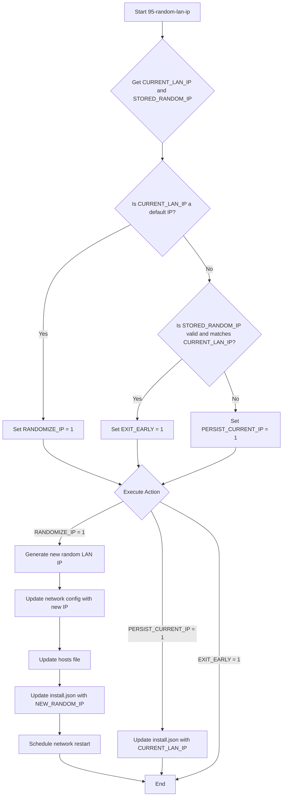

# High-Level Design Document (HLDD) - IP Randomization Enhancement

## 1. Problem Statement
The current IP address randomization logic in `files/etc/uci-defaults/95-random-lan-ip` is not sufficiently robust. It currently only checks `install.json` and fails to identify common vendor default IP addresses (e.g., `192.168.1.1`, `192.168.8.1`, and `192.168.X.1` where `X` is any number) as "not randomized," leading to unnecessary or incorrect IP randomization. This can also contribute to transient network disconnections if an IP change is triggered unnecessarily.

## 2. Goal
Enhance the IP address randomization check in `files/etc/uci-defaults/95-random-lan-ip` to:
*   Check the currently assigned `network.lan.ipaddr`.
*   Accurately identify and treat common vendor default IP addresses (`192.168.8.1`, `192.168.1.1`, and `192.168.X.1` where `X` is any number) as "not randomized", triggering a new randomization if found.
*   Ensure randomization only occurs if no valid, non-default randomized IP is already set and active.
*   Mitigate transient network disconnections by only triggering a `network restart` when a new IP address is actually set.

## 3. Current Architecture Overview (Relevant to IP Randomization)

*   **`95-random-lan-ip`:**
    *   Reads `ip_address_randomized` from `install.json`.
    *   If `install.json` is missing or `ip_address_randomized` is invalid/null, it proceeds to randomize.
    *   Sets `network.lan.ipaddr`, `netmask`, `broadcast`.
    *   Schedules `network restart` (sleep 5) and `nodogsplash restart` at the end of its execution.

## 4. Proposed Solution Architecture
The `95-random-lan-ip` script will be modified to include a refined check for existing randomized IPs and common default IPs, and to persist the current non-default IP if `install.json` is not properly populated.

*   A new shell function `is_default_ip()` will be introduced. This function will use regex to check if a given IP address matches common vendor default patterns (`^192\.168\.(1|8|([0-9]{1,3}))\.1$`).
*   The main logic in `95-random-lan-ip` will determine whether to randomize the IP (`RANDOMIZE_IP=1`), persist the current non-default IP (`PERSIST_CURRENT_IP=1`), or do nothing (`EXIT_EARLY=1`).

    1.  Get the `CURRENT_LAN_IP` from UCI (`network.lan.ipaddr`).
    2.  Get the `STORED_RANDOM_IP` from `install.json` (if `install.json` exists and the value is valid).

    3.  **Decision Flow:**
        *   **If `is_default_ip(CURRENT_LAN_IP)` is true:**
            *   Set `RANDOMIZE_IP = 1`. (Always randomize if current is a default IP).
        *   **Else (`CURRENT_LAN_IP` is NOT a default IP):**
            *   **If `STORED_RANDOM_IP` is valid AND `CURRENT_LAN_IP` equals `STORED_RANDOM_IP`:**
                *   Set `EXIT_EARLY = 1`. (No action needed, IP is already randomized and stored).
            *   **Else (`STORED_RANDOM_IP` is invalid/missing OR `CURRENT_LAN_IP` does not match `STORED_RANDOM_IP`):**
                *   Set `PERSIST_CURRENT_IP = 1`. (Persist `CURRENT_LAN_IP` to `install.json` without re-randomizing).

*   **Execution based on Flags:**
    *   **If `RANDOMIZE_IP = 1`:**
        *   Generate a new random LAN IP.
        *   Update network config with the new IP.
        *   Update `/etc/hosts`.
        *   Update `install.json` with the *new* randomized IP.
        *   Schedule `network restart`.
    *   **Else If `PERSIST_CURRENT_IP = 1`:**
        *   Update `install.json` with `CURRENT_LAN_IP`. (No network restart needed).
    *   **Else If `EXIT_EARLY = 1`:**
        *   Exit the script.

## 5. Data Flow Diagram (Mermaid)

## 6. Future Extensibility Considerations

*   **Configurable Default IPs:** Allow the list of "default" IPs to be configurable, perhaps via a separate UCI option, to adapt to different vendor environments.
*   **More Sophisticated IP Conflict Detection:** Implement more advanced checks to detect potential IP conflicts on the network *before* applying a new randomized IP.