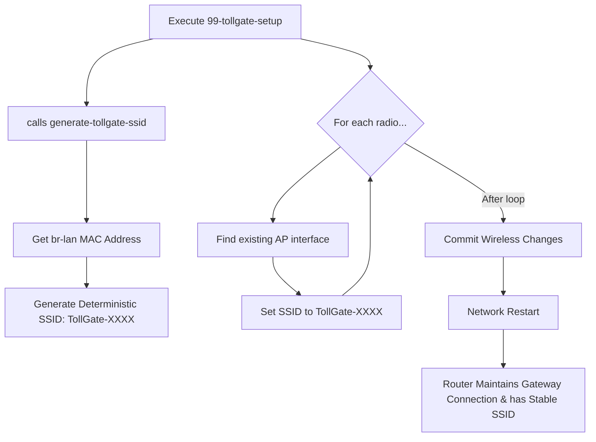

# High-Level Design Document (HLDD) - Network Disconnection and SSID Stability Fix

## 1. Problem Statement
The `tollgate-module-basic-go` package installation causes two primary issues on OpenWRT routers:
1.  **Gateway Disconnection:** Routers configured in Wi-Fi client (STA) mode lose their upstream gateway connection because the setup script unconditionally reconfigures wireless interfaces.
2.  **SSID Instability:** The TollGate Access Point (AP) SSID is regenerated with a new random suffix on every boot, which is confusing for users.

## 2. Goal
Modify the installation scripts to achieve two focused objectives for this pull request:
1.  **Preserve Connectivity:** Add TollGate captive portal APs by **modifying existing APs** rather than creating new ones, which preserves existing Wi-Fi client (STA) configurations.
2.  **Ensure SSID Stability:** Implement a deterministic SSID generation mechanism that produces a single, consistent SSID for all radios, based on a stable hardware identifier.

## 3. Proposed Solution Architecture
To minimize scope creep for this fix, the solution will be simplified to focus only on the immediate problems. The more complex "Identity Management" feature will be deferred.

1.  **SSID Generation Seed:** The SSID will be generated deterministically using the **MAC address of the `br-lan` interface** as the stable seed. This provides a single, consistent identifier for the router's local network identity.

2.  **Helper Script (`/usr/bin/generate-tollgate-ssid`):**
    *   A single, simple helper script will be created.
    *   Its only job is to get the MAC address of the `br-lan` interface and use a few characters of it to generate the `TollGate-XXXX` SSID.

3.  **Modified Setup Script (`99-tollgate-setup`):**
    *   The script will call the new helper script **once** to get the single, deterministic SSID.
    *   It will then iterate through all physical radios, find the first existing AP interface on each, and reconfigure it with the shared TollGate SSID. This prevents interference with STA links.

## 4. Data Flow Diagram (Mermaid)

## 5. Future Extensibility (Deferred)
The concept of a full "Identity Management" system, including the ability to rotate all MAC addresses on the device, has been designed and documented in `docs/HLDD_Identity_Management.md` and `docs/LLDD_Identity_Management.md`. This feature can be implemented in a future pull request to avoid scope creep in the current fix.