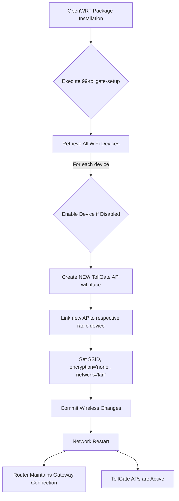

# High-Level Design Document (HLDD) - Network Disconnection Fix

## 1. Problem Statement
The `tollgate-module-basic-go` package installation causes OpenWRT routers configured in Wi-Fi client (STA) mode to lose their upstream gateway connection. This occurs because the `files/etc/uci-defaults/99-tollgate-setup` UCI script unconditionally reconfigures wireless interfaces, inadvertently disrupting the existing STA link.

## 2. Goal
Modify the `files/etc/uci-defaults/99-tollgate-setup` script to add TollGate captive portal Access Points (APs) without interfering with or removing existing Wi-Fi client (STA) configurations, thereby preserving upstream network connectivity.

## 3. Current Architecture Overview (Relevant to Network)

*   **`99-tollgate-setup`:**
    *   Modifies `firewall` to include `firewall-tollgate`.
    *   Changes `uhttpd` listener ports to 8080/443.
    *   Sets `network.lan.dns` to CloudFlare DNS (1.1.1.1, 1.0.0.1) if unset or localhost.
    *   **Crucially, it currently attempts to configure `wireless.default_radio0` and `wireless.default_radio1` to act as open Access Points (SSID: "TollGate-XXXX", encryption 'none'), which overwrites or conflicts with existing STA configurations.**
    *   Configures `nodogsplash` (captive portal) on `br-lan`.
    *   Enables `network.modem_*` interfaces if they exist.
    *   Triggers `network restart` and `nodogsplash restart`.

*   **`95-random-lan-ip`:**
    *   Randomly assigns a private IP address (10.x.x.1, 172.16-31.x.1, or 192.168.x.1) to `network.lan.ipaddr`, along with `netmask` and `broadcast`.
    *   Updates `/etc/hosts`.
    *   Schedules `network restart` and `nodogsplash restart`.

## 4. Hypotheses for Disconnection (Confirmed)

*   **Primary Hypothesis (Confirmed):** The `99-tollgate-setup` script's forced configuration of `wireless.default_radio0` and `wireless.default_radio1` as Access Points directly overrides and removes an existing Wi-Fi client (STA) connection to the upstream gateway. When the router relies on a Wi-Fi client connection for its WAN access, converting these radios to AP mode severs that connection.

## 5. Proposed Solution Architecture
The solution will involve a targeted modification of the `99-tollgate-setup` script. Instead of attempting to configure generic `default_radioX` sections, the script will:
*   Identify all available physical Wi-Fi devices (e.g., `radio0`, `radio1`, or specific device names like `mt798111`, `mt798112`).
*   For each identified physical device, a *new*, explicitly named `wifi-iface` section will be created. This ensures that existing `wifi-iface` sections, particularly those in STA mode, are left untouched.
*   The newly created TollGate APs will still be configured as open networks with a randomly generated SSID, linked to the `lan` network interface.

## 6. Data Flow Diagram (Mermaid) - Updated

## 7. Future Extensibility Considerations

*   **Flexible Network Configuration:** For future versions, consider making network configuration changes (especially WiFi and LAN IP) more flexible and less prescriptive. Allow users to specify their intended network role (e.g., AP, STA, Router) during installation or via a pre-configuration step.
*   **Pre-flight Checks:** Implement pre-flight checks in the installation process to detect existing network configurations (e.g., if a radio is already in STA mode) and warn the user or prompt for a decision before making potentially disruptive changes.
*   **Rollback Mechanism:** Explore a robust rollback mechanism for network changes in case of installation failure or unexpected behavior.