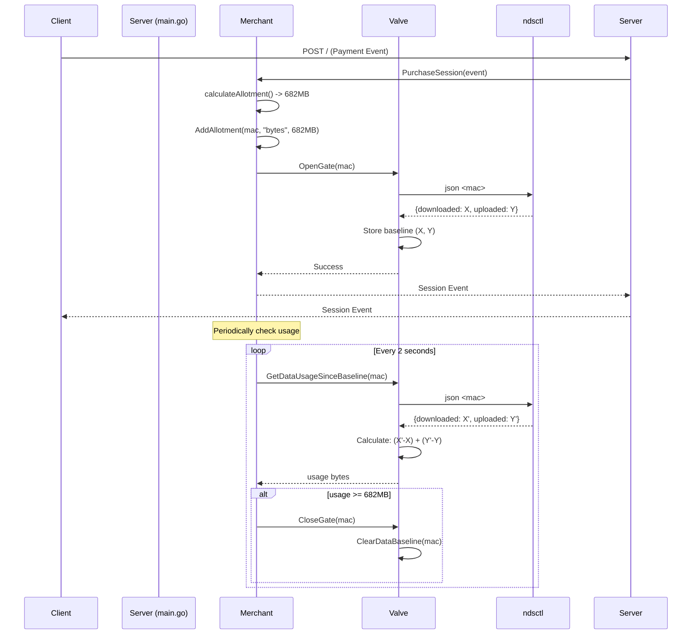

# Data-Based Session Management

This document describes the TollGate architecture for managing data-based (`bytes` metric) sessions with accurate per-customer tracking.

## Overview

TollGate uses NoDogSplash's per-client statistics to accurately track data usage for individual customers. When a customer purchases a data-based session, the system:

1. Captures a baseline of their current data usage
2. Opens the network gate to allow traffic
3. Periodically monitors their usage against the purchased allotment
4. Automatically closes the gate when the allotment is consumed

## Architecture

### Key Components

- **Merchant**: Manages session purchases and monitors data usage
- **Valve**: Controls network gate and tracks per-customer data baselines
- **NoDogSplash (ndsctl)**: Provides per-client network statistics

### Per-Customer Data Tracking

Instead of monitoring interface-level statistics (which would track all customers together), TollGate uses `ndsctl json <mac_address>` to get accurate per-customer data:

```bash
# Get stats for a specific MAC address
ndsctl json ac:e0:10:12:2d:75
```

Returns:
```json
{
  "id": 2,
  "ip": "192.168.5.132",
  "mac": "ac:e0:10:12:2d:75",
  "added": 1576258985,
  "active": 1576264663,
  "duration": 5678,
  "token": "35dfa494",
  "state": "Authenticated",
  "downloaded": 18663,    // in kilobytes
  "avg_down_speed": 26.3,
  "uploaded": 4986,       // in kilobytes
  "avg_up_speed": 7.03
}
```

**Advantages:**
- Accurate per-customer tracking
- Downloaded and uploaded bytes tracked separately
- No interference from other customers on the same interface
- Thread-safe via mutex-protected ndsctl calls

## Session Purchase Flow



## Implementation Details

### Valve Module

The Valve module provides these key functions for data tracking:

#### `GetClientStats(macAddress string) (downloaded, uploaded uint64, err error)`
- Calls `ndsctl json <mac>` to retrieve current statistics
- Returns downloaded and uploaded bytes (converted from kilobytes)
- Thread-safe via `ndsctlMutex`

#### `SetDataBaseline(macAddress string) error`
- Captures current usage as baseline when gate opens
- Stores baseline in `customerDataBaselines` map
- Called automatically by `OpenGate()`

#### `GetDataUsageSinceBaseline(macAddress string) (uint64, error)`
- Gets current usage via `GetClientStats()`
- Calculates: `(current_downloaded - baseline_downloaded) + (current_uploaded - baseline_uploaded)`
- Returns total bytes used since baseline

#### `ClearDataBaseline(macAddress string)`
- Removes baseline when gate closes
- Called automatically by `CloseGate()`

#### `HasDataBaseline(macAddress string) bool`
- Checks if a baseline exists for the customer
- Used to prevent re-authorization during session extensions

### Merchant Module

The Merchant module manages data sessions:

#### `PurchaseSession(event)`
- Calculates data allotment from payment
- Adds allotment to customer's session
- Checks if baseline exists before opening gate (prevents re-authorization)
- Opens gate if no baseline exists

#### `StartDataUsageMonitoring()`
- Runs background goroutine checking usage every 2 seconds
- Monitors all active data-based sessions
- Closes gates when allotment is consumed

#### `checkDataUsage()`
- Iterates through all data sessions
- Calls `GetDataUsageSinceBaseline()` for each customer
- Compares usage against allotment
- Closes gate when `usage >= allotment`

### Baseline Tracking

Baseline tracking ensures we only count data used during the current session:

1. **Gate Opens**: `OpenGate()` calls `SetDataBaseline()` to capture current usage
2. **Usage Calculation**: `GetDataUsageSinceBaseline()` returns `current - baseline`
3. **Session Extension**: If customer pays again, baseline is preserved (no re-authorization)
4. **Gate Closes**: `CloseGate()` calls `ClearDataBaseline()` to cleanup

### Thread Safety

All `ndsctl` calls are serialized using `ndsctlMutex` to prevent race conditions:

```go
ndsctlMutex.Lock()
cmd := exec.Command("ndsctl", "json", macAddress)
output, err := cmd.CombinedOutput()
ndsctlMutex.Unlock()
```

The mutex is unlocked immediately after the command completes to minimize lock duration.

## Session Extensions

When a customer makes an additional payment during an active session:

1. Merchant checks `HasDataBaseline(mac)` 
2. If baseline exists, only adds allotment (no gate re-authorization)
3. If no baseline, opens gate and captures new baseline
4. Baseline is preserved across multiple payments
5. Total usage is tracked cumulatively

This prevents:
- Re-authorization errors from NoDogSplash
- Baseline resets that would allow unlimited data
- Unnecessary gate operations

## Separation of Concerns

The architecture maintains clear separation:

- **Merchant**: Business logic (sessions, payments, monitoring)
- **Valve**: Gate control and data tracking
- **Chandler**: Pricing and session calculations (no gate control)

The Merchant works independently for downstream customers without requiring Chandler dependencies.

## Key Benefits

1. **Accurate Tracking**: Per-customer statistics from NoDogSplash
2. **Baseline System**: Only counts new usage, not historical data
3. **Thread Safety**: Mutex-protected ndsctl calls prevent race conditions
4. **Session Extensions**: Preserves baseline across multiple payments
5. **Clean Architecture**: Proper separation of concerns between modules
6. **Automatic Enforcement**: Background monitoring closes gates when allotment consumed