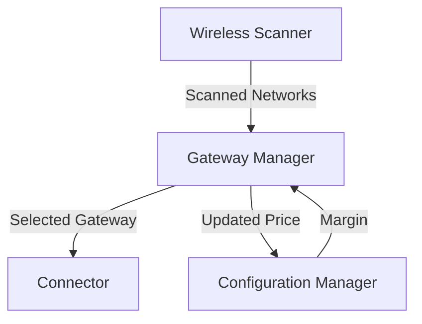

# HLDD: Price-Based Gateway Selection

## 1. Overview

This document outlines the high-level design for a price-based gateway selection mechanism in the TollGate system. The primary goal is to enable TollGate devices to dynamically select and connect to the most cost-effective upstream gateway, creating a market-driven mesh network.

## 2. System Architecture

The system will be composed of the following key components:

*   **Wireless Scanner:** Scans for nearby Wi-Fi networks and parses TollGate SSIDs to extract pricing information.
*   **Gateway Manager:** Maintains a list of available gateways, calculates a score for each based on price and signal strength, and manages the connection to the selected gateway.
*   **Configuration Manager:** Stores and manages the device's pricing configuration, including the profit margin.
*   **Connector:** Handles the low-level details of connecting to the selected Wi-Fi network.

## 3. Data Flow

1.  The **Wireless Scanner** periodically scans for Wi-Fi networks.
2.  It parses the SSIDs of TollGate networks to extract `price_per_step` and `step_size`.
3.  The list of available gateways with their pricing information is passed to the **Gateway Manager**.
4.  The **Gateway Manager** calculates a score for each gateway. The primary factor in the score is the price, with a secondary consideration for signal strength.
5.  The **Gateway Manager** selects the gateway with the best score.
6.  It retrieves the profit margin from the **Configuration Manager**.
7.  It calculates its own price by adding the margin to the selected gateway's price.
8.  It updates its own AP's SSID to advertise the new price.
9.  It instructs the **Connector** to connect to the selected gateway.
10. It updates the **Configuration Manager** with the new pricing information.

## 4. API Definitions

### GatewayManager

*   `ScanWirelessNetworks()`: Initiates a scan for wireless networks.
*   `SelectBestGateway() (Gateway, error)`: Selects the best gateway based on price and signal strength.
*   `ConnectToGateway(gateway Gateway)`: Connects to the specified gateway.

### WirelessScanner

*   `Scan() ([]NetworkInfo, error)`: Scans for networks and returns a list of `NetworkInfo` structs, including parsed pricing information.

## 5. Testing Strategy

*   **Unit Tests:** Each component will have unit tests to verify its functionality in isolation.
*   **Integration Tests:** Integration tests will be created to verify that the components work together correctly.
*   **Manual Tests:** A manual testing plan will be developed to test the end-to-end functionality on a real device.