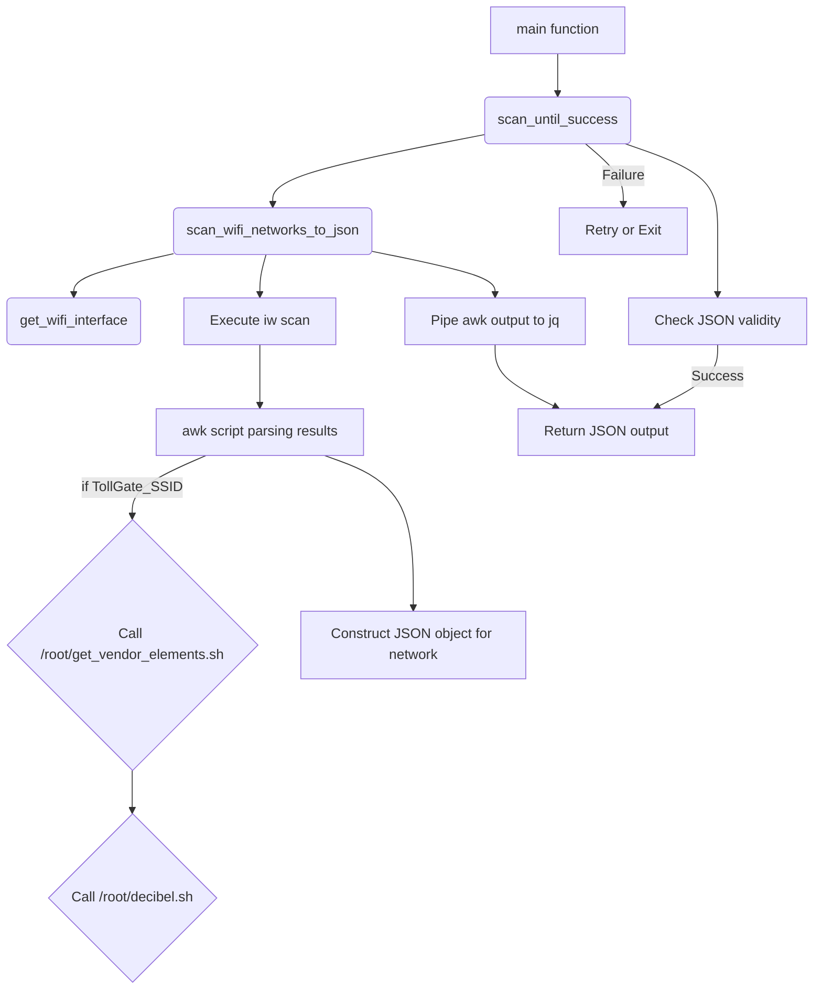

# Low-Level Design Document (LLDD): `scan_wifi_networks.sh` Script

## 1. Introduction

This document provides a low-level design for the `scan_wifi_networks.sh` script, outlining its internal mechanisms, data processing, and interactions with external utilities.

## 2. Script Structure and Functions

The script consists of the following key functions:

### 2.1. `get_wifi_interface()`

*   **Purpose:** To dynamically find the name of the first managed Wi-Fi interface.
*   **Implementation:**
    *   Executes `iw dev`.
    *   Uses `awk` to parse the output and identify lines starting with "Interface" and "type" "managed".
    *   Example: `iw dev | awk '$1 == "Interface" { iface=$2 } $1 == "type" && $2 == "managed" { print iface; exit }'`
*   **Return Value:** The interface name (e.g., `wlan0`) or empty string if not found.

### 2.2. `scan_wifi_networks_to_json()`

*   **Purpose:** Performs the actual Wi-Fi scan and converts the raw output into a JSON array of network objects.
*   **Dependencies:** Relies on `iw`, `awk`, `jq`, and the external scripts [`/root/get_vendor_elements.sh`](files/root/get_vendor_elements.sh) and [`/root/decibel.sh`](files/root/decibel.sh).
*   **Implementation Details:**
    1.  **Interface Setup:** Sets the identified interface `up` using `ip link set "$interface" up`.
    2.  **Scan Execution:** Runs `iw dev "$interface" scan 2>&1` to capture scan results and stderr for error detection (e.g., "Resource busy").
    3.  **`awk` Parsing Logic:** The core of the function is a multi-state `awk` script that processes the line-by-line output of `iw scan`.
        *   **State Management:** `BEGIN` block initializes JSON array, `first` flag. `END` block closes the JSON array.
        *   **BSS Block (`$1 == "BSS"`):** When a new BSS (Basic Service Set, i.e., an AP) is encountered:
            *   If `mac` and `ssid` from the *previous* BSS are valid, it prints the accumulated JSON object.
            *   Resets variables (`mac`, `ssid`, `encryption`, `signal`) for the new BSS.
        *   **SSID Line (`$1 == "SSID:"`):** Extracts the SSID string.
        *   **Encryption Detection (`/RSN:/`, `/WPA:/`):** Sets `encryption` variable to "WPA2", "WPA", or defaults to "Open".
        *   **Signal Line (`$1 == "signal:"`):** Extracts the signal strength and removes " dBm" suffix.
        *   **TollGate Specific Processing (within `awk`):**
            ```awk
            if (ssid ~ /^TollGate_/) {
                cmd = "/root/get_vendor_elements.sh \"" ssid "\" 12 | jq -r \".kb_allocation_decimal, .contribution_decimal\""
                if ((cmd | getline kb_allocation_decimal) > 0) {
                    if ((cmd | getline contribution_decimal) > 0) {
                        cmd_db1 = "/root/decibel.sh " kb_allocation_decimal
                        cmd_db2 = "/root/decibel.sh " contribution_decimal
                        cmd_db1 | getline kb_allocation_db
                        cmd_db2 | getline contribution_db
                        # Calculate score
                        score = signal + kb_allocation_db + contribution_db
                        printf ", \"kb_allocation_dB\": \"%s\", \"contribution_dB\": \"%s\", \"score\": \"%s\"", \
                              kb_allocation_db, contribution_db, score
                        close(cmd_db1)
                        close(cmd_db2)
                        close(cmd) # Close the pipe for get_vendor_elements.sh
                    }
                }
            } else {
                printf ", \"score\": \"%s\"", signal
            }
            ```
            *   This block conditionally executes external shell commands (`get_vendor_elements.sh`, `decibel.sh`) and incorporates their output directly into the JSON object being constructed.
    4.  **Final `jq` Formatting:** The `awk` output is piped to `jq .` for pretty-printing and final JSON validation.

### 2.3. `scan_until_success()`

*   **Purpose:** Provides a retry mechanism for `scan_wifi_networks_to_json()` to handle transient errors.
*   **Implementation:**
    *   Loops a defined number of `retries` (15) with a `delay` (3 seconds).
    *   Calls `scan_wifi_networks_to_json()`.
    *   Checks the return code (`ret_code`) and `jq empty 2>/dev/null` for JSON validity.
    *   Prints informative messages to `stderr` on retry or failure.
    *   Exits with `1` if all retries fail.

## 3. Data Flow Between Internal Script Components



## 4. Error Handling and Edge Cases

*   **`jq` Not Found:** The script checks for `jq` at startup and exits if not found.
*   **No Managed Wi-Fi Interface:** `get_wifi_interface()` handles this, and `scan_wifi_networks_to_json()` exits gracefully.
*   **`iw scan` "Resource busy":** Handled by `scan_until_success()` with retries.
*   **Invalid JSON Output:** `scan_until_success()` performs a `jq empty` check to ensure the output is valid JSON before returning it.
*   **Empty SSID:** Explicitly handled in `awk` to prevent malformed JSON.
*   **Malformed Vendor Elements:** If `get_vendor_elements.sh` or `decibel.sh` return invalid data, the `awk` script's `getline` might fail, potentially leading to incomplete JSON objects for those specific networks, or `jq invalid` if the error propagates. Current design needs robust error propagation from external scripts.

## 5. Performance Considerations within OpenWRT

*   **CPU Usage:**
    *   `iw scan`: Can be CPU-intensive, especially on older hardware.
    *   `awk` parsing: Generally efficient, but complex regex and frequent string manipulations add overhead.
    *   `jq` processing: Can be CPU-intensive proportional to the size of the JSON data and complexity of queries.
    *   External script calls (`get_vendor_elements.sh`, `decibel.sh`): Each call incurs shell overhead, command execution overhead, and IPC. For a large number of discovered TollGate SSIDs, this could significantly impact performance.
*   **Memory Usage:**
    *   Storing scan results in memory (within `awk` and `jq` pipelines): For a very large number of networks, this could consume significant RAM.
*   **Latency:**
    *   `iw scan` can take a few seconds.
    *   `scan_until_success()` retries introduce fixed delays (3 seconds per retry).
    *   Sequential execution of external scripts per TollGate SSID.

## 6. Optimization Opportunities

*   **Reduce `awk` complexity:** Consider splitting complex `awk` logic into simpler, single-purpose `awk` calls or leveraging other tools for specific parsing tasks.
*   **Batch Processing of Vendor Elements:** If possible, modify `get_vendor_elements.sh` or `decibel.sh` to handle multiple inputs in a single invocation to reduce shell overhead.
*   **Pre-compiled tools:** For critical path components, replacing shell scripts with small, statically compiled Go binaries (especially for JSON processing or vendor element extraction) could dramatically improve performance on OpenWRT.

## 7. Testing and Verification

To verify the functionality of `iw scan` on the target OpenWRT router, the following commands were executed remotely via SSH:

1. `iw dev`: Listed available wireless interfaces on the router.
2. `iw dev phy0-wifinet0 scan | tail -n 20`: Tested the `iw scan` command on the `phy0-wifinet0` (managed) interface, confirming its operation.

These tests confirmed that `iw scan` is functional on the `phy0-wifinet0` interface, returning valid scan results.