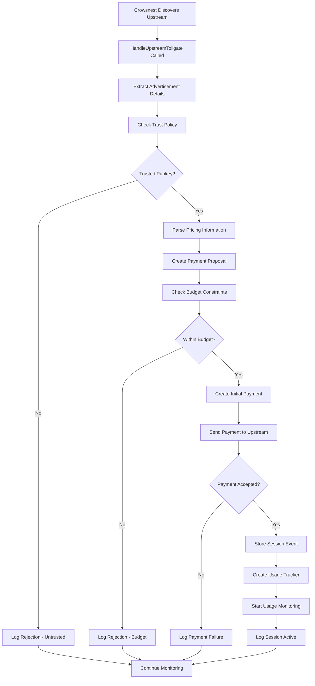
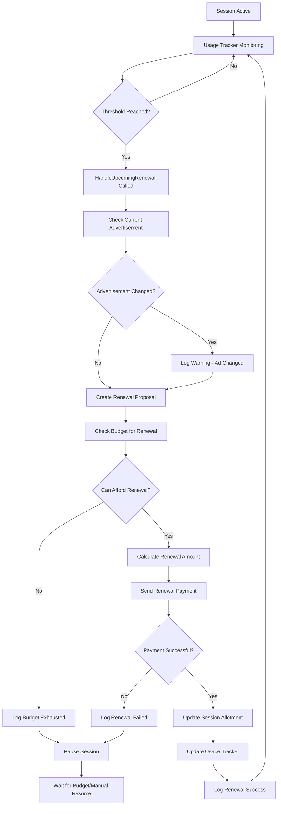
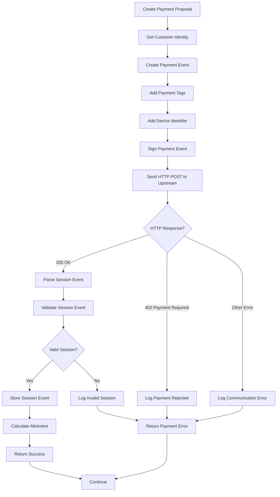

# Chandler Module - Functional Design Document

## Overview

The Chandler module is responsible for managing upstream TollGate connections on behalf of our TollGate device. It acts as the financial and session management layer that makes decisions about connecting to and paying for upstream TollGate services. The Chandler receives signals from the Crowsnest module about discovered upstream TollGates and manages the entire lifecycle of upstream connections including budget decisions, payments, session management, and usage tracking.

## Responsibilities

- Receive upstream TollGate discovery signals from Crowsnest
- Make financial decisions about connecting to upstream TollGates
- Manage budget and spending limits for upstream connections
- Create and manage payment sessions with upstream TollGates
- Track usage and handle automatic renewals based on thresholds
- Store and manage session state for active upstream connections
- Handle upstream TollGate disconnections and cleanup

## Architecture

### Core Components

#### 1. SessionManager
- **Purpose**: Manage active sessions with upstream TollGates
- **Implementation**: Maps pubkey to session information, stores session events locally
- **State**: Track session creation, allotment, usage, and renewal history

#### 2. PaymentDecisionEngine
- **Purpose**: Make decisions about whether to start/continue sessions
- **Implementation**: Budget checking, trust verification, price validation
- **Decisions**: Within budget? Trust pubkey? Acceptable pricing?

#### 3. UsageTracker System
- **Purpose**: Monitor usage and trigger renewal callbacks
- **Implementation**: Separate tracker implementations per metric type
- **Types**: TimeUsageTracker (milliseconds), DataUsageTracker (bytes)

#### 4. PaymentClient
- **Purpose**: Create and send payment events to upstream TollGates
- **Implementation**: Simple Nostr event creation and HTTP POST to upstream
- **Protocol**: Creates payment events (kind 21000), processes session responses (kind 1022)

## Data Structures

### ChandlerSession
```go
type ChandlerSession struct {
    // Upstream TollGate identification
    UpstreamPubkey    string             // TollGate pubkey (primary key)
    InterfaceName     string             // Network interface name
    GatewayIP         string             // Gateway IP address
    
    // Advertisement and pricing
    Advertisement     *nostr.Event       // Current advertisement (kind 10021)
    Metric            string             // "milliseconds" or "bytes"
    StepSize          uint64             // Step size from advertisement
    PricingOptions    []PricingOption    // Available pricing options from advertisement
    SelectedPricing   *PricingOption     // Currently selected pricing option
    
    // Session state
    SessionEvent      *nostr.Event       // Active session event (kind 1022)
    TotalAllotment    uint64             // Total allotment purchased
    
    // Usage tracking
    UsageTracker      UsageTrackerInterface // Active usage tracker
    RenewalThresholds []float64          // Renewal thresholds (e.g., 0.5, 0.8, 0.9)
    LastRenewalAt     time.Time          // Last renewal timestamp
    
    // Session metadata
    CreatedAt         time.Time          // Session creation time
    LastPaymentAt     time.Time          // Last payment timestamp
    TotalSpent        uint64             // Total sats spent on this session
    PaymentCount      int                // Number of payments made
    Status            SessionStatus      // Active, Paused, Expired, etc.
}

type PricingOption struct {
    AssetType        string             // "cashu"
    PricePerStep     uint64             // Price per step in units
    PriceUnit        string             // Price unit (e.g., "sat")
    MintURL          string             // Accepted mint URL
    MinSteps         uint64             // Minimum steps to purchase
}

type SessionStatus int

const (
    SessionActive SessionStatus = iota
    SessionPaused
    SessionExpired
    SessionError
)
```

### UsageTrackerInterface
```go
type UsageTrackerInterface interface {
    // Start monitoring usage for the given session
    Start(session *ChandlerSession, chandler ChandlerInterface) error
    
    // Stop monitoring and cleanup
    Stop() error
    
    // Get current usage amount
    GetCurrentUsage() uint64
    
    // Update usage amount (for external updates)
    UpdateUsage(amount uint64) error
    
    // Set renewal thresholds
    SetRenewalThresholds(thresholds []float64) error
}
```

### TimeUsageTracker
```go
type TimeUsageTracker struct {
    session       *ChandlerSession
    chandler      ChandlerInterface
    startTime     time.Time
    pausedTime    time.Duration
    thresholds    []float64
    ticker        *time.Ticker
    done          chan bool
    mu            sync.RWMutex
}
```

### DataUsageTracker
```go
type DataUsageTracker struct {
    session       *ChandlerSession
    chandler      ChandlerInterface
    interfaceName string
    startBytes    uint64
    currentBytes  uint64
    thresholds    []float64
    ticker        *time.Ticker
    done          chan bool
    mu            sync.RWMutex
}
```

### PaymentProposal
```go
type PaymentProposal struct {
    UpstreamPubkey     string         // Target upstream TollGate
    Steps              uint64         // Number of steps to purchase
    PricingOption      *PricingOption // Selected pricing option
    Reason             string         // "initial", "renewal", "extension"
    EstimatedAllotment uint64         // Expected allotment
}
```

## Core Interfaces

### Enhanced ChandlerInterface
```go
type ChandlerInterface interface {
    // Called by Crowsnest when upstream TollGate discovered
    HandleUpstreamTollgate(upstream *UpstreamTollgate) error
    
    // Called by Crowsnest when network interface disconnects
    HandleDisconnect(interfaceName string) error
    
    // Called by UsageTracker when renewal threshold reached
    HandleUpcomingRenewal(upstreamPubkey string, currentUsage uint64) error
    
    // Management methods
    GetActiveSessions() map[string]*ChandlerSession
    GetSessionByPubkey(pubkey string) (*ChandlerSession, error)
    GetBudgetStatus() *BudgetStatus
    
    // Control methods
    PauseSession(pubkey string) error
    ResumeSession(pubkey string) error
    TerminateSession(pubkey string) error
}
```

```

## Workflow

### Upstream TollGate Discovery Workflow



### Session Management Workflow



### Payment Creation and Processing Workflow



## Error Handling

### Error Categories

1. **Discovery Errors**
   - Invalid advertisement format
   - Unsupported metric types
   - Missing pricing information
   - Signature verification failures

2. **Trust Errors**
   - Pubkey not in allowlist
   - Pubkey in blocklist
   - Identity verification failures

3. **Budget Errors**
   - Price exceeds maximum per unit
   - Daily budget exhausted
   - Maximum sessions reached
   - Insufficient funds

4. **Payment Errors**
   - HTTP communication failures
   - Payment rejection by upstream
   - Invalid session response
   - Token generation failures

5. **Session Errors**
   - Session creation failures
   - Usage tracking errors
   - Renewal failures
   - Session expiration

### Error Handling Strategy

```go
type ChandlerError struct {
    Type        ErrorType
    Code        string
    Message     string
    Cause       error
    UpstreamPubkey string
    Context     map[string]interface{}
}

type ErrorType int

const (
    ErrorTypeDiscovery ErrorType = iota
    ErrorTypeTrust
    ErrorTypeBudget
    ErrorTypePayment
    ErrorTypeSession
    ErrorTypeUsageTracking
)
```

### Logging Strategy

- **Level**: Use structured logging with consistent fields
- **Context**: Include upstream pubkey, interface name, and session ID
- **Security**: Never log private keys or sensitive payment data
- **Performance**: Log session metrics for analysis

#### Example Log Messages

```go
// Discovery
log.Printf("Upstream TollGate discovered: pubkey=%s, interface=%s, price=%d %s per %s", 
    pubkey, interfaceName, pricePerStep, priceUnit, metric)

// Budget decision
log.Printf("Payment proposal within budget: pubkey=%s, amount=%d sats, steps=%d", 
    pubkey, amount, steps)

// Session creation
log.Printf("Session created with upstream: pubkey=%s, allotment=%d %s, session_id=%s", 
    pubkey, allotment, metric, sessionID)

// Usage tracking
log.Printf("Usage threshold reached: pubkey=%s, threshold=%.1f%%, usage=%d/%d %s", 
    pubkey, threshold*100, used, total, metric)

// Renewal
log.Printf("Session renewed: pubkey=%s, additional_allotment=%d %s, total_spent=%d sats", 
    pubkey, additionalAllotment, metric, totalSpent)

// Advertisement change
log.Printf("WARNING: Upstream advertisement changed: pubkey=%s, old_price=%d, new_price=%d", 
    pubkey, oldPrice, newPrice)
```

## Configuration

### Configuration Structure
```go
type ChandlerConfig struct {
    // Simple budget settings
    MaxPricePerMillisecond float64 `json:"max_price_per_millisecond"` // Max sats per ms (can be fractional)
    MaxPricePerByte        float64 `json:"max_price_per_byte"`        // Max sats per byte (can be fractional)
    
    // Trust settings
    Trust TrustConfig `json:"trust"`
    
    // Session settings
    Sessions SessionConfig `json:"sessions"`
    
    // Usage tracking settings
    UsageTracking UsageTrackingConfig `json:"usage_tracking"`
}

type TrustConfig struct {
    DefaultPolicy string   `json:"default_policy"` // "trust_all", "trust_none"
    Allowlist     []string `json:"allowlist"`      // Trusted pubkeys
    Blocklist     []string `json:"blocklist"`      // Blocked pubkeys
}

type SessionConfig struct {
    DefaultRenewalThresholds            []float64 `json:"default_renewal_thresholds"`            // [0.5, 0.8, 0.9]
    PreferredSessionIncrementsMilliseconds uint64    `json:"preferred_session_increments_milliseconds"` // Preferred increment for time sessions
    PreferredSessionIncrementsBytes        uint64    `json:"preferred_session_increments_bytes"`        // Preferred increment for data sessions
    RenewalStepMultiplier               float64   `json:"renewal_step_multiplier"`               // Multiplier for renewal amounts
}

type UsageTrackingConfig struct {
    MonitoringInterval    time.Duration `json:"monitoring_interval"`     // How often to check usage
    TimeTracker          TimeTrackerConfig `json:"time_tracker"`
    DataTracker          DataTrackerConfig `json:"data_tracker"`
}

type TimeTrackerConfig struct {
    Enabled           bool          `json:"enabled"`
    PrecisionMs       uint64        `json:"precision_ms"`       // Tracking precision in milliseconds
}

type DataTrackerConfig struct {
    Enabled           bool          `json:"enabled"`
    InterfacePattern  string        `json:"interface_pattern"`   // Pattern to match interfaces
    MonitoringInterval time.Duration `json:"monitoring_interval"` // How often to check data usage
}
```

### Default Configuration
```json
{
    "max_price_per_millisecond": 0.002777777778, // 10k sats/hr
    "max_price_per_byte": 0.00003725782414, // 5k stats/gbit
    "trust": {
        "default_policy": "trust_all",
        "allowlist": [],
        "blocklist": []
    },
    "sessions": {
        "default_renewal_thresholds": [0.5, 0.8, 0.9],
        "preferred_session_increments_milliseconds": 60000,
        "preferred_session_increments_bytes": 1048576,
        "renewal_step_multiplier": 1.0
    },
    "usage_tracking": {
        "monitoring_interval": "10s",
        "time_tracker": {
            "enabled": true,
            "precision_ms": 1000
        },
        "data_tracker": {
            "enabled": true,
            "interface_pattern": "*",
            "monitoring_interval": "5s"
        }
    }
}
```

## Integration Points

### Main Application Integration

```go
// In main.go or init function
func initChandler() {
    chandlerInstance, err := chandler.NewChandler(configManager)
    if err != nil {
        log.Fatalf("Failed to create chandler instance: %v", err)
    }
    
    // Set chandler for crowsnest
    crowsnestInstance.SetChandler(chandlerInstance)
    
    log.Println("Chandler module initialized and ready to manage upstream connections")
}
```

### Module Dependencies

- **Required**: `config_manager` for configuration
- **Required**: `tollwallet` for payment creation and token management
- **Required**: `crowsnest` interface for upstream discovery notifications
- **External**: `nostr` for event creation and validation

## Implementation Details

### Payment Event Creation

```go
func (c *Chandler) createPaymentEvent(proposal *PaymentProposal, macAddressSelf string) (*nostr.Event, error) {
    // Get customer identity (could be random for privacy)
    customerIdentity := c.getCustomerIdentity()
    
    // Create payment token from tollwallet
    paymentAmount := proposal.Steps * proposal.PricingOption.PricePerStep
    paymentToken, err := c.tollwallet.CreatePaymentToken(
        proposal.PricingOption.MintURL,
        paymentAmount,
    )
    if err != nil {
        return nil, fmt.Errorf("failed to create payment token: %w", err)
    }
    
    // Create payment event
    paymentEvent := nostr.Event{
        Kind: 21000,
        Tags: nostr.Tags{
            {"p", proposal.UpstreamPubkey},
            {"device-identifier", "mac", macAddressSelf},
            {"payment", paymentToken},
        },
        Content: "",
    }
    
    // Sign with customer identity
    err = paymentEvent.Sign(customerIdentity.PrivateKey)
    if err != nil {
        return nil, fmt.Errorf("failed to sign payment event: %w", err)
    }
    
    return &paymentEvent, nil
}
```

### Advertisement Comparison

```go
func (c *Chandler) checkAdvertisementChanges(session *ChandlerSession, newAd *nostr.Event) {
    if session.Advertisement == nil {
        return // First advertisement
    }
    
    oldPricing := c.extractPricingOptions(session.Advertisement)
    newPricing := c.extractPricingOptions(newAd)
    
    // Compare pricing options
    if !c.comparePricingOptions(oldPricing, newPricing) {
        logger.WithFields(logrus.Fields{
            "upstream_pubkey": session.UpstreamTollgate.Advertisement.PubKey,
            "old_pricing":     oldPricing,
            "new_pricing":     newPricing,
        }).Warn("WARNING: Upstream advertisement pricing changed")
    }
    
    // Update to new advertisement
    session.Advertisement = newAd
}
```

## Testing Strategy

### Unit Tests

1. **SessionManager Tests**
   - Session creation and storage
   - Session state management
   - Session cleanup on disconnect

2. **PaymentDecisionEngine Tests**
   - Budget constraint checking
   - Trust policy enforcement
   - Pricing validation

3. **UsageTracker Tests**
   - Time-based tracking accuracy
   - Data-based tracking accuracy
   - Threshold callback triggering
   - Multi-session handling

4. **PaymentClient Tests**
   - Payment event creation
   - HTTP communication with upstream
   - Session response handling

### Integration Tests

1. **End-to-End Flow**
   - Complete discovery-to-payment flow
   - Session renewal workflows
   - Disconnection handling

2. **Crowsnest Integration**
   - HandleUpstreamTollgate integration
   - HandleDisconnect integration
   - Error propagation

3. **Configuration Tests**
   - Trust policy enforcement
   - Budget limit enforcement
   - Threshold configuration

### Manual Testing

1. **Real Network Scenarios**
   - Connect to actual upstream TollGates
   - Test with different pricing models
   - Verify usage tracking accuracy

2. **Edge Cases**
   - Network disconnections during payment
   - Advertisement changes mid-session
   - Budget exhaustion scenarios

## Performance Considerations

### Resource Usage

- **Memory**: Session storage scales linearly with active upstream connections
- **CPU**: Minimal background processing for usage tracking
- **Network**: Periodic usage monitoring and renewal payments

### Scalability

- **Concurrent Sessions**: Handle multiple upstream connections simultaneously
- **Usage Tracking**: Efficient tracking with configurable precision
- **Payment Processing**: Asynchronous payment handling

### Monitoring

- **Metrics**: Track session counts, payment success rates, usage accuracy
- **Health Checks**: Monitor usage tracker health and payment connectivity
- **Alerting**: Log critical failures for operational monitoring

## Security Considerations

### Payment Security

- **Token Generation**: Use tollwallet for secure token creation
- **Event Signing**: Always sign payment events with customer identity
- **Private Key Handling**: Never log or expose private keys

### Trust Management

- **Pubkey Verification**: Always verify upstream advertisement signatures
- **Trust Policies**: Enforce configured allowlist/blocklist policies
- **Advertisement Validation**: Validate all advertisement content and structure

### Budget Protection

- **Price Validation**: Always check pricing against configured maximums
- **Spending Tracking**: Track all payments and enforce limits
- **Session Limits**: Prevent excessive concurrent sessions

## Future Enhancements

### Planned Features

1. **Advanced Budget Management**
   - Time-based budget limits (hourly, daily, weekly)
   - Per-upstream spending limits
   - Spending analytics and reporting

2. **Enhanced Trust System**
   - Reputation tracking based on session success
   - Dynamic trust adjustments
   - Community trust feeds

3. **Smart Renewal Strategies**
   - Predictive renewal based on usage patterns
   - Dynamic step sizing for renewals
   - Cost optimization algorithms

4. **Metrics and Analytics**
   - Prometheus metrics integration
   - Session analytics dashboard
   - Cost-effectiveness reporting

### Technical Debt

- Consider using dependency injection for better testability
- Implement proper graceful shutdown for usage trackers
- Add comprehensive error recovery mechanisms
- Consider using structured logging library consistently

## Implementation Notes

1. **Module Structure**: Follow existing TollGate module patterns with separate `go.mod` file
2. **Dependencies**: Integrate with existing `tollwallet` and `config_manager` modules
3. **Configuration**: Add chandler configuration to main config structure
4. **Testing**: Implement comprehensive test coverage before integration
5. **Documentation**: Maintain both technical and operational documentation

## Conclusion

The Chandler module provides intelligent upstream connection management for TollGate devices, handling the complete lifecycle from discovery to session management. By separating financial decision-making from network discovery, it creates a clean separation of concerns while enabling sophisticated payment and usage tracking capabilities.

The design emphasizes simplicity in budget management while providing the flexibility needed for various upstream pricing models and usage patterns. The usage tracking system enables efficient automatic renewals while maintaining transparency in spending and usage.

This design provides a solid foundation for implementing the Chandler module while maintaining consistency with the existing TollGate architecture and design principles. The focus on security, reliability, and maintainability ensures that the module can handle real-world upstream connection scenarios effectively.