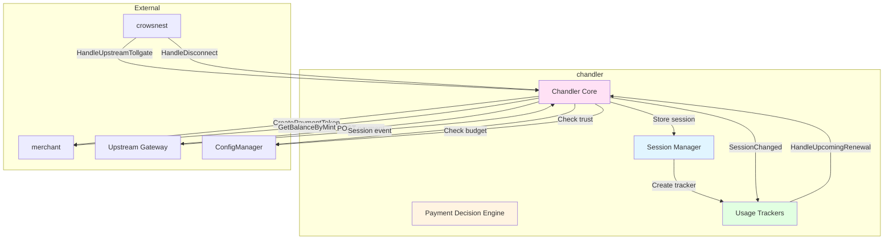
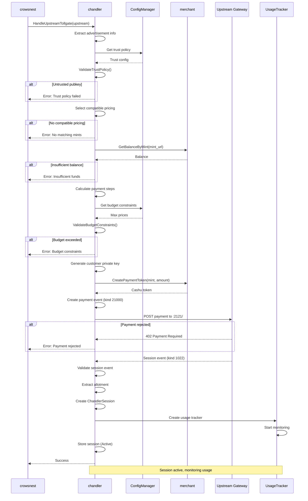
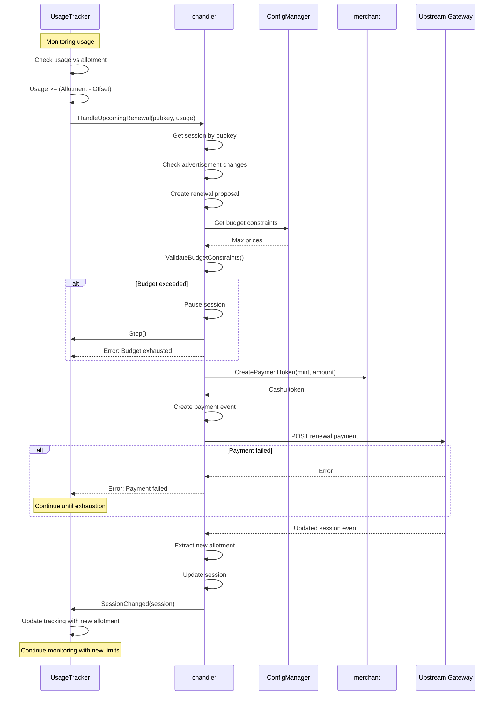
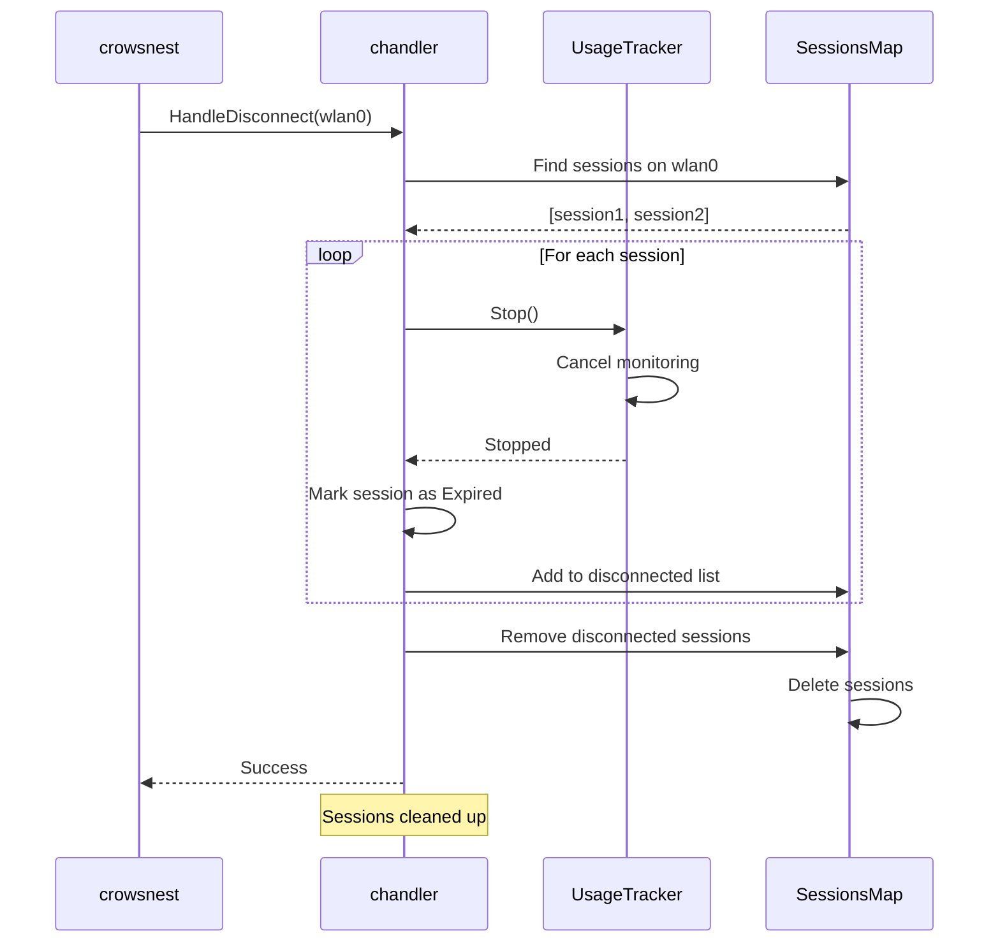

# Chandler - Session Management & Upstream Payments

## Overview

The `chandler` module manages upstream TollGate sessions on behalf of the local TollGate device. It acts as the financial decision-maker and session manager for upstream connections, handling payment creation, session tracking, and automatic renewals.

**Key Responsibilities**:
- Receive upstream TollGate discoveries from [`crowsnest`](crowsnest.md)
- Make financial decisions (trust, budget, pricing)
- Create payment sessions with upstream TollGates
- Track usage and trigger automatic renewals
- Manage session lifecycle (active, paused, expired)
- Coordinate with [`merchant`](merchant.md) for wallet operations

## Component Architecture



## Behavioral Flow Descriptions

### 1. Upstream TollGate Discovery Handling

**Trigger**: `crowsnest.HandleUpstreamTollgate()` called with discovered upstream

**Purpose**: Evaluate upstream TollGate and decide whether to create session

**Flow**:
1. Receive UpstreamTollgate object from crowsnest
2. Extract advertisement information:
   - Metric (milliseconds or bytes)
   - Step size
   - Pricing options (mint URLs, prices, minimums)
3. Validate trust policy:
   - Check if pubkey in allowlist
   - Check if pubkey in blocklist
   - Apply default policy (trust_all or trust_none)
4. Select compatible pricing option:
   - Find pricing options matching our accepted mints
   - Choose option with best terms
5. Check wallet balance:
   - Get balance for selected mint
   - Verify sufficient funds for minimum purchase
6. Calculate payment steps:
   - Use preferred session increments from config
   - Ensure meets minimum purchase requirement
   - Ensure within affordable range
7. Validate budget constraints:
   - Check price per unit against max allowed
   - Verify within configured limits
8. Generate unique customer identity for this session
9. Create and send payment (see Payment Creation flow)
10. Receive and validate session event
11. Extract actual allotment from response
12. Create usage tracker for session
13. Store session in active sessions map

**State Changes**:
- New ChandlerSession created
- Session stored with status "Active"
- Usage tracker started
- Merchant wallet balance decreased

**Decision Points**:
- Trust policy: Reject if untrusted
- Compatible pricing: Reject if no matching mints
- Sufficient balance: Reject if can't afford minimum
- Budget constraints: Reject if price too high

### 2. Payment Creation and Sending

**Trigger**: Initial session creation or renewal

**Purpose**: Create and send payment to upstream TollGate

**Flow**:
1. Create payment proposal with:
   - Upstream pubkey
   - Number of steps to purchase
   - Selected pricing option
   - Reason (initial/renewal)
2. Request payment token from merchant:
   - Specify mint URL
   - Specify amount in sats
3. Merchant creates Cashu token
4. Create Nostr payment event (kind 21000):
   - Add `p` tag with upstream pubkey
   - Add `device-identifier` tag with local MAC address
   - Add `payment` tag with Cashu token
5. Sign event with customer private key
6. POST event to upstream gateway at `:2121/`
7. Receive response (session event kind 1022 or notice event)
8. Validate session event structure
9. Extract allotment from session event
10. Return session event to caller

**State Changes**:
- Merchant wallet balance decreased
- Payment event created and sent
- Session event received and stored

**Error Handling**:
- HTTP errors: Log and return error
- Payment rejection (402): Log and return error
- Invalid session response: Log and return error
- Network timeout: Log and return error

### 3. Usage Tracking

**Trigger**: Session created or renewed

**Purpose**: Monitor usage and trigger renewals before exhaustion

**Two Tracker Types**:

#### Time-Based Tracking (milliseconds)
1. Record session start time
2. Calculate end time: `start + (allotment / 1000)` seconds
3. Set timer for renewal trigger
4. Renewal triggers at: `end_time - (renewal_offset / 1000)` seconds
5. When timer fires, call `chandler.HandleUpcomingRenewal()`

#### Data-Based Tracking (bytes)
1. Poll upstream gateway for usage information every 1 second
2. GET request to `http://[gateway_ip]:2121/usage`
3. Parse response in format "usage/allotment" (e.g., "1048576/10485760")
4. Store upstream usage and allotment values
5. Calculate remaining: `remaining = allotment - usage`
6. When `remaining <= renewal_offset`, trigger renewal
7. Also tracks local interface bytes from `/proc/net/dev` for reference

**State Changes**:
- Usage tracker running in background
- Periodic checks or timer set
- Renewal triggered when threshold reached

**Key Configuration**:
- `millisecond_renewal_offset`: How many ms before exhaustion to renew
- `bytes_renewal_offset`: How many bytes before exhaustion to renew

### 4. Session Renewal

**Trigger**: Usage tracker detects approaching allotment limit

**Purpose**: Extend session before exhaustion to maintain connectivity

**Flow**:
1. Receive `HandleUpcomingRenewal()` call from usage tracker
2. Retrieve session by upstream pubkey
3. Check if advertisement has changed (log warning if so)
4. Create renewal payment proposal:
   - Use same pricing option
   - Calculate steps based on preferred increments
5. Validate budget constraints for renewal
6. If budget exceeded:
   - Pause session
   - Stop usage tracker
   - Return error
7. Create and send renewal payment
8. Receive updated session event
9. Extract new total allotment
10. Update session metadata:
    - Total allotment
    - Last renewal timestamp
    - Total spent
    - Payment count
11. Notify usage tracker of session change
12. Usage tracker updates with new allotment

**State Changes**:
- Session allotment increased
- Payment count incremented
- Total spent updated
- Last renewal timestamp updated
- Usage tracker updated with new limits

**Failure Handling**:
- Budget exceeded: Pause session
- Payment failure: Log error, session continues until exhaustion
- Network error: Log error, retry on next threshold

### 5. Session Disconnection

**Trigger**: `crowsnest.HandleDisconnect()` called for interface

**Purpose**: Clean up sessions when network connection lost

**Flow**:
1. Receive interface name from crowsnest
2. Find all sessions on that interface
3. For each session:
   - Stop usage tracker
   - Mark session as "Expired"
   - Add to disconnected sessions list
4. Remove all disconnected sessions from sessions map
5. Log disconnection details

**State Changes**:
- Usage trackers stopped
- Sessions marked as expired
- Sessions removed from memory
- No persistent storage (sessions lost)

**Cleanup**:
- All session resources released
- No automatic reconnection attempt
- New discovery required to recreate session

### 6. Trust Policy Validation

**Trigger**: Before creating session with upstream

**Purpose**: Ensure only trusted upstreams are used

**Logic**:
```
ValidateTrustPolicy(pubkey, allowlist, blocklist, defaultPolicy):
  - If pubkey in blocklist: REJECT
  - If pubkey in allowlist: ACCEPT
  - If defaultPolicy == "trust_all": ACCEPT
  - If defaultPolicy == "trust_none": REJECT
```

**Configuration**:
```json
{
  "trust": {
    "default_policy": "trust_all",
    "allowlist": ["pubkey1", "pubkey2"],
    "blocklist": ["pubkey3"]
  }
}
```

**State Changes**:
- None (validation only)
- Rejection prevents session creation

### 7. Budget Constraint Validation

**Trigger**: Before creating session or renewal

**Purpose**: Ensure pricing is within acceptable limits

**Validation**:
```
For milliseconds metric:
  price_per_ms = (steps * price_per_step) / (steps * step_size)
  if price_per_ms > max_price_per_millisecond: REJECT

For bytes metric:
  price_per_byte = (steps * price_per_step) / (steps * step_size)
  if price_per_byte > max_price_per_byte: REJECT
```

**Configuration**:
```json
{
  "max_price_per_millisecond": 0.002777777778,
  "max_price_per_byte": 0.00003725782414
}
```

**State Changes**:
- None (validation only)
- Rejection prevents payment

## Sequence Diagrams

### Complete Session Creation Flow



### Session Renewal Flow



### Disconnection Flow



## Events Sent to Other Components

### To Merchant

| Event | Trigger | Data | Purpose |
|-------|---------|------|---------|
| `CreatePaymentToken()` | Payment needed | mint URL, amount | Get Cashu token for payment |
| `GetBalanceByMint()` | Before payment | mint URL | Check available balance |

### To Usage Tracker

| Event | Trigger | Data | Purpose |
|-------|---------|------|---------|
| `Start()` | Session created | session, chandler | Begin usage monitoring |
| `SessionChanged()` | Session renewed | updated session | Update tracking limits |
| `Stop()` | Session paused/expired | - | Stop monitoring |

### From Usage Tracker

| Event | Trigger | Data | Purpose |
|-------|---------|------|---------|
| `HandleUpcomingRenewal()` | Threshold reached | pubkey, current usage | Trigger renewal |

### From Crowsnest

| Event | Trigger | Data | Purpose |
|-------|---------|------|---------|
| `HandleUpstreamTollgate()` | TollGate discovered | UpstreamTollgate | Create session |
| `HandleDisconnect()` | Interface down | interface name | Clean up sessions |

## Edge Cases & State Issues

### Issue 1: Session Creation Failure with No Retry

**Scenario**: Chandler rejects upstream due to temporary condition (insufficient balance, budget)

**Root Cause**:
- Balance temporarily low (payout routine running)
- Budget constraints temporarily exceeded
- Network error during payment
- No retry mechanism in chandler
- Crowsnest marks discovery as "success" (advertisement was valid)

**Current Behavior**:
- Discovery successful (advertisement valid)
- Session creation fails
- Error logged
- No retry attempted
- Device connected but not paying
- Periodic check won't help (discovery tracker shows success)

**Detection**:
```bash
# Check crowsnest logs
logread | grep "Successfully handed off"  # Present

# Check chandler logs
logread | grep chandler | grep -i error
# Shows: "Insufficient funds" or "Budget constraints not met"

# Check sessions
tollgate-cli network status  # No active session

# Interface connected
ip link show wlan0  # UP
```

**Potential Fixes**:
1. Implement retry mechanism in chandler with exponential backoff
2. Add session creation monitoring
3. Separate discovery success from session creation success
4. Add manual retry trigger
5. Implement session health check

**Recommended Fix**:
```go
// Add retry logic in chandler
func (c *Chandler) HandleUpstreamTollgate(upstream *UpstreamTollgate) error {
    maxRetries := 3
    for attempt := 0; attempt < maxRetries; attempt++ {
        err := c.createSession(upstream)
        if err == nil {
            return nil
        }
        if isRetryable(err) {
            time.Sleep(time.Duration(attempt+1) * 5 * time.Second)
            continue
        }
        return err
    }
    return fmt.Errorf("max retries exceeded")
}
```

### Issue 2: Race Condition with Merchant Payout

**Scenario**: Merchant payout drains wallet while chandler tries to create payment

**Root Cause**:
- Merchant payout runs every 1 minute
- Chandler checks balance before payment
- Payout happens between check and payment creation
- No locking or coordination
- Payment creation fails with "insufficient funds"

**Current Behavior**:
- Chandler: `GetBalanceByMint()` returns sufficient balance
- Merchant: Payout drains wallet
- Chandler: `CreatePaymentToken()` fails
- Session creation fails
- No retry

**Detection**:
```bash
# Check timing in logs
logread | grep -E "(chandler|merchant)" | grep -E "(balance|payout)"

# Chandler shows balance check succeeded
# Merchant shows payout completed
# Chandler shows payment creation failed
# Timestamps show payout between check and payment
```

**Potential Fixes**:
1. Implement wallet reservation system
2. Add mutex around balance operations
3. Coordinate payout timing with session needs
4. Reserve funds for active sessions
5. Implement two-phase commit for payments

**Recommended Fix**:
```go
// In merchant, check for reserved funds
func (m *Merchant) GetAvailableBalance(mintURL string) uint64 {
    total := m.GetBalanceByMint(mintURL)
    reserved := m.getReservedFunds(mintURL)
    return total - reserved
}

// In chandler, reserve funds before payment
func (c *Chandler) createPayment() error {
    amount := calculateAmount()
    c.merchant.ReserveFunds(mintURL, amount)
    defer c.merchant.ReleaseFunds(mintURL, amount)
    // Create payment...
}
```

### Issue 3: Renewal Failure Handling

**Scenario**: Renewal payment fails but session continues

**Root Cause**:
- Renewal triggered at threshold
- Payment fails (network, balance, budget)
- Error logged but session continues
- No retry mechanism
- Session will exhaust and disconnect

**Current Behavior**:
- Usage tracker triggers renewal
- Payment creation fails
- Error returned to usage tracker
- Usage tracker continues monitoring
- Session exhausts allotment
- Connection lost

**Detection**:
```bash
# Check logs for renewal attempts
logread | grep "Processing renewal request"

# Check for renewal failures
logread | grep "Failed to send renewal payment"

# Session still active but approaching exhaustion
tollgate-cli network status
```

**Potential Fixes**:
1. Implement renewal retry with backoff
2. Pause session on renewal failure
3. Add multiple renewal thresholds (50%, 80%, 90%)
4. Alert on renewal failure
5. Implement graceful degradation

**Recommended Fix**:
```go
// Multiple renewal thresholds
renewal_thresholds: [0.5, 0.8, 0.9]

// In usage tracker
for _, threshold := range thresholds {
    if usage >= allotment * threshold {
        err := chandler.HandleUpcomingRenewal()
        if err == nil {
            break // Success, stop trying
        }
        // Continue to next threshold
    }
}
```

### Issue 4: Advertisement Change During Session

**Scenario**: Upstream changes pricing while session active

**Root Cause**:
- Upstream updates advertisement
- Pricing changes
- Chandler detects change during renewal
- Logs warning but continues with old pricing
- May cause renewal failure if pricing incompatible

**Current Behavior**:
- Renewal triggered
- Chandler checks advertisement
- Detects change (logs warning)
- Continues with stored pricing option
- May fail if pricing no longer valid

**Detection**:
```bash
# Check logs for advertisement changes
logread | grep "WARNING: Upstream advertisement changed"

# Shows old and new pricing
```

**Potential Fixes**:
1. Re-evaluate pricing on advertisement change
2. Fetch fresh advertisement before renewal
3. Validate pricing still compatible
4. Renegotiate session if needed
5. Implement pricing change notification

### Issue 5: Session State Inconsistency

**Scenario**: Session marked as active but usage tracker stopped

**Root Cause**:
- Usage tracker crashes or stops
- Session status not updated
- Session appears active but not monitored
- No health check for trackers

**Current Behavior**:
- Session status = Active
- Usage tracker not running
- No renewals triggered
- Session exhausts without renewal
- Connection lost

**Detection**:
```bash
# Session shows active
tollgate-cli network status  # Active

# But no renewal logs
logread | grep "Processing renewal"  # None recent

# Usage tracker not running (would need debug endpoint)
```

**Potential Fixes**:
1. Implement usage tracker health check
2. Add tracker restart mechanism
3. Monitor tracker goroutines
4. Add session health monitoring
5. Implement watchdog for trackers

### Issue 6: Multiple Sessions on Same Interface

**Scenario**: Multiple TollGate discoveries on same interface create multiple sessions

**Root Cause**:
- Interface connects to TollGate A
- Session created
- Interface reconnects to TollGate B (different pubkey)
- New session created
- Both sessions active on same interface

**Current Behavior**:
- Two sessions in sessions map
- Both usage trackers running
- Unclear which session is actually used
- Potential double payment

**Detection**:
```bash
# Check sessions
tollgate-cli network status  # Shows multiple sessions

# Check sessions map (would need debug endpoint)
# Multiple sessions with same interface name
```

**Potential Fixes**:
1. Enforce one session per interface
2. Terminate old session when new one created
3. Add interface-to-session mapping
4. Validate interface uniqueness
5. Implement session replacement logic

**Recommended Fix**:
```go
// In HandleUpstreamTollgate
func (c *Chandler) HandleUpstreamTollgate(upstream *UpstreamTollgate) error {
    // Check for existing session on this interface
    c.mu.Lock()
    for pubkey, session := range c.sessions {
        if session.UpstreamTollgate.InterfaceName == upstream.InterfaceName {
            // Terminate old session
            c.terminateSessionLocked(pubkey)
        }
    }
    c.mu.Unlock()
    
    // Create new session...
}
```

### Issue 8: Startup with Existing Connection and Unknown Session State

**Scenario**: TollGate starts/restarts while already connected to upstream, but doesn't know if session exists

**Root Cause**:
- System reboot or TollGate restart
- Interface already connected to upstream TollGate
- May have active session on upstream (from before restart)
- May have no session (session expired)
- Chandler has no persistent session storage
- No way to know session state without checking

**Current Behavior**:
- Crowsnest discovers upstream (initial scan or periodic check)
- Hands off to chandler
- Chandler creates NEW session (new payment)
- If old session existed on upstream, it's abandoned (wasted payment)
- If old session didn't exist, correct behavior

**Detection**:
```bash
# After restart, check if already connected
ip link show wlan0  # UP
ip route | grep default  # Shows gateway

# Check upstream for existing session
curl http://[gateway_ip]:2121/usage
# Returns: "1234567/10485760" (session exists!)
# OR: "-1/-1" (no session)

# But chandler creates new session anyway
logread | grep "Session created successfully"
```

**Impact**:
- Double payment if session still active
- Wasted funds (old session abandoned)
- No session recovery mechanism
- Lost session state on restart

**Potential Fixes**:
1. **Check `:2121/usage` before creating session**:
```go
// In chandler.HandleUpstreamTollgate()
// Before creating payment, check if session exists
func (c *Chandler) checkExistingSession(upstream *UpstreamTollgate) (*ChandlerSession, error) {
    url := fmt.Sprintf("http://%s:2121/usage", upstream.GatewayIP)
    resp, err := http.Get(url)
    if err != nil {
        return nil, err // No session or can't check
    }
    defer resp.Body.Close()
    
    body, _ := io.ReadAll(resp.Body)
    parts := strings.Split(strings.TrimSpace(string(body)), "/")
    
    if len(parts) == 2 && parts[0] != "-1" {
        // Session exists! Recover it
        usage, _ := strconv.ParseUint(parts[0], 10, 64)
        allotment, _ := strconv.ParseUint(parts[1], 10, 64)
        
        // Create session object from existing session
        session := &ChandlerSession{
            UpstreamTollgate: upstream,
            TotalAllotment:   allotment,
            Status:           SessionActive,
            // ... other fields
        }
        
        // Start usage tracker with current usage
        return session, nil
    }
    
    return nil, nil // No session, proceed with new payment
}
```

2. **Implement session persistence**:
   - Store session metadata to disk (JSON file)
   - On startup, load stored sessions
   - Validate each session via `:2121/usage`
   - Resume tracking if valid, discard if expired

3. **Add session recovery flow**:
   - Query upstream for session state
   - Recover session if still valid
   - Only create new session if needed

**Recommended Approach**:
- Always check `:2121/usage` before creating new session
- If returns valid usage/allotment, recover session
- If returns -1/-1, create new session
- Prevents double payment and enables session recovery

### Issue 9: Advertisement Changes Not Detected During Session

**Scenario**: Upstream changes advertisement (pricing, terms) but chandler uses stale data

**Root Cause**:
- Advertisement fetched once during discovery
- Stored in session object
- Never refreshed during session lifetime
- Upstream may change pricing, mints, or terms
- Chandler uses old advertisement for renewals

**Current Behavior**:
- Advertisement fetched at discovery time
- Stored in `ChandlerSession.Advertisement`
- Used for all renewal decisions
- If upstream changes advertisement:
  - Chandler logs warning during renewal
  - Continues with old pricing
  - May cause renewal failure if incompatible

**Detection**:
```bash
# Check logs for advertisement change warnings
logread | grep "WARNING: Upstream advertisement changed"

# Manually check if advertisement changed
curl http://[gateway_ip]:2121/  # Current advertisement
# Compare pubkey, pricing, terms with session data
```

**Impact**:
- Using outdated pricing information
- Renewal failures if pricing incompatible
- Missing new mint options
- No awareness of upstream changes
- Potential overpayment or underpayment

**Potential Fixes**:
1. **Periodic advertisement polling** (Recommended):
```go
// In chandler or as part of usage tracker
func (c *Chandler) pollAdvertisement(session *ChandlerSession) {
    ticker := time.NewTicker(60 * time.Second)
    defer ticker.Stop()
    
    for range ticker.C {
        // Fetch fresh advertisement
        url := fmt.Sprintf("http://%s:2121/", session.UpstreamTollgate.GatewayIP)
        resp, err := http.Get(url)
        if err != nil {
            logger.Debug("Failed to poll advertisement (temporary connectivity issue)")
            continue // Retry next cycle
        }
        defer resp.Body.Close()
        
        data, _ := io.ReadAll(resp.Body)
        
        // Validate and parse
        newAd, err := tollgate_protocol.ValidateAdvertisementFromBytes(data)
        if err != nil {
            logger.Warn("Invalid advertisement from upstream")
            continue
        }
        
        // Compare with stored advertisement
        if newAd.ID != session.Advertisement.ID {
            logger.Info("Advertisement changed, updating session")
            
            // Extract new info
            newInfo, _ := tollgate_protocol.ExtractAdvertisementInfo(newAd)
            
            // Update session
            session.mu.Lock()
            session.Advertisement = newAd
            session.AdvertisementInfo = newInfo
            
            // Re-evaluate pricing compatibility
            newPricing, err := c.selectCompatiblePricingOption(newInfo.PricingOptions)
            if err != nil {
                logger.Error("New advertisement incompatible, terminating session")
                session.Status = SessionError
                session.UsageTracker.Stop()
            } else {
                session.SelectedPricing = newPricing
            }
            session.mu.Unlock()
        }
    }
}
```

2. **Fetch fresh advertisement before renewal**:
   - Before each renewal, fetch current advertisement
   - Validate still compatible
   - Update session if changed
   - Fail renewal if incompatible

3. **Advertisement versioning**:
   - Track advertisement version/timestamp
   - Detect changes via version comparison
   - Update session on version change

**Additional Benefits**:
- Periodic polling detects if upstream is still reachable
- Can recover from temporary network issues
- Provides health check for upstream connection
- Enables dynamic pricing updates

**Recommended Approach**:
- Poll advertisement every 60 seconds
- Update session if changed and compatible
- Terminate session if incompatible
- Also serves as connectivity health check

### Issue 10: Expired Sessions Not Cleaned Up

**Scenario**: Expired/paused sessions remain in sessions map

**Root Cause**:
- Sessions marked as expired but not removed
- Only removed on explicit disconnect
- Sessions map grows over time
- Affects periodic check logic

**Current Behavior**:
- Sessions map contains expired sessions
- `GetActiveSessions()` filters by status
- But periodic check uses `len(activeSessions) > 0`
- Expired sessions prevent periodic check from running

**Detection**:
```bash
# Sessions map contains expired entries
# (would need debug endpoint to see)

# Periodic check not running despite no active sessions
logread | grep "Periodic check discovered"  # None
```

**Potential Fixes**:
1. Implement automatic cleanup of expired sessions
2. Add periodic cleanup routine
3. Remove sessions immediately on expiration
4. Fix periodic check to only count active sessions
5. Add session garbage collection

## Integration with Other Components

### Relationship with Crowsnest

**Connection**: Direct function calls

**Flow**:
```
crowsnest discovers TollGate
  → chandler.HandleUpstreamTollgate()
    → Session creation

crowsnest detects disconnect
  → chandler.HandleDisconnect()
    → Session cleanup
```

**Dependency**: Chandler must be set in crowsnest before handoff

### Relationship with Merchant

**Connection**: Direct function calls (wallet provider)

**Flow**:
```
chandler needs payment
  → merchant.CreatePaymentToken()
    → Cashu token returned

chandler checks balance
  → merchant.GetBalanceByMint()
    → Balance returned
```

**Dependency**: Merchant must be initialized before chandler

### Relationship with Usage Trackers

**Connection**: Interface implementation

**Flow**:
```
chandler creates session
  → chandler.createUsageTracker()
    → tracker.Start()

tracker detects threshold
  → chandler.HandleUpcomingRenewal()
    → Renewal process

chandler renews session
  → tracker.SessionChanged()
    → Update tracking
```

**Dependency**: Trackers depend on chandler for renewal

## Configuration

### Chandler Config

```json
{
  "chandler": {
    "max_price_per_millisecond": 0.002777777778,
    "max_price_per_byte": 0.00003725782414,
    "trust": {
      "default_policy": "trust_all",
      "allowlist": [],
      "blocklist": []
    },
    "sessions": {
      "preferred_session_increments_milliseconds": 60000,
      "preferred_session_increments_bytes": 1048576,
      "millisecond_renewal_offset": 5000,
      "bytes_renewal_offset": 10485760
    }
  }
}
```

**Key Parameters**:
- `max_price_per_millisecond`: Maximum acceptable price per ms
- `max_price_per_byte`: Maximum acceptable price per byte
- `preferred_session_increments_*`: How much to buy per payment
- `*_renewal_offset`: How much before exhaustion to renew

---

## Technical Implementation Details

### Key Functions

#### HandleUpstreamTollgate()
```go
func (c *Chandler) HandleUpstreamTollgate(upstream *UpstreamTollgate) error
```

**Purpose**: Main session creation logic

**Call Path**:
```
HandleUpstreamTollgate()
  → tollgate_protocol.ExtractAdvertisementInfo()
  → ValidateTrustPolicy()
  → selectCompatiblePricingOption()
  → merchant.GetBalanceByMint()
  → ValidateBudgetConstraints()
  → createAndSendPayment()
    → merchant.CreatePaymentToken()
    → createPaymentEvent()
    → HTTP POST to upstream
  → extractAllotment()
  → createUsageTracker()
  → Store session
```

#### HandleUpcomingRenewal()
```go
func (c *Chandler) HandleUpcomingRenewal(upstreamPubkey string, currentUsage uint64) error
```

**Purpose**: Process renewal request from usage tracker

**Call Path**:
```
HandleUpcomingRenewal()
  → Get session by pubkey
  → checkAdvertisementChanges()
  → Create renewal proposal
  → ValidateBudgetConstraints()
  → createAndSendPayment()
  → extractAllotment()
  → Update session
  → tracker.SessionChanged()
```

#### createAndSendPayment()
```go
func (c *Chandler) createAndSendPayment(session *ChandlerSession, proposal *PaymentProposal) (*nostr.Event, error)
```

**Purpose**: Create payment event and send to upstream

**Operations**:
1. Request payment token from merchant
2. Create Nostr event (kind 21000)
3. Add tags (p, device-identifier, payment)
4. Sign with customer private key
5. POST to upstream gateway
6. Parse response
7. Validate session event
8. Return session event

### Data Structures

#### ChandlerSession
```go
type ChandlerSession struct {
    UpstreamTollgate   *UpstreamTollgate
    CustomerPrivateKey string
    Advertisement      *nostr.Event
    AdvertisementInfo  *tollgate_protocol.AdvertisementInfo
    SelectedPricing    *tollgate_protocol.PricingOption
    SessionEvent       *nostr.Event
    TotalAllotment     uint64
    UsageTracker       UsageTrackerInterface
    RenewalOffset      uint64
    LastRenewalAt      time.Time
    CreatedAt          time.Time
    LastPaymentAt      time.Time
    TotalSpent         uint64
    PaymentCount       int
    Status             SessionStatus
    mu                 sync.RWMutex
}
```

#### PaymentProposal
```go
type PaymentProposal struct {
    UpstreamPubkey     string
    Steps              uint64
    PricingOption      *tollgate_protocol.PricingOption
    Reason             string  // "initial", "renewal"
    EstimatedAllotment uint64
}
```

#### SessionStatus
```go
const (
    SessionActive SessionStatus = iota
    SessionPaused
    SessionExpired
    SessionError
)
```

### Payment Event Structure

```json
{
  "kind": 21000,
  "tags": [
    ["p", "<upstream_pubkey>"],
    ["device-identifier", "mac", "<local_mac_address>"],
    ["payment", "<cashu_token>"]
  ],
  "content": "",
  "pubkey": "<customer_pubkey>",
  "sig": "<signature>"
}
```

### Session Event Structure

```json
{
  "kind": 1022,
  "tags": [
    ["p", "<customer_pubkey>"],
    ["allotment", "<metric>", "<amount>"]
  ],
  "content": "",
  "pubkey": "<upstream_pubkey>",
  "sig": "<signature>"
}