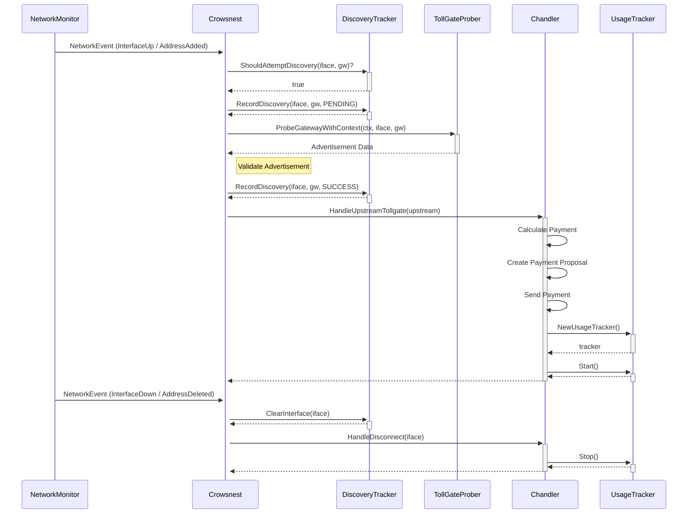

# Crowsnest and Chandler Interaction

This document explains the sequence of events between the `crowsnest` and `chandler` modules, from discovery to session management and disconnection.

## Sequence Diagram

### Connection Flow

1.  **Network Event**: The `NetworkMonitor` detects a network change (e.g., an interface comes up or an IP address is assigned) and sends a `NetworkEvent` to `Crowsnest`.
2.  **Discovery Check**: `Crowsnest` asks the `DiscoveryTracker` if it should attempt to discover a TollGate on the specified interface and gateway.
3.  **Probe Gateway**: If discovery is allowed, `Crowsnest` records the attempt as pending and uses the `TollGateProber` to probe the gateway for a TollGate advertisement.
4.  **Validation**: `Crowsnest` validates the advertisement data.
5.  **Record Success**: Upon successful validation, `Crowsnest` records the discovery as successful in the `DiscoveryTracker`.
6.  **Handoff to Chandler**: `Crowsnest` creates an `UpstreamTollgate` object and passes it to the `Chandler`'s `HandleUpstreamTollgate` method.
7.  **Session Establishment**: The `Chandler` takes over, handles the payment, and establishes a session with the upstream TollGate.
8.  **Usage Tracking**: Once the session is established, the `Chandler` creates and starts a `UsageTracker` to monitor the session's allotment.

### Disconnection Flow

1.  **Network Event**: The `NetworkMonitor` detects a disconnection event (e.g., interface goes down or IP address is removed) and notifies `Crowsnest`.
2.  **Clear Discovery State**: `Crowsnest` immediately calls `ClearInterface` on the `DiscoveryTracker`. This is the critical step that was failing. It removes all records for that interface, including the `DiscoveryResultSuccess` entry, allowing a new discovery attempt when the interface comes back online.
3.  **Notify Chandler**: `Crowsnest` calls `HandleDisconnect` on the `Chandler`.
4.  **Stop Usage Tracking**: The `Chandler` stops the `UsageTracker` for the disconnected session and performs any other necessary cleanup.