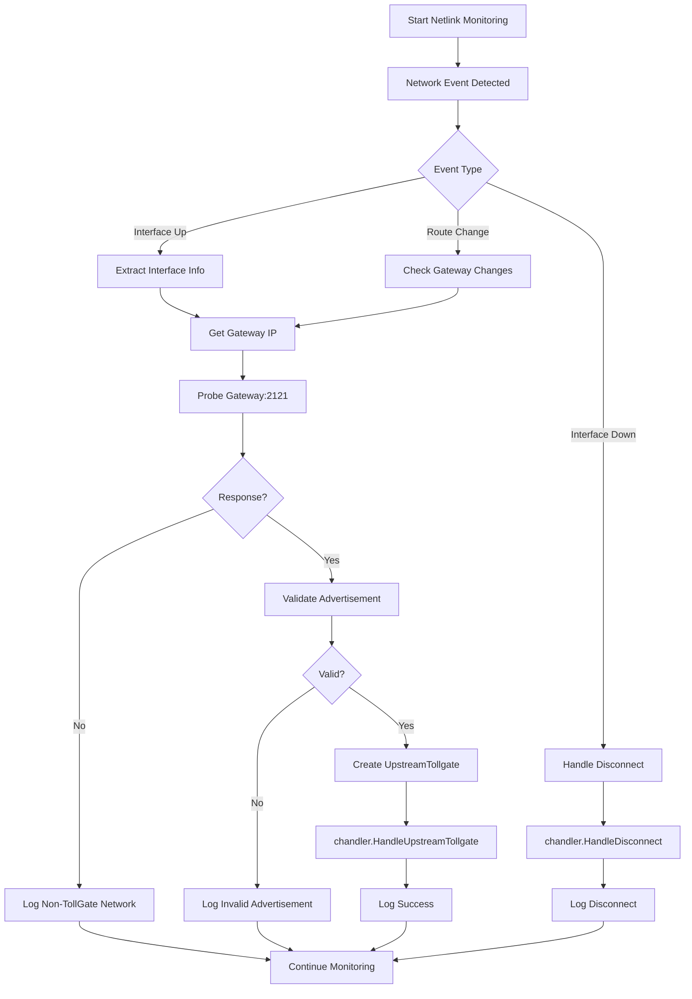
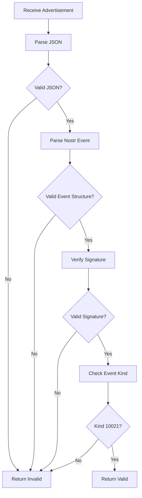

# Crowsnest Module - Functional Design Document

## Overview

The Crowsnest module is responsible for monitoring network changes and detecting upstream TollGate devices. It watches for new network interfaces using netlink sockets, validates discovered TollGate advertisements, and hands off validated upstream TollGate information to the Chandler module for management.

## Responsibilities

- Monitor network interface changes using netlink sockets
- Detect new network connections and disconnections
- Probe discovered gateways for TollGate advertisements on port 2121
- Validate TollGate advertisement format and signatures
- Create `upstreamTollgate` objects for validated discoveries
- Hand off upstream TollGate management to the Chandler module
- Notify Chandler of network disconnections

## Architecture

### Core Components

#### 1. NetworkMonitor
- **Purpose**: Listen for netlink socket events to detect network changes
- **Implementation**: Uses `github.com/vishvananda/netlink` package
- **Events**: Interface up/down, route changes, address changes

#### 2. TollGateProber
- **Purpose**: Probe discovered gateways for TollGate advertisements
- **Implementation**: HTTP client with timeout controls
- **Protocol**: HTTP GET request to `http://<gateway_ip>:2121/`

#### 3. AdvertisementValidator
- **Purpose**: Validate TollGate advertisement as signed Nostr event
- **Implementation**: Nostr event validation using `github.com/nbd-wtf/go-nostr`
- **Validation**: Event structure, signature verification, kind 10021 check

#### 4. DiscoveryTracker
- **Purpose**: Track discovery attempts and prevent duplicate processing
- **Implementation**: In-memory map with cleanup routines
- **State**: Track interfaces being processed and recent discoveries

## Data Structures

### UpstreamTollgate
```go
type UpstreamTollgate struct {
    // Network interface information
    InterfaceName string    // e.g., "eth0", "wlan0"
    MacAddress    string    // MAC address of local interface
    GatewayIP     string    // IP address of the upstream gateway
    
    // TollGate advertisement information
    Advertisement *nostr.Event // Complete TollGate advertisement event (kind 10021)
    
    // Discovery metadata
    DiscoveredAt time.Time     // When this TollGate was discovered
}
```

### NetworkEvent
```go
type NetworkEvent struct {
    Type          EventType
    InterfaceName string
    InterfaceInfo *InterfaceInfo
    GatewayIP     string
    Timestamp     time.Time
}

type EventType int

const (
    EventInterfaceUp EventType = iota
    EventInterfaceDown
    EventRouteDeleted
    EventAddressAdded
    EventAddressDeleted
)

type InterfaceInfo struct {
    Name         string
    MacAddress   string
    IPAddresses  []string
    IsUp         bool
    IsLoopback   bool
    IsPointToPoint bool
}
```

## Core Interfaces

### Crowsnest Interface
```go
type Crowsnest interface {
    Start() error
    Stop() error
    SetChandler(chandler ChandlerInterface)
}
```

### ChandlerInterface (External Module)
```go
type ChandlerInterface interface {
    // Called when a new upstream TollGate is discovered and validated
    HandleUpstreamTollgate(upstream *UpstreamTollgate) error
    
    // Called when a network interface goes down
    HandleDisconnect(interfaceName string) error
}
```

## Workflow

### Network Discovery Workflow



### Advertisement Validation Workflow



## Error Handling

### Error Categories

1. **Network Errors**
   - Netlink socket failures
   - Interface enumeration errors
   - Gateway discovery failures

2. **Communication Errors**
   - HTTP request timeouts
   - Connection refused
   - Invalid response format

3. **Validation Errors**
   - Invalid Nostr event format
   - Signature verification failures
   - Invalid event kind (not 10021)

4. **Integration Errors**
   - Chandler interface failures
   - Callback errors

### Error Handling Strategy

```go
type CrowsnestError struct {
    Type    ErrorType
    Code    string
    Message string
    Cause   error
    Context map[string]interface{}
}

type ErrorType int

const (
    ErrorTypeNetwork ErrorType = iota
    ErrorTypeCommunication
    ErrorTypeValidation
    ErrorTypeIntegration
)
```

### Logging Strategy

- **Level**: Use standard log levels (DEBUG, INFO, WARN, ERROR)
- **Format**: Structured logging with consistent fields
- **Context**: Include interface name, IP addresses, and timestamps
- **Sensitive Data**: Never log private keys or tokens

#### Example Log Messages

```go
// Network discovery
log.Printf("Network interface %s detected, gateway: %s", interfaceName, gatewayIP)

// TollGate discovery
log.Printf("TollGate advertisement found on %s (gateway: %s, pubkey: %s)", interfaceName, gatewayIP, advertisement.PubKey)

// Validation failure
log.Printf("Invalid TollGate advertisement on %s: %s", interfaceName, validationError)

// Successful handoff
log.Printf("Upstream TollGate handed off to chandler: %s", interfaceName)

// Disconnection
log.Printf("Network interface %s disconnected, notifying chandler", interfaceName)
```

## Configuration

### Configuration Structure
```go
type CrowsnestConfig struct {
    // Network monitoring settings
    MonitoringInterval time.Duration `json:"monitoring_interval"`
    
    // Probing settings
    ProbeTimeout       time.Duration `json:"probe_timeout"`
    ProbeRetryCount    int           `json:"probe_retry_count"`
    ProbeRetryDelay    time.Duration `json:"probe_retry_delay"`
    
    // Validation settings
    RequireValidSignature bool `json:"require_valid_signature"`
    
    // Logging settings
    LogLevel string `json:"log_level"`
    
    // Interface filtering
    IgnoreInterfaces []string `json:"ignore_interfaces"`
    OnlyInterfaces   []string `json:"only_interfaces"`
    
    // Discovery deduplication
    DiscoveryTimeout time.Duration `json:"discovery_timeout"`
}
```

### Default Configuration
```json
{
    "monitoring_interval": "5s",
    "probe_timeout": "10s",
    "probe_retry_count": 3,
    "probe_retry_delay": "2s",
    "require_valid_signature": true,
    "log_level": "INFO",
    "ignore_interfaces": ["lo", "docker0"],
    "only_interfaces": [],
    "discovery_timeout": "300s"
}
```

## Integration Points

### Main Application Integration

```go
// In main.go init() function
func initCrowsnest() {
    crowsnestInstance, err := crowsnest.NewCrowsnest(configManager)
    if err != nil {
        log.Fatalf("Failed to create crowsnest instance: %v", err)
    }
    
    // Set chandler when available
    // crowsnestInstance.SetChandler(chandlerInstance)
    
    go crowsnestInstance.Start()
    log.Println("Crowsnest module initialized and monitoring network changes")
}
```

### Module Dependencies

- **Required**: `config_manager` for configuration
- **Required**: `chandler` interface for upstream TollGate handoff
- **External**: `netlink` for network monitoring, `nostr` for event validation

## Chandler Interface Specifications

### Purpose
The Chandler module is responsible for managing upstream TollGate connections after they have been discovered and validated by the Crowsnest module.

### Interface Contract

```go
type ChandlerInterface interface {
    // HandleUpstreamTollgate is called when Crowsnest discovers a new upstream TollGate
    // The chandler should:
    // - Store the upstream TollGate information
    // - Establish connection management
    // - Handle session management with the upstream TollGate
    // - Return error if the upstream TollGate cannot be handled
    HandleUpstreamTollgate(upstream *UpstreamTollgate) error
    
    // HandleDisconnect is called when a network interface goes down
    // The chandler should:
    // - Clean up any sessions or connections for this interface
    // - Release any resources associated with this interface
    // - Update connection state tracking
    HandleDisconnect(interfaceName string) error
}
```

### Expected Chandler Behavior

1. **On HandleUpstreamTollgate**:
   - Validate the upstream TollGate information
   - Store connection metadata
   - Initialize session management
   - Begin connection health monitoring
   - Return error if unable to handle the upstream TollGate

2. **On HandleDisconnect**:
   - Identify all sessions associated with the interface
   - Clean up connection state
   - Release allocated resources
   - Update tracking state
   - Return error if cleanup fails

### Error Handling Contract

- **HandleUpstreamTollgate**: Return error if unable to manage the upstream TollGate
- **HandleDisconnect**: Return error if cleanup fails (non-critical)
- **Logging**: Chandler should log its own operations, Crowsnest will log handoff attempts

## Testing Strategy

### Unit Tests

1. **NetworkMonitor Tests**
   - Mock netlink events
   - Test interface detection
   - Test event filtering

2. **TollGateProber Tests**
   - Mock HTTP responses
   - Test timeout handling
   - Test retry logic

3. **AdvertisementValidator Tests**
   - Test valid advertisements (kind 10021)
   - Test invalid signatures
   - Test wrong event kinds

4. **DiscoveryTracker Tests**
   - Test deduplication logic
   - Test cleanup routines
   - Test thread safety

### Integration Tests

1. **End-to-End Discovery**
   - Mock network interface changes
   - Verify complete discovery workflow
   - Test chandler integration

2. **Chandler Integration**
   - Mock chandler interface
   - Test successful handoffs
   - Test error handling

3. **Error Scenarios**
   - Network failures
   - Invalid advertisements
   - Chandler failures
   - Timeout conditions

### Manual Testing

1. **Real Network Changes**
   - Connect/disconnect network interfaces
   - Verify detection and chandler notification
   - Test with actual TollGate devices

## Performance Considerations

### Resource Usage

- **Memory**: Minimal, only tracking active discoveries
- **CPU**: Minimal background processing
- **Network**: Periodic probing with configurable intervals

### Scalability

- **Concurrent Interfaces**: Handle multiple network interfaces
- **Rate Limiting**: Prevent overwhelming upstream TollGates
- **Deduplication**: Prevent duplicate discovery attempts

### Monitoring

- **Metrics**: Track discovery rates, validation failures, handoff success
- **Health Checks**: Monitor netlink socket health
- **Alerting**: Log critical failures for operational monitoring

## Security Considerations

### Advertisement Validation

- **Signature Verification**: Always verify Nostr event signatures
- **Content Validation**: Validate all required tags and formats
- **Replay Protection**: Consider event timestamps for freshness

### Network Security

- **Timeout Controls**: Prevent hanging connections
- **Rate Limiting**: Prevent excessive probing
- **Interface Filtering**: Only monitor intended interfaces

### Information Disclosure

- **Logging**: Avoid logging sensitive network information
- **Error Messages**: Provide minimal information in error responses
- **Handoff Security**: Ensure secure data transfer to chandler

## Future Enhancements

### Planned Features

1. **Advanced Filtering**
   - Network type filtering (WiFi, Ethernet, etc.)
   - Gateway address filtering
   - Custom validation rules

2. **Enhanced Discovery**
   - Parallel discovery for multiple interfaces
   - Background re-discovery for failed attempts
   - Discovery result caching

3. **Metrics and Monitoring**
   - Prometheus metrics integration
   - Discovery success rates
   - Handoff performance metrics

4. **Configuration Management**
   - Dynamic configuration updates
   - Per-interface configuration
   - Remote configuration support

### Technical Debt

- Consider using dependency injection for better testability
- Implement proper graceful shutdown handling
- Add comprehensive error recovery mechanisms
- Consider using structured logging library

## Implementation Notes

1. **Module Structure**: Follow existing TollGate module patterns with separate `go.mod` file
2. **Dependencies**: Minimize external dependencies, prefer standard library where possible
3. **Configuration**: Integrate with existing `config_manager` for consistency
4. **Testing**: Implement comprehensive test coverage before integration
5. **Documentation**: Maintain both technical and operational documentation

## Conclusion

The Crowsnest module provides a focused, single-responsibility component for network monitoring and upstream TollGate discovery. By cleanly separating discovery from management, it creates a clear interface with the Chandler module while maintaining the robustness required for reliable network monitoring.

The design emphasizes security, reliability, and maintainability, following the established patterns in the TollGate codebase. The clear separation of concerns between discovery (Crowsnest) and management (Chandler) ensures that each module can be developed, tested, and maintained independently.

This design provides a solid foundation for implementing the Crowsnest module while maintaining consistency with the existing TollGate architecture and design principles.