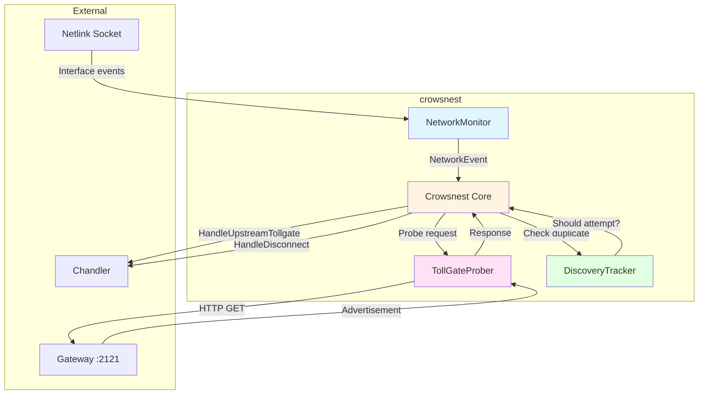
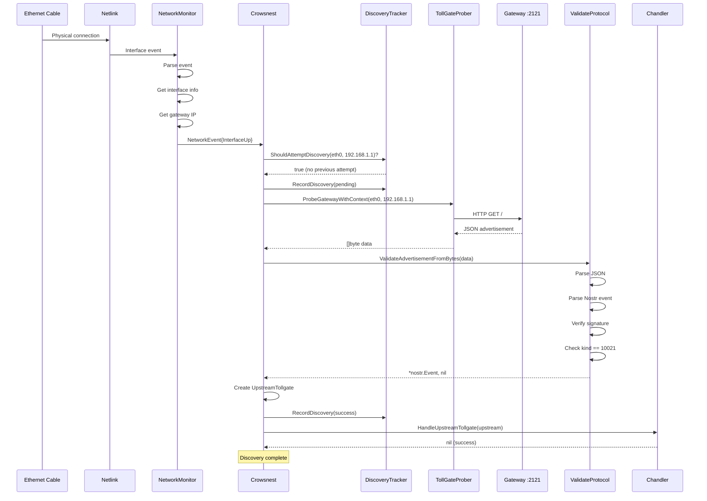
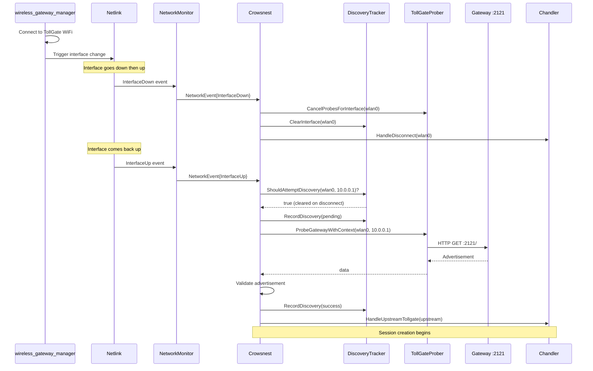
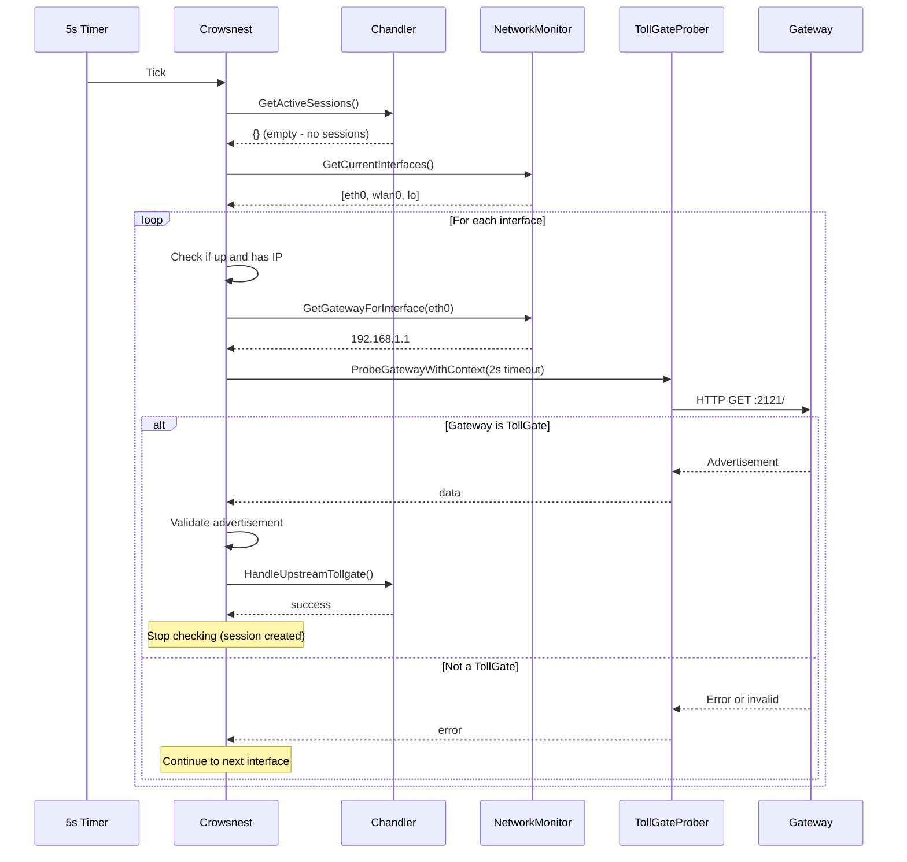
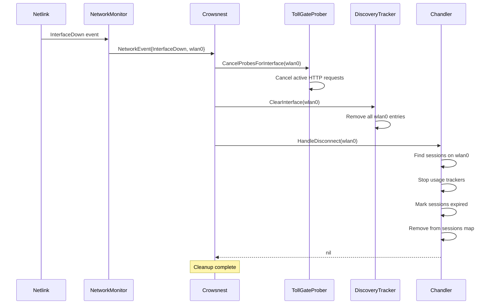

# Crowsnest - Network Detection & TollGate Discovery

## Overview

The `crowsnest` module is responsible for monitoring network interface changes and discovering upstream TollGate devices. It acts as the bridge between network connectivity (managed by [`wireless_gateway_manager`](wireless_gateway_manager.md) or physical connections) and session management (handled by [`chandler`](chandler.md)).

**Key Responsibilities**:
- Monitor network interface state changes via netlink
- Detect new network connections (WiFi and wired)
- Probe gateways for TollGate advertisements
- Validate TollGate advertisements
- Hand off validated upstream TollGates to chandler
- Notify chandler of disconnections

## Component Architecture



## Behavioral Flow Descriptions

### 1. Network Monitoring via Netlink

**Trigger**: System netlink events (interface state changes)

**Purpose**: Detect when network interfaces come up, go down, or change state

**Flow**:
1. NetworkMonitor subscribes to netlink socket events
2. Listens for interface updates, route changes, address changes
3. Filters events to relevant types:
   - InterfaceUp: Interface becomes active
   - InterfaceDown: Interface becomes inactive
   - AddressAdded: IP address assigned to interface
   - AddressDeleted: IP address removed from interface
4. Extracts interface information (name, MAC, IP addresses, state)
5. Determines gateway IP for the interface
6. Creates NetworkEvent with all relevant data
7. Sends event to crowsnest event loop

**State Changes**:
- NetworkEvent queued for processing
- Interface information captured at event time

**Key Data Extracted**:
- Interface name (e.g., "wlan0", "eth0")
- MAC address
- IP addresses
- Gateway IP
- Interface flags (up, loopback, point-to-point)

### 2. Initial Interface Scan on Startup

**Trigger**: Crowsnest starts (after 2-second delay)

**Purpose**: Auto-discover TollGates on already-connected interfaces after reboot

**Flow**:
1. Wait 2 seconds for system initialization
2. Get list of all current network interfaces
3. For each interface:
   - Check if interface is up
   - Check if interface has IP addresses
   - Get gateway IP for interface
   - If gateway exists, attempt TollGate discovery
4. Discovery attempts run asynchronously (goroutines)

**Rationale**: After reboot, interfaces may already be connected before crowsnest starts. Without this scan, those connections wouldn't trigger discovery.

**State Changes**:
- Multiple discovery attempts initiated
- Discovery tracker populated with attempts

### 3. Periodic Upstream Check

**Trigger**: Timer tick every 5 seconds

**Purpose**: Continuously check for upstream TollGates when no active sessions exist

**Flow**:
1. Check if chandler is set
2. Get active sessions from chandler
3. If active sessions exist, skip check (already connected)
4. If no active sessions:
   - Get all current network interfaces
   - For each up interface with IP and gateway:
     - Probe gateway with short timeout (2 seconds)
     - Validate advertisement if received
     - Hand off to chandler if valid
     - Stop checking after first successful session creation

**Rationale**: Provides recovery mechanism if initial discovery failed or session expired

**State Changes**:
- May create new session via chandler
- Stops checking once session created

**Key Limitation**: Only runs when NO active sessions exist

### 4. TollGate Discovery Process

**Trigger**: Interface up event, address added event, or periodic check

**Purpose**: Determine if gateway is a TollGate and obtain advertisement

**Flow**:
1. Check discovery tracker: should we attempt discovery?
   - Skip if recently attempted (prevents duplicates)
   - Skip if already successful for this interface/gateway
2. Record discovery attempt as "pending"
3. Create context with discovery timeout (from config)
4. Probe gateway on port 2121 via HTTP GET
5. Receive response data (should be JSON)
6. Validate advertisement:
   - Parse as Nostr event
   - Verify event structure
   - Check event kind (must be 10021)
   - Verify signature
7. If valid:
   - Create UpstreamTollgate object
   - Record discovery as "success"
   - Hand off to chandler
8. If invalid or error:
   - Record appropriate failure reason
   - Log error
   - Do not hand off to chandler

**State Changes**:
- Discovery tracker updated with attempt and result
- UpstreamTollgate object created on success
- Chandler notified on success

**Timeout Handling**:
- Discovery timeout configurable (default: 300s)
- Probe timeout separate (default: 10s)
- Context cancellation on timeout

### 5. Discovery Deduplication

**Trigger**: Before each discovery attempt

**Purpose**: Prevent redundant probes and respect previous results

**Logic**:
```
ShouldAttemptDiscovery(interface, gateway):
  - Check if discovery attempt exists for this interface+gateway
  - If no previous attempt: return true (attempt)
  - If previous attempt was successful: return false (skip)
  - If previous attempt was recent (< timeout): return false (skip)
  - If previous attempt was old: return true (retry)
```

**Tracking Data**:
- Interface name + Gateway IP (composite key)
- Attempt timestamp
- Result (pending, success, error, validation failed)

**Cleanup**:
- Tracker cleaned up on interface down
- Old entries expire after timeout period

### 6. Handoff to Chandler

**Trigger**: Valid TollGate advertisement discovered

**Purpose**: Transfer upstream TollGate information to session manager

**Flow**:
1. Create UpstreamTollgate object with:
   - Interface name
   - MAC address
   - Gateway IP
   - Advertisement event
   - Discovery timestamp
2. Call `chandler.HandleUpstreamTollgate(upstream)`
3. Log success or error
4. Chandler takes over session management

**Data Passed**:
```go
type UpstreamTollgate struct {
    InterfaceName string
    MacAddress    string
    GatewayIP     string
    Advertisement *nostr.Event
    DiscoveredAt  time.Time
}
```

**Error Handling**:
- If chandler returns error, log but don't retry
- Discovery marked as successful regardless (advertisement was valid)
- Chandler responsible for session creation retry logic

### 7. Disconnection Handling

**Trigger**: InterfaceDown or AddressDeleted netlink event

**Purpose**: Clean up state and notify chandler of lost connectivity

**Flow**:
1. Receive interface down or address deleted event
2. Cancel any active probes for this interface
3. Clear discovery tracker for this interface (allows re-discovery)
4. Call `chandler.HandleDisconnect(interfaceName)`
5. Chandler cleans up sessions on that interface

**State Changes**:
- Active probes cancelled
- Discovery tracker cleared for interface
- Chandler sessions terminated

**Rationale**: 
- Clearing tracker allows re-discovery when interface comes back up
- Chandler needs notification to stop usage tracking and clean up

## Sequence Diagrams

### Complete Discovery Flow (Wired Connection)



### WiFi Connection Discovery Flow



### Periodic Check Recovery Flow



### Disconnection Flow



## Events Sent to Other Components

### To Chandler

| Event | Trigger | Data Passed | Purpose |
|-------|---------|-------------|---------|
| `HandleUpstreamTollgate()` | Valid TollGate discovered | UpstreamTollgate object | Initiate session creation |
| `HandleDisconnect()` | Interface down/address deleted | Interface name | Clean up sessions |

### From NetworkMonitor (Internal)

| Event | Trigger | Data | Purpose |
|-------|---------|------|---------|
| InterfaceUp | Interface becomes active | NetworkEvent | Trigger discovery |
| InterfaceDown | Interface becomes inactive | NetworkEvent | Trigger cleanup |
| AddressAdded | IP assigned | NetworkEvent | Trigger discovery |
| AddressDeleted | IP removed | NetworkEvent | Trigger cleanup |

## Edge Cases & State Issues

### Issue 1: Discovery Deduplication Prevents Retry After Failure

**Scenario**: Initial probe fails due to temporary network issue, but gateway is actually a TollGate

**Root Cause**:
- Discovery attempt recorded as "error"
- `ShouldAttemptDiscovery()` returns false for same interface/gateway
- No retry mechanism for failed discoveries
- Only way to retry is interface down/up cycle

**Current Behavior**:
- Interface connected to TollGate
- Discovery tracker shows "error" result
- No session created
- Periodic check won't help (uses same discovery tracker)
- Device stuck in "connected but not paying" state

**Detection**:
```bash
# Check interface is up
ip link show wlan0  # state UP

# Check gateway reachable
ping -c 1 10.0.0.1  # success

# Check TollGate advertisement manually
curl http://10.0.0.1:2121/  # returns valid advertisement

# Check crowsnest logs
logread | grep crowsnest  # Shows "Failed to probe gateway"

# Check discovery tracker (would need debug endpoint)
# Shows: {interface: wlan0, gateway: 10.0.0.1, result: error}
```

**Potential Fixes**:
1. Implement time-based retry for failed discoveries
2. Clear "error" discoveries after timeout (e.g., 5 minutes)
3. Add manual retry trigger via CLI
4. Distinguish between "not a TollGate" and "temporary error"
5. Periodic check could bypass discovery tracker for retry

**Recommended Fix**:
```go
// In DiscoveryTracker.ShouldAttemptDiscovery()
if attempt.Result == DiscoveryResultError {
    // Retry errors after 5 minutes
    if time.Since(attempt.AttemptTime) > 5*time.Minute {
        return true
    }
}
```

### Issue 2: Missed Netlink Events

**Scenario**: Interface state changes but crowsnest doesn't receive netlink event

**Root Cause**:
- Netlink socket buffer overflow
- Event processing delay
- System under heavy load
- Netlink subscription issues

**Current Behavior**:
- Interface connected but no InterfaceUp event
- No discovery triggered
- No session created
- Periodic check might eventually discover (if no other sessions)

**Detection**:
- Interface shows as connected in system
- No corresponding crowsnest log entry
- No discovery attempt logged
- Time gap between connection and discovery

**Potential Fixes**:
1. Increase netlink socket buffer size
2. Add event queue monitoring
3. Implement periodic interface state polling as backup
4. Add health check for netlink subscription
5. Log dropped events for monitoring

### Issue 3: Periodic Check Only Runs When No Sessions

**Scenario**: Session expires but interface stays connected

**Root Cause**:
- Periodic check: `if len(activeSessions) > 0 { return }`
- Expired/paused sessions still in sessions map
- Check won't run until sessions removed
- No automatic session recreation

**Current Behavior**:
- Session expired or paused
- Interface still connected to TollGate
- Periodic check doesn't run
- No new session created
- Device connected but not paying

**Detection**:
```bash
# Check session status
tollgate-cli network status  # Shows expired/paused session

# Check interface
ip link show wlan0  # UP

# Check gateway
ping 10.0.0.1  # Success

# Periodic check not running (no logs)
```

**Potential Fixes**:
1. Change check to: `if len(activeSessionsWithStatusActive) > 0`
2. Add session health monitoring
3. Implement automatic cleanup of expired sessions
4. Add session recreation logic
5. Separate periodic discovery from session status

**Recommended Fix**:
```go
// In periodicUpstreamCheck()
activeSessions := cs.chandler.GetActiveSessions()
hasActiveSession := false
for _, session := range activeSessions {
    if session.Status == SessionActive {
        hasActiveSession = true
        break
    }
}
if hasActiveSession {
    return // Skip check
}
// Continue with check...
```

### Issue 4: Race Condition on Interface State Change

**Scenario**: Multiple rapid interface state changes cause race conditions

**Root Cause**:
- InterfaceDown followed quickly by InterfaceUp
- Discovery attempt started before cleanup completes
- Probe cancellation races with new probe
- Discovery tracker state inconsistent

**Current Behavior**:
- Unpredictable behavior
- May have duplicate discovery attempts
- May miss discovery
- Logs show overlapping operations

**Detection**:
- Rapid interface state changes in logs
- Concurrent probe attempts
- Discovery tracker inconsistencies
- Error logs about cancelled contexts

**Potential Fixes**:
1. Add mutex around discovery operations
2. Implement operation queue per interface
3. Add debouncing for rapid state changes
4. Wait for cleanup completion before new discovery
5. Use atomic operations for tracker updates

### Issue 5: Advertisement Validation Failure

**Scenario**: Gateway returns data but validation fails

**Root Cause**:
- Invalid JSON format
- Invalid Nostr event structure
- Signature verification fails
- Wrong event kind
- Corrupted data

**Current Behavior**:
- Discovery marked as "validation failed"
- No retry (same as error case)
- No session created
- Logged as warning

**Detection**:
```bash
# Check logs
logread | grep "Invalid TollGate advertisement"

# Manual validation
curl http://10.0.0.1:2121/ | jq .

# Check discovery tracker
# Shows: result = DiscoveryResultValidationFailed
```

**Potential Fixes**:
1. Add detailed validation error logging
2. Distinguish between permanent and temporary validation failures
3. Retry validation failures after delay
4. Add validation bypass for testing
5. Implement advertisement health check

### Issue 6: Chandler Handoff Failure

**Scenario**: Advertisement valid but chandler rejects it

**Root Cause**:
- Trust policy rejection
- Budget constraints
- Insufficient balance
- Chandler internal error

**Current Behavior**:
- Discovery marked as "success" (advertisement was valid)
- Chandler returns error
- Error logged but no retry
- No session created
- Discovery tracker prevents retry

**Detection**:
```bash
# Check crowsnest logs
logread | grep "Successfully handed off"  # Not present

# Check chandler logs
logread | grep chandler | grep -i error

# Discovery tracker shows success
# But no active session
```

**Potential Fixes**:
1. Distinguish between discovery success and session creation success
2. Add retry mechanism in chandler
3. Implement session creation monitoring
4. Add health check for session creation
5. Separate discovery tracking from session tracking

**Recommended Approach**:
- Discovery tracker tracks advertisement validity
- Separate session tracker tracks session creation
- Retry session creation independently of discovery

### Issue 7: Initial Scan Timing

**Scenario**: Initial scan runs before interfaces fully initialized

**Root Cause**:
- 2-second delay may not be sufficient
- DHCP may not have completed
- Gateway not yet reachable
- DNS not yet configured

**Current Behavior**:
- Initial scan finds interfaces
- But gateways not yet available
- Discovery attempts fail
- Must wait for next trigger (address added event or periodic check)

**Detection**:
- Startup logs show initial scan
- But no successful discoveries
- Later logs show successful discovery
- Time gap between startup and first session

**Potential Fixes**:
1. Increase initial delay
2. Wait for gateway reachability
3. Retry initial scan if no discoveries
4. Add readiness check before scan
5. Make delay configurable

### Issue 8: Startup with Existing Connection and Unknown Session State

**Scenario**: TollGate starts/restarts while already connected to upstream, but doesn't know if session exists

**Root Cause**:
- System reboot or TollGate restart
- Interface already connected to upstream TollGate
- May have active session on upstream (from before restart)
- May have no session (session expired)
- No way to know session state without checking

**Current Behavior**:
- Initial scan discovers interface and gateway
- Probes gateway, gets advertisement
- Chandler creates NEW session (new payment)
- If old session existed, it's abandoned (wasted payment)
- If old session didn't exist, correct behavior

**Detection**:
```bash
# After restart, check if already connected
ip link show wlan0  # UP
ip route | grep default  # Shows gateway

# Check upstream for session
curl http://[gateway_ip]:2121/usage
# Returns: "1234567/10485760" (session exists)
# OR: "-1/-1" (no session)

# But crowsnest/chandler doesn't check this before creating new session
```

**Impact**:
- Potential double payment (old session + new session)
- Wasted funds if old session still valid
- No session recovery mechanism
- Lost session state on restart

**Potential Fixes**:
1. **Check `:2121/usage` before creating session**:
```go
// In chandler.HandleUpstreamTollgate()
// Before creating payment, check if session exists
resp, err := http.Get(fmt.Sprintf("http://%s:2121/usage", upstream.GatewayIP))
if err == nil {
    body, _ := io.ReadAll(resp.Body)
    parts := strings.Split(strings.TrimSpace(string(body)), "/")
    if len(parts) == 2 && parts[0] != "-1" {
        // Session exists! Try to recover it
        usage, _ := strconv.ParseUint(parts[0], 10, 64)
        allotment, _ := strconv.ParseUint(parts[1], 10, 64)
        // Create session object from existing session
        // Start usage tracker with current usage
        return nil
    }
}
// No session or error, proceed with new payment
```

2. **Implement session persistence**:
   - Store session metadata to disk
   - On startup, check for stored sessions
   - Validate sessions still active via `:2121/usage`
   - Resume tracking if valid

3. **Add session recovery flow**:
   - Query upstream for session state
   - Recover session if still valid
   - Only create new session if needed

**Recommended Approach**:
- Always check `:2121/usage` before creating new session
- If returns valid usage/allotment, recover session
- If returns -1/-1, create new session
- Prevents double payment and enables session recovery

### Issue 9: Advertisement Changes Not Detected

**Scenario**: Upstream changes advertisement (pricing, terms) but chandler uses stale data

**Root Cause**:
- Advertisement fetched once during discovery
- Stored in session object
- Never refreshed during session lifetime
- Upstream may change pricing, mints, or terms
- Chandler uses old advertisement for renewals

**Current Behavior**:
- Advertisement fetched at discovery time
- Stored in `ChandlerSession.Advertisement`
- Used for all renewal decisions
- If upstream changes advertisement:
  - Chandler logs warning during renewal
  - Continues with old pricing
  - May cause renewal failure if incompatible

**Detection**:
```bash
# Check logs for advertisement change warnings
logread | grep "WARNING: Upstream advertisement changed"

# Manually check if advertisement changed
curl http://[gateway_ip]:2121/  # Current advertisement
# Compare with stored advertisement in session
```

**Impact**:
- Using outdated pricing information
- Renewal failures if pricing incompatible
- Missing new mint options
- No awareness of upstream changes

**Potential Fixes**:
1. **Periodic advertisement polling**:
```go
// In chandler or usage tracker
func (c *Chandler) pollAdvertisement(session *ChandlerSession) {
    ticker := time.NewTicker(60 * time.Second)
    for range ticker.C {
        // Fetch fresh advertisement
        data, err := http.Get(fmt.Sprintf("http://%s:2121/", session.UpstreamTollgate.GatewayIP))
        if err != nil {
            continue // Temporary connectivity issue
        }
        
        // Validate and parse
        newAd, err := tollgate_protocol.ValidateAdvertisementFromBytes(data)
        if err != nil {
            continue
        }
        
        // Compare with stored advertisement
        if advertisementChanged(session.Advertisement, newAd) {
            // Update session with new advertisement
            session.Advertisement = newAd
            session.AdvertisementInfo, _ = tollgate_protocol.ExtractAdvertisementInfo(newAd)
            // Re-evaluate pricing compatibility
            // Log change
        }
    }
}
```

2. **Fetch fresh advertisement before renewal**:
   - Before each renewal, fetch current advertisement
   - Validate still compatible
   - Update session if changed
   - Fail renewal if incompatible

3. **Advertisement change notifications**:
   - Upstream could provide change notification mechanism
   - Chandler subscribes to changes
   - Proactive update on change

**Recommended Approach**:
- Poll advertisement every 60 seconds
- Update session if changed
- Re-evaluate compatibility
- Also helps overcome temporary connectivity issues (if probe failed but connection still valid)

**Additional Benefit**:
- Periodic polling can detect if upstream is still reachable
- Can recover from temporary network issues
- Provides health check for upstream connection

## Integration with Other Components

### Relationship with wireless_gateway_manager

**Connection**: Indirect via netlink events

**Flow**:
```
wireless_gateway_manager connects to WiFi
  → UCI/wifi reload
    → Interface down/up
      → Netlink events
        → crowsnest receives events
          → Discovery triggered
```

**Gap**: No direct communication

**Issue**: If netlink events missed, discovery doesn't happen

### Relationship with Chandler

**Connection**: Direct function calls

**Flow**:
```
crowsnest discovers TollGate
  → crowsnest.HandleUpstreamTollgate()
    → chandler.HandleUpstreamTollgate()
      → Session creation begins

crowsnest detects disconnect
  → crowsnest.HandleDisconnect()
    → chandler.HandleDisconnect()
      → Session cleanup
```

**Dependency**: Crowsnest must have chandler set before handoff

**Error Handling**: Chandler errors logged but not retried

## Configuration

### Crowsnest Config

```json
{
  "crowsnest": {
    "monitoring_interval": "5s",
    "probe_timeout": "10s",
    "probe_retry_count": 3,
    "probe_retry_delay": "2s",
    "require_valid_signature": true,
    "log_level": "INFO",
    "ignore_interfaces": ["lo", "docker0"],
    "only_interfaces": [],
    "discovery_timeout": "300s"
  }
}
```

**Key Parameters**:
- `monitoring_interval`: How often to check network state (not currently used)
- `probe_timeout`: HTTP request timeout for gateway probe
- `discovery_timeout`: Overall timeout for discovery attempt
- `ignore_interfaces`: Interfaces to skip (loopback, docker, etc.)

---

## Technical Implementation Details

### Key Functions

#### Start()
```go
func (cs *crowsnest) Start() error
```

**Purpose**: Initialize and start crowsnest monitoring

**Operations**:
1. Start network monitor (netlink subscription)
2. Start event loop goroutine
3. Start periodic check goroutine
4. Trigger initial interface scan

**Call Path**:
```
main.initCrowsnest()
  → crowsnest.Start()
    → networkMonitor.Start()
    → go eventLoop()
    → go periodicUpstreamCheck()
    → go performInitialInterfaceScan()
```

#### eventLoop()
```go
func (cs *crowsnest) eventLoop()
```

**Purpose**: Main event processing loop

**Operations**:
1. Listen on network monitor events channel
2. Process each event via handleNetworkEvent()
3. Stop on stopChan signal

**Runs**: Continuously in goroutine until Stop() called

#### attemptTollGateDiscovery()
```go
func (cs *crowsnest) attemptTollGateDiscovery(interfaceName, macAddress, gatewayIP string)
```

**Purpose**: Core discovery logic

**Call Path**:
```
attemptTollGateDiscovery()
  → discoveryTracker.ShouldAttemptDiscovery()
  → discoveryTracker.RecordDiscovery(pending)
  → tollGateProber.ProbeGatewayWithContext()
  → tollgate_protocol.ValidateAdvertisementFromBytes()
  → discoveryTracker.RecordDiscovery(success/error)
  → chandler.HandleUpstreamTollgate()
```

**Key Operations**:
1. Check if should attempt
2. Record as pending
3. Probe gateway
4. Validate response
5. Create UpstreamTollgate
6. Record result
7. Hand off to chandler

#### periodicUpstreamCheck()
```go
func (cs *crowsnest) periodicUpstreamCheck()
```

**Purpose**: Backup discovery mechanism

**Runs**: Every 5 seconds in goroutine

**Operations**:
1. Check if chandler set
2. Get active sessions
3. If no sessions, scan interfaces
4. Probe each gateway
5. Hand off first valid TollGate found

**Limitation**: Only runs when no active sessions

### Data Structures

#### NetworkEvent
```go
type NetworkEvent struct {
    Type          EventType
    InterfaceName string
    InterfaceInfo *InterfaceInfo
    GatewayIP     string
    Timestamp     time.Time
}
```

#### DiscoveryAttempt
```go
type DiscoveryAttempt struct {
    InterfaceName string
    GatewayIP     string
    AttemptTime   time.Time
    Result        DiscoveryResult
}
```

#### DiscoveryResult
```go
const (
    DiscoveryResultPending DiscoveryResult = iota
    DiscoveryResultSuccess
    DiscoveryResultNotTollGate
    DiscoveryResultValidationFailed
    DiscoveryResultError
)
```

### Netlink Event Types

```go
const (
    EventInterfaceUp EventType = iota
    EventInterfaceDown
    EventRouteDeleted
    EventAddressAdded
    EventAddressDeleted
)
```

**Handled Events**:
- InterfaceUp → Trigger discovery
- InterfaceDown → Trigger cleanup
- AddressAdded → Trigger discovery
- AddressDeleted → Trigger cleanup
- RouteDeleted → Currently not handled