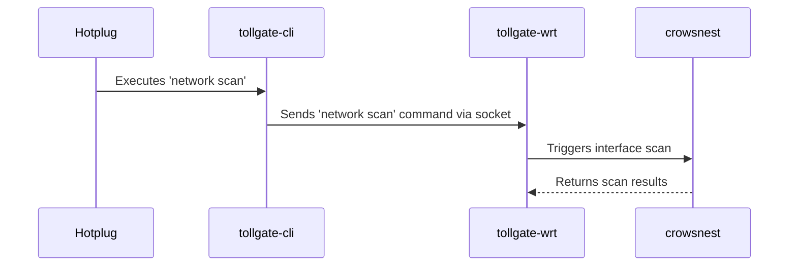

# Hotplug Improvement Plan

## Problem

The current hotplug script (`95-tollgate-restart`) is designed to run only once when a `wan` or `wwan` interface comes up. It creates a flag file (`/tmp/tollgate_initial_restart_done`) to prevent subsequent executions. This causes an issue when the network connection switches from a wired `wan` to a wireless `wwan` interface, as the `tollgate-wrt` service is not restarted or notified to adapt to the new network configuration. This leads to a failure in router-to-router payments over the wireless link.

## Proposed Solution

To address this, we will implement a more robust and graceful mechanism for handling network interface changes. Instead of a full service restart, the hotplug script will send a command to the running `tollgate-wrt` service to trigger a re-scan of network interfaces.

This will be accomplished with the following changes:

1.  **Extend CLI Server:**
    *   A new command, `network scan`, will be added to the `tollgate-cli`.
    *   This command will instruct the `crowsnest` module to perform a new scan for TollGate advertisements on the current network interfaces.

2.  **Modify Hotplug Script:**
    *   The `95-tollgate-restart` script will be updated to call `tollgate-cli network scan` whenever a `wan` or `wwan` interface comes up.
    *   The logic for restarting the `tollgate-wrt` service will be removed.

3.  **Remove Flag File Logic:**
    *   The use of the `/tmp/tollgate_initial_restart_done` flag file will be removed from the hotplug script, allowing it to run every time the relevant interfaces come up.

## Diagram

This approach ensures that the `tollgate-wrt` service can dynamically adapt to network changes without the disruption of a full restart, leading to more reliable operation in scenarios with multiple WAN interfaces.