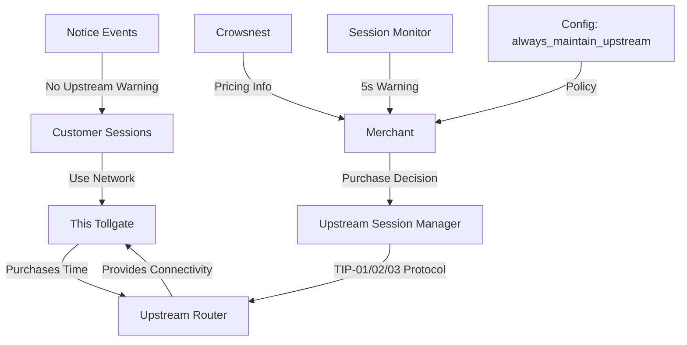
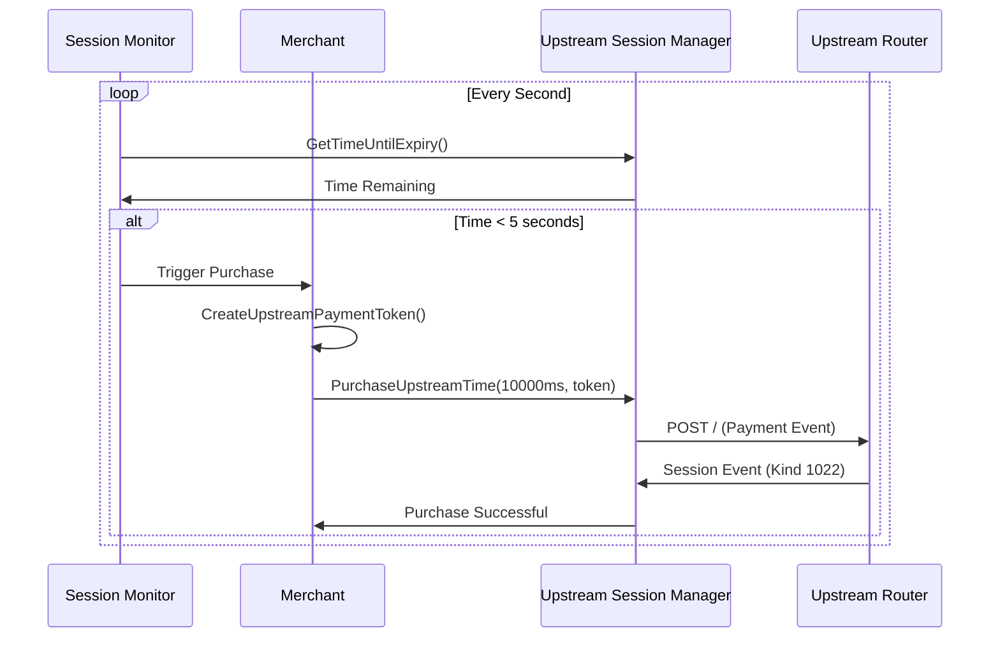
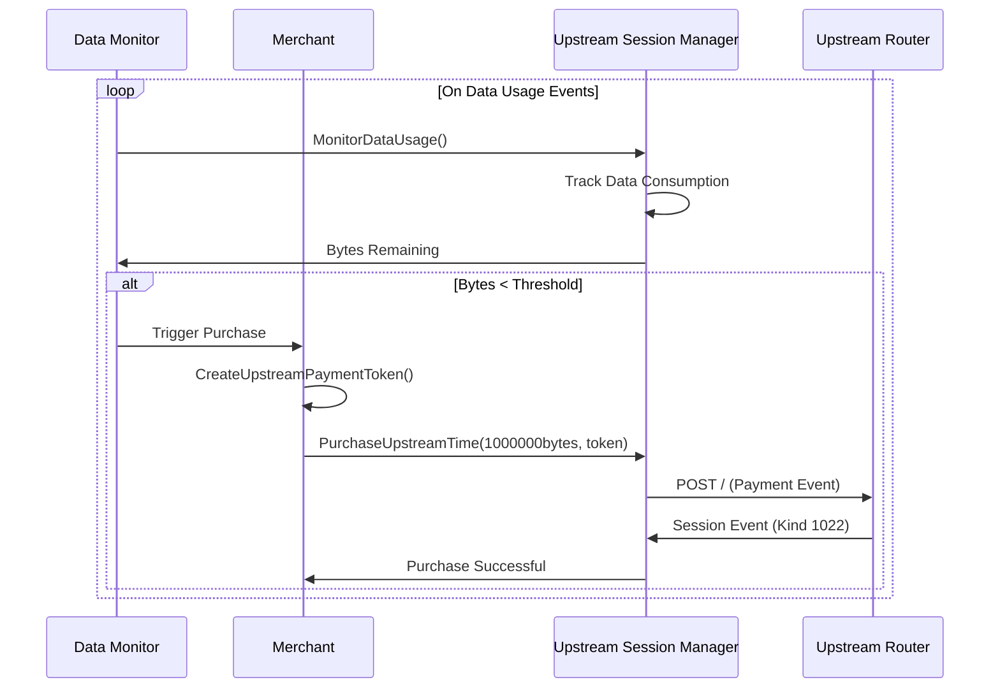
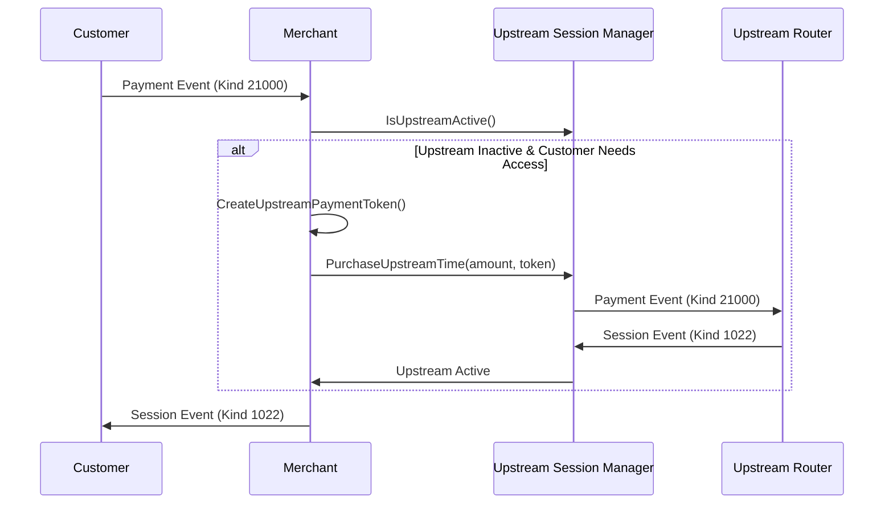
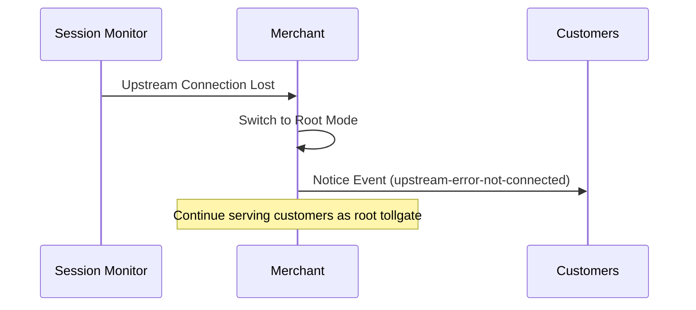

# Upstream Router Purchasing Feature - Implementation Plan

## Overview
This document outlines the implementation plan for adding upstream router purchasing capability to the tollgate system. This feature enables tollgates to buy network connectivity time (or data allowance) from upstream routers, creating a hierarchical network topology.

## Key Concepts

### Upstream Connection Model
- **Upstream Session**: When a tollgate purchases time from an upstream router, it buys network connectivity for itself
- **Customer Independence**: The number of customers using the tollgate doesn't affect the upstream session duration/data allowance
- **Shared Infrastructure**: All customers benefit from the single upstream connection during its active period
- **Metric Flexibility**: Designed to support both time-based (milliseconds) and data-based (bytes) upstream purchasing

### Example Scenario
- Tollgate purchases 60 seconds (or 1GB of data) from upstream router
- During that period/allowance, any number of customers (1, 100, or 500) can use the network through this tollgate
- After the time expires or data is consumed, the tollgate loses upstream connectivity unless renewed

## Architecture Components



## In-Scope Components

### 1. Crowsnest Module (Detection & Pricing)
**Responsibility**: Once connected to an upstream, gather and provide pricing information to merchant

**Location**: `src/crowsnest/`

**Key Functions**:
```go
// DiscoverUpstreamRouter dynamically discovers upstream router IP address
func DiscoverUpstreamRouter() (string, error)

// GetUpstreamPricing retrieves pricing information from discovered upstream
func GetUpstreamPricing(upstreamURL string) (*UpstreamPricing, error)

// GetUpstreamAdvertisement fetches the advertisement event (Kind 10021)
func GetUpstreamAdvertisement(upstreamURL string) (*nostr.Event, error)

// MonitorUpstreamConnection checks if upstream is still available
func MonitorUpstreamConnection() error
```

**Protocol Implementation**:
- TIP-03: GET / endpoint to retrieve advertisement
- TIP-01: Parse Kind 10021 events for pricing structure
- TIP-02: Extract Cashu payment configuration

### 2. Merchant Module (Enhanced)
**Responsibility**: Make purchase decisions and coordinate upstream purchases

**Enhanced Functions**:
```go
// CheckUpstreamRequired determines if upstream purchase is needed
func (m *Merchant) CheckUpstreamRequired() bool

// CalculateUpstreamPurchase determines optimal purchase amount
func (m *Merchant) CalculateUpstreamPurchase(upstreamPricing *UpstreamPricing) (uint64, error)

// CreateUpstreamPaymentToken creates payment token from merchant's wallet for upstream purchase
func (m *Merchant) CreateUpstreamPaymentToken(amount uint64, mintURL string) (string, error)

// TriggerUpstreamPurchase initiates purchase through session manager with merchant-provided token
func (m *Merchant) TriggerUpstreamPurchase() error

// HandleUpstreamLoss manages fallback when upstream connection fails
func (m *Merchant) HandleUpstreamLoss() error
```

**Purchase Decision Logic**:
- **Always Maintain Mode (Time)**: Purchase 5 seconds before current upstream session expires
- **Always Maintain Mode (Bytes)**: Purchase when remaining bytes drop below threshold
- **On-Demand Mode**: Only purchase when active customer sessions require upstream access
- **Amount Calculation**: Respect upstream router's `step_size` and `min_purchase_steps`
- **Metric-Specific Monitoring**: Time-based uses countdown timers, byte-based uses data consumption tracking

### 3. Upstream Session Manager (New Helper)
**Responsibility**: Execute upstream purchases and track upstream session state

**Location**: `src/upstream_session_manager/`

**Key Functions**:
```go
// PurchaseUpstreamTime executes payment to upstream router using tokens from merchant
func (usm *UpstreamSessionManager) PurchaseUpstreamTime(amount uint64, paymentToken string) (*nostr.Event, error)

// GetUpstreamSessionInfo returns current upstream session details
func (usm *UpstreamSessionManager) GetUpstreamSessionInfo() (*UpstreamSession, error)

// IsUpstreamActive checks if upstream session is still valid
func (usm *UpstreamSessionManager) IsUpstreamActive() bool

// GetTimeUntilExpiry returns time until upstream session expires (time-based metrics only)
func (usm *UpstreamSessionManager) GetTimeUntilExpiry() (uint64, error) // returns milliseconds remaining

// GetBytesRemaining returns bytes remaining in upstream session (data-based metrics only)
func (usm *UpstreamSessionManager) GetBytesRemaining() (uint64, error) // returns bytes remaining

// GetCurrentMetric returns the metric type of the upstream session ("milliseconds" or "bytes")
func (usm *UpstreamSessionManager) GetCurrentMetric() (string, error)

// MonitorDataUsage tracks data consumption for byte-based upstream sessions
func (usm *UpstreamSessionManager) MonitorDataUsage() error
```

**Protocol Implementation**:
- TIP-03: POST / with payment events (Kind 21000)
- TIP-01: Handle session responses (Kind 1022)
- TIP-01: Process notice events (Kind 21023) for errors

## Configuration Changes

### New Upstream Configuration Section
```json
{
  "upstream_config": {
    "enabled": true,
    "always_maintain_upstream_connection": false,
    "preferred_purchase_amount_ms": 10000,
    "preferred_purchase_amount_bytes": 1000000,
    "purchase_trigger_buffer_ms": 5000,
    "purchase_trigger_buffer_bytes": 100000,
    "retry_attempts": 3,
    "retry_backoff_seconds": 5
  }
}
```

**Configuration Options**:
- `enabled`: Enable/disable upstream purchasing
- `always_maintain_upstream_connection`: Continuous vs on-demand purchasing
- `preferred_purchase_amount_ms`: Desired purchase amount for time-based upstream (subject to upstream constraints)
- `preferred_purchase_amount_bytes`: Desired purchase amount for byte-based upstream (subject to upstream constraints)
- `purchase_trigger_buffer_ms`: How many ms before expiry to trigger purchase (time-based)
- `purchase_trigger_buffer_bytes`: How many bytes remaining to trigger purchase (byte-based)
- `retry_attempts`: Number of retry attempts for failed purchases
- `retry_backoff_seconds`: Delay between retry attempts

**Note**: The upstream router IP address is dynamically discovered by the crowsnest module rather than configured statically.

## Implementation Flows

### Flow 1: Upstream Session Monitoring (Always Maintain Mode - Time)


### Flow 1b: Upstream Session Monitoring (Always Maintain Mode - Bytes)


### Flow 2: Customer Payment with Upstream Check (On-Demand Mode)


### Flow 3: Upstream Connection Loss


## Error Handling

### Upstream Purchase Failures
- **Retry Logic**: Exponential backoff with configurable attempts
- **Fallback**: Switch to root tollgate mode
- **Customer Notification**: Send notice events with code `upstream-error-not-connected`

### Upstream Detection Failures
- **Continue Operation**: Operate as root tollgate
- **Logging**: Log errors for manual intervention
- **Configuration**: Mark upstream as unavailable

### Invalid Upstream Responses
- **Validation**: Verify session event structure and signatures
- **Error Codes**: Map upstream errors to appropriate notice events
- **Recovery**: Attempt reconnection or fallback to root mode

## Testing Strategy

### Unit Testing
- Crowsnest pricing detection and parsing
- Upstream session manager purchase logic
- Merchant decision-making algorithms
- Configuration validation

### Integration Testing
- End-to-end upstream purchase flow
- Customer session with upstream dependency
- Failover scenarios (upstream loss)
- Multiple concurrent customer sessions

### Protocol Compliance Testing
- TIP-01 advertisement parsing
- TIP-02 Cashu payment creation
- TIP-03 HTTP endpoint interaction
- Event signature validation

## Implementation Phases

### Phase 1: Foundation (Weeks 1-2)
1. Create crowsnest module structure with dynamic IP discovery
2. Implement upstream advertisement parsing (TIP-01) with metric flexibility
3. Add upstream configuration to config_manager (without static upstream_url)
4. Create basic upstream session manager with metric-agnostic design

### Phase 2: Purchase Logic (Weeks 3-4)
1. Implement payment token creation in merchant (TIP-02)
2. Add HTTP client for upstream communication (TIP-03)
3. Create merchant purchase decision logic with wallet integration
4. Implement separate monitoring systems: time-based countdown and data-based consumption tracking

### Phase 3: Integration (Weeks 5-6)
1. Integrate crowsnest dynamic discovery with merchant
2. Connect upstream session manager to merchant token flow
3. Add configuration-driven behavior (always_maintain vs on-demand)
4. Implement error handling and fallback

### Phase 4: Testing & Polish (Weeks 7-8)
1. Comprehensive testing suite for both time-based and data-based scenarios with different monitoring approaches
2. Error scenario testing including wallet failures
3. Performance optimization for token generation
4. Documentation and examples for both metrics

## File Structure

```
src/
├── crowsnest/
│   ├── crowsnest.go
│   ├── crowsnest_test.go
│   ├── pricing.go
│   ├── go.mod
│   ├── go.sum
│   └── HLDD.md
├── upstream_session_manager/
│   ├── upstream_session_manager.go
│   ├── upstream_session_manager_test.go
│   ├── session.go
│   ├── go.mod
│   ├── go.sum
│   └── HLDD.md
├── merchant/
│   └── merchant.go (enhanced with upstream logic)
├── config_manager/
│   └── config_manager.go (enhanced with upstream config)
└── main.go (integration point)
```

## Success Criteria

1. **Functional**: Tollgate can successfully purchase time/data from upstream routers
2. **Configurable**: Both always-maintain and on-demand modes work correctly
3. **Robust**: Handles upstream failures and wallet issues gracefully with appropriate fallbacks
4. **Protocol Compliant**: Implements TIP-01, TIP-02, and TIP-03 correctly
5. **Testable**: Comprehensive test coverage for all scenarios including metric variations
6. **Maintainable**: Clean separation of concerns between modules with merchant controlling wallet
7. **Future-Ready**: Architecture supports both milliseconds (time-based countdown) and bytes (consumption-based monitoring) metrics with appropriate monitoring strategies for each

This implementation will enable tollgates to form hierarchical networks while maintaining the existing customer-facing functionality and protocol compliance.