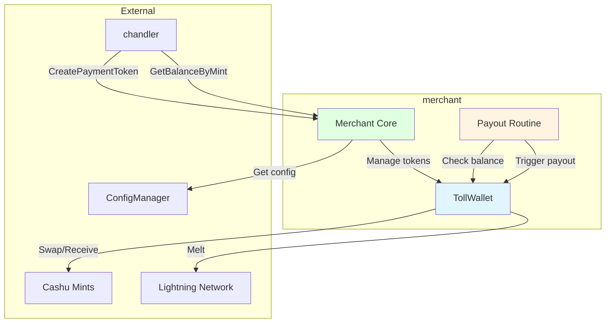
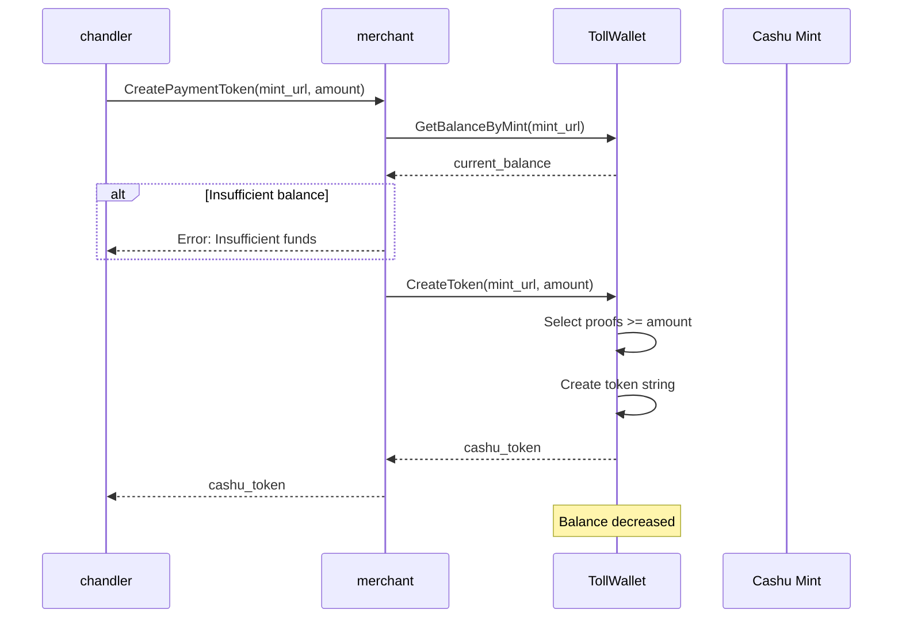
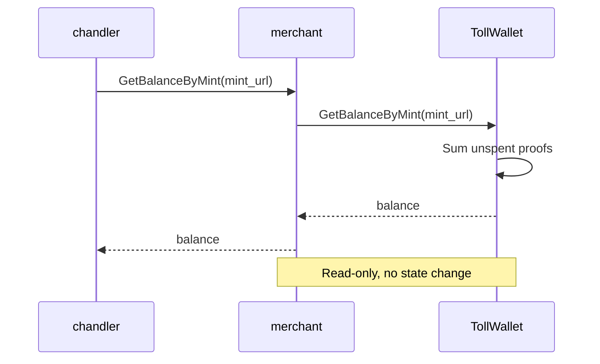
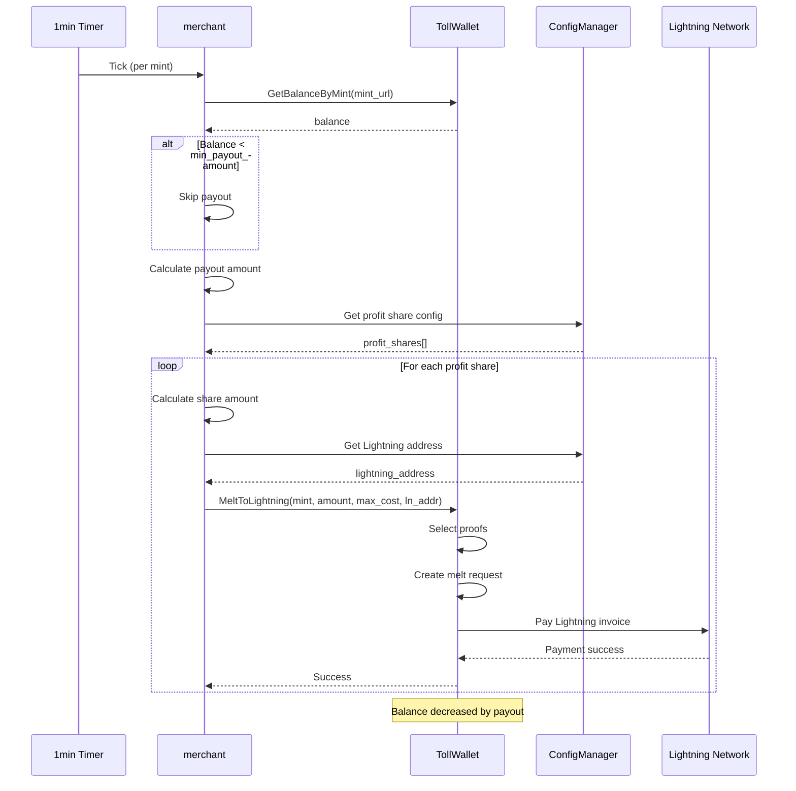
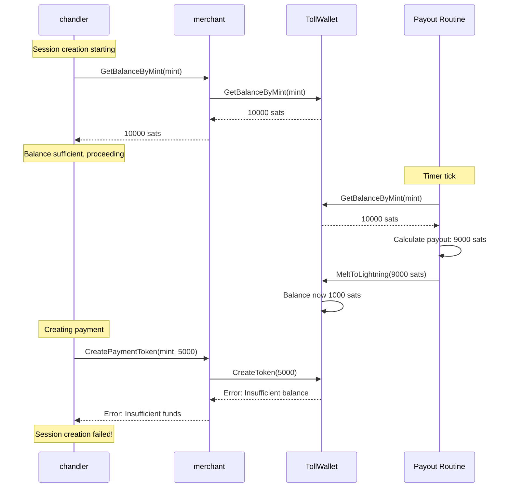

# Merchant - Wallet Provider for Upstream Payments

## Overview

The `merchant` module serves as the wallet provider for the [`chandler`](chandler.md) module when making upstream payments. While its primary purpose is managing downstream customer payments and sessions, this document focuses on its role in supporting upstream TollGate connections.

**Key Responsibilities (Upstream Context)**:
- Provide wallet functionality for chandler
- Create Cashu payment tokens for upstream payments
- Manage wallet balance across multiple mints
- Handle automatic payouts to configured recipients
- Coordinate wallet operations with chandler's payment needs

## Component Architecture



## Behavioral Flow Descriptions

### 1. Payment Token Creation for Chandler

**Trigger**: `chandler.CreatePaymentToken()` called during session creation or renewal

**Purpose**: Generate Cashu token for upstream payment

**Flow**:
1. Receive request with mint URL and amount
2. Check wallet balance for specified mint
3. If insufficient balance, return error
4. Create Cashu token from wallet:
   - Select proofs totaling requested amount
   - May include overpayment if exact amount unavailable
   - Create token string
5. Return token to chandler
6. Wallet balance decreased by token amount

**State Changes**:
- Wallet proofs consumed
- Balance decreased for mint
- Token created (not yet spent)

**Error Conditions**:
- Insufficient balance
- Mint not available
- Token creation failure

### 2. Balance Checking

**Trigger**: Chandler checks balance before payment

**Purpose**: Verify sufficient funds available

**Flow**:
1. Receive mint URL from chandler
2. Query tollwallet for balance at that mint
3. Return current balance
4. No state changes (read-only)

**Balance Calculation**:
- Sum of all unspent proofs for the mint
- Does not include pending/reserved funds
- Real-time calculation

### 3. Automatic Payout Routine

**Trigger**: Timer tick every 1 minute (per mint)

**Purpose**: Automatically pay out profits to configured recipients

**Flow**:
1. For each configured mint:
   - Get current balance
   - Check if balance >= minimum payout amount
   - If below threshold, skip
   - Calculate payout amount: `balance - min_balance`
   - For each profit share recipient:
     - Calculate share: `payout_amount * factor`
     - Get Lightning address from identities
     - Melt tokens to Lightning
     - Send to recipient's Lightning address
   - Log payout completion

**State Changes**:
- Wallet balance decreased
- Tokens melted to Lightning
- Funds sent to recipients

**Coordination Issue**: Runs independently of chandler payment needs

### 4. Wallet Funding (Receiving Tokens)

**Trigger**: Receiving Cashu tokens (from downstream customers or external sources)

**Purpose**: Add funds to wallet

**Flow**:
1. Receive Cashu token string
2. Decode token
3. Swap with mint (verify proofs not spent)
4. Store new proofs in wallet
5. Return amount received
6. Balance increased

**State Changes**:
- New proofs added to wallet
- Balance increased for mint

**Note**: This is primarily for downstream customer payments, but affects balance available for upstream payments

## Sequence Diagrams

### Payment Token Creation Flow



### Balance Check Flow



### Payout Routine Flow



### Race Condition Scenario



## Events Sent to Other Components

### To Chandler (via function returns)

| Event | Trigger | Data | Purpose |
|-------|---------|------|---------|
| Token created | `CreatePaymentToken()` | Cashu token string | Provide payment token |
| Balance returned | `GetBalanceByMint()` | Balance amount | Inform available funds |
| Error returned | Insufficient funds | Error message | Indicate payment impossible |

### From Chandler

| Event | Trigger | Data | Purpose |
|-------|---------|------|---------|
| `CreatePaymentToken()` | Payment needed | mint URL, amount | Request payment token |
| `GetBalanceByMint()` | Before payment | mint URL | Check available balance |

## Edge Cases & State Issues

### Issue 1: Race Condition Between Payout and Payment

**Scenario**: Payout routine drains wallet while chandler is creating payment

**Root Cause**:
- Payout runs every 1 minute independently
- Chandler checks balance, then creates payment
- Payout happens between check and creation
- No locking or coordination mechanism
- No fund reservation system

**Current Behavior**:
- Chandler: Balance check shows sufficient funds
- Payout: Drains wallet to minimum balance
- Chandler: Payment creation fails
- Session creation fails
- No retry mechanism

**Impact**:
- Upstream session creation fails
- Device connected but not paying
- User experience degraded
- Requires manual intervention or wait for next discovery

**Detection**:
```bash
# Check logs for timing
logread | grep -E "(chandler|merchant)" | grep -E "(balance|payout)"

# Look for pattern:
# 1. Chandler balance check: 10000 sats
# 2. Merchant payout: 9000 sats
# 3. Chandler payment creation: Error insufficient funds
```

**Potential Fixes**:

1. **Fund Reservation System** (Recommended):
```go
// In merchant
type FundReservation struct {
    MintURL   string
    Amount    uint64
    ExpiresAt time.Time
}

func (m *Merchant) ReserveFunds(mintURL string, amount uint64) error {
    // Reserve funds for 30 seconds
    // Payout routine checks reserved funds
}

func (m *Merchant) GetAvailableBalance(mintURL string) uint64 {
    total := m.GetBalanceByMint(mintURL)
    reserved := m.getReservedFunds(mintURL)
    return total - reserved
}
```

2. **Mutex Locking**:
```go
// Add mutex around balance operations
var walletMutex sync.Mutex

func (m *Merchant) CreatePaymentToken(...) {
    walletMutex.Lock()
    defer walletMutex.Unlock()
    // Create token...
}

func (m *Merchant) processPayout(...) {
    walletMutex.Lock()
    defer walletMutex.Unlock()
    // Process payout...
}
```

3. **Payout Coordination**:
```go
// Check for active sessions before payout
func (m *Merchant) processPayout(mintConfig) {
    // Check if chandler has active sessions needing this mint
    if m.chandler.HasActiveSessionsForMint(mintConfig.URL) {
        // Skip payout or reduce amount
        return
    }
    // Proceed with payout...
}
```

4. **Two-Phase Commit**:
```go
// Reserve, then commit
func (m *Merchant) CreatePaymentToken(...) {
    // Phase 1: Reserve
    reservation := m.reserveFunds(mintURL, amount)
    defer m.releaseFunds(reservation)
    
    // Phase 2: Create token
    token := m.createToken(...)
    
    // Phase 3: Commit
    m.commitReservation(reservation)
    return token
}
```

### Issue 2: Insufficient Balance for Minimum Purchase

**Scenario**: Wallet has funds but not enough for upstream minimum purchase

**Root Cause**:
- Upstream requires minimum purchase (e.g., 1000 sats)
- Wallet has 500 sats
- Chandler checks balance, sees insufficient
- Session creation fails
- No notification or alert

**Current Behavior**:
- Balance check fails
- Session creation aborted
- Error logged
- No user notification
- No automatic funding mechanism

**Detection**:
```bash
# Check chandler logs
logread | grep "Insufficient funds for minimum purchase"

# Shows:
# Required: 1000 sats
# Available: 500 sats
```

**Potential Fixes**:
1. Add balance monitoring and alerts
2. Implement automatic funding from external source
3. Add user notification for low balance
4. Support partial payments if upstream allows
5. Add balance threshold warnings

### Issue 3: Payout Timing Configuration

**Scenario**: Payout interval too frequent for usage patterns

**Root Cause**:
- Payout runs every 1 minute
- May be too frequent for low-volume usage
- Increases Lightning network fees
- May interfere with upstream payments

**Current Behavior**:
- Frequent payout attempts
- Higher transaction costs
- Potential payment conflicts
- Inefficient use of funds

**Potential Fixes**:
1. Make payout interval configurable
2. Implement adaptive payout timing
3. Coordinate with session activity
4. Add payout scheduling logic
5. Implement batch payouts

### Issue 4: Multiple Mint Balance Fragmentation

**Scenario**: Funds spread across multiple mints, none sufficient alone

**Root Cause**:
- Wallet supports multiple mints
- Funds distributed across mints
- Upstream requires specific mint
- No cross-mint consolidation

**Current Behavior**:
- Total balance sufficient
- Per-mint balance insufficient
- Payment fails
- No automatic consolidation

**Detection**:
```bash
# Check all mint balances
tollgate-cli wallet balance

# Shows:
# Mint A: 300 sats
# Mint B: 400 sats
# Mint C: 300 sats
# Total: 1000 sats

# But upstream requires 800 sats from Mint A
# Payment fails despite total balance
```

**Potential Fixes**:
1. Implement cross-mint swapping
2. Add balance consolidation
3. Support multiple mint payments
4. Add mint selection logic
5. Implement automatic rebalancing

### Issue 5: Payout Configuration Errors

**Scenario**: Profit share configuration invalid or missing

**Root Cause**:
- Lightning address not configured
- Identity not found
- Profit share factors don't sum to 1.0
- Configuration errors

**Current Behavior**:
- Payout routine logs error
- Continues to next profit share
- Funds may not be distributed correctly
- No alerts or notifications

**Detection**:
```bash
# Check merchant logs
logread | grep "Could not find public identity"

# Or check for payout errors
logread | grep "Error during payout"
```

**Potential Fixes**:
1. Validate configuration on startup
2. Add configuration health checks
3. Implement fallback payout addresses
4. Add configuration validation
5. Alert on payout failures

### Issue 6: Wallet State Persistence

**Scenario**: Wallet state lost on restart

**Root Cause**:
- Wallet stores proofs in memory or file
- File corruption or loss
- Restart loses pending operations
- No transaction log

**Current Behavior**:
- Wallet state may be inconsistent
- Proofs may be lost
- Balance may be incorrect
- No recovery mechanism

**Potential Fixes**:
1. Implement robust persistence
2. Add transaction logging
3. Implement wallet backup
4. Add state recovery
5. Implement proof verification on startup

## Integration with Other Components

### Relationship with Chandler

**Connection**: Direct function calls (wallet provider)

**Flow**:
```
chandler needs payment
  → merchant.CreatePaymentToken()
    → Token created and returned

chandler checks balance
  → merchant.GetBalanceByMint()
    → Balance returned
```

**Dependency**: Merchant must be initialized before chandler

**Critical Path**: Payment token creation is blocking operation

### Relationship with TollWallet

**Connection**: Internal component

**Flow**:
```
merchant operations
  → tollwallet.CreateToken()
  → tollwallet.GetBalance()
  → tollwallet.MeltToLightning()
  → tollwallet.Receive()
```

**Dependency**: TollWallet manages actual Cashu operations

### Relationship with ConfigManager

**Connection**: Configuration access

**Flow**:
```
merchant initialization
  → configManager.GetConfig()
    → Accepted mints
    → Profit share config
    → Payout settings
```

**Dependency**: Configuration must be loaded before merchant

## Configuration

### Merchant Config (Relevant to Upstream Payments)

```json
{
  "accepted_mints": [
    {
      "url": "https://mint.example.com",
      "price_per_step": 100,
      "price_unit": "sat",
      "min_purchase_steps": 10,
      "min_payout_amount": 5000,
      "min_balance": 1000,
      "balance_tolerance_percent": 10
    }
  ],
  "profit_share": [
    {
      "identity": "owner",
      "factor": 1.0
    }
  ]
}
```

**Key Parameters**:
- `accepted_mints`: Mints the wallet can use
- `min_payout_amount`: Minimum balance before payout
- `min_balance`: Minimum balance to maintain after payout
- `balance_tolerance_percent`: Overpayment tolerance for melting

### Payout Timing

**Current**: Hardcoded 1 minute interval per mint

**Location**: `merchant.go` in `StartPayoutRoutine()`

```go
ticker := time.NewTicker(1 * time.Minute)
```

**Recommendation**: Make configurable

---

## Technical Implementation Details

### Key Functions

#### CreatePaymentToken()
```go
func (m *Merchant) CreatePaymentToken(mintURL string, amount uint64) (string, error)
```

**Purpose**: Create Cashu token for upstream payment

**Call Path**:
```
CreatePaymentToken()
  → tollwallet.GetBalanceByMint()
  → tollwallet.CreateToken()
    → Select proofs
    → Create token string
  → Return token
```

**Error Conditions**:
- Insufficient balance
- Mint not available
- Token creation failure

#### GetBalanceByMint()
```go
func (m *Merchant) GetBalanceByMint(mintURL string) uint64
```

**Purpose**: Get current balance for specific mint

**Call Path**:
```
GetBalanceByMint()
  → tollwallet.GetBalanceByMint()
    → Sum unspent proofs
  → Return balance
```

**Note**: Read-only, no state changes

#### StartPayoutRoutine()
```go
func (m *Merchant) StartPayoutRoutine()
```

**Purpose**: Start automatic payout goroutines

**Call Path**:
```
StartPayoutRoutine()
  → For each mint:
    → go payoutRoutine()
      → ticker.Tick (1 minute)
        → processPayout()
          → GetBalanceByMint()
          → Calculate payout
          → MeltToLightning()
```

**Runs**: Continuously in background goroutines

#### processPayout()
```go
func (m *Merchant) processPayout(mintConfig config_manager.MintConfig)
```

**Purpose**: Process payout for single mint

**Operations**:
1. Get current balance
2. Check minimum payout threshold
3. Calculate payout amount
4. For each profit share:
   - Calculate share amount
   - Get Lightning address
   - Melt to Lightning
5. Log completion

### Data Structures

#### MintConfig
```go
type MintConfig struct {
    URL                      string
    PricePerStep             uint64
    PriceUnit                string
    MinPurchaseSteps         uint64
    MinPayoutAmount          uint64
    MinBalance               uint64
    BalanceTolerancePercent  uint64
}
```

#### ProfitShare
```go
type ProfitShare struct {
    Identity string  // Identity name in identities.json
    Factor   float64 // Percentage of profits (0.0-1.0)
}
```

### Wallet Operations

**Balance Check**:
```go
balance := merchant.GetBalanceByMint(mintURL)
```

**Token Creation**:
```go
token, err := merchant.CreatePaymentToken(mintURL, amount)
```

**Payout**:
```go
err := tollwallet.MeltToLightning(mintURL, amount, maxCost, lightningAddress)
```

### Coordination Points

**Critical Sections** (need protection):
1. Balance check + token creation
2. Payout calculation + execution
3. Token reception + balance update

**Current Protection**: None (race conditions possible)

**Recommended Protection**: Mutex or reservation system