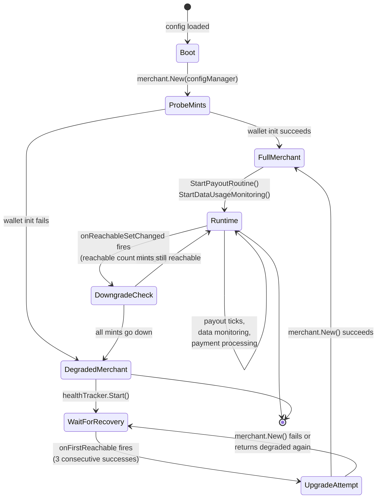
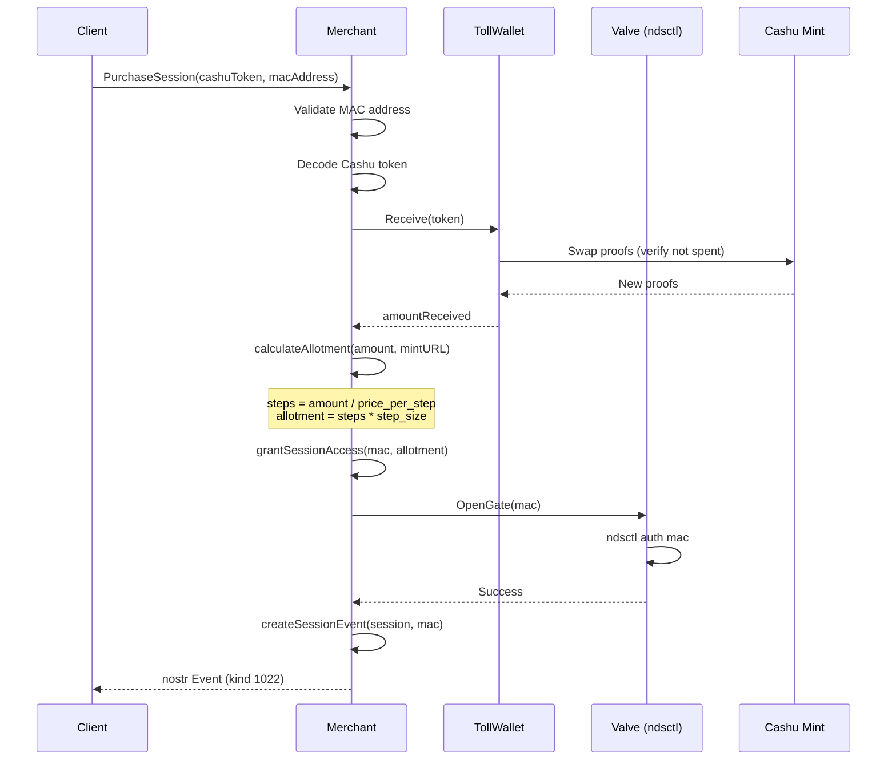

# Merchant — Wallet Provider, Payment Processor, and Session Manager

## Overview

The `merchant` module is the financial core of the TollGate router. It handles three
concerns:

1. **Customer-facing payment processing** — accepts Cashu tokens, validates them with
   mints, calculates allotments (time or data), and authorizes network access via the
   valve (ndsctl).
2. **Wallet operations** — manages Cashu wallet balances across multiple mints, creates
   payment tokens for upstream TollGate purchases, and funds the wallet from external
   sources.
3. **Lightning payouts** — automatically sweeps accumulated balances to configured
   Lightning addresses on a per-mint schedule, split according to profit-share
   configuration.

### Degraded Mode

When mints are unreachable at startup (or during runtime), the merchant boots into
**degraded mode** (`MerchantDegraded`) instead of crashing. In degraded mode:

- The HTTP API stays alive — clients receive signed notice events (kind 21023) asking
  them to retry later.
- `GetAdvertisement()` and `CreateNoticeEvent()` work normally (they only need the
  merchant private key, not wallet access).
- All wallet and session operations return errors or zero values.
- A background `MintHealthTracker` probes mints every 5 minutes. When a mint recovers
  (3 consecutive successful probes), the tracker fires a callback that upgrades the
  process to a full merchant — **no service restart required**.

This degraded-mode architecture was introduced in three PRs:

- [PR #138](https://github.com/OpenTollGate/tollgate-module-basic-go/pull/138) —
  `merchant_types` package: zero-dependency interfaces (`PaymentMerchant`,
  `MerchantProvider`) to decouple `upstream_session_manager` from the full merchant.
- [PR #139](https://github.com/OpenTollGate/tollgate-module-basic-go/pull/139) —
  `MintHealthTracker` and `MutexMerchantProvider`: health probing and atomic merchant
  swap.
- [PR #140](https://github.com/OpenTollGate/tollgate-module-basic-go/pull/140) —
  `MerchantDegraded`: degraded-mode boot, dynamic upgrade/downgrade lifecycle.

## Component Architecture

```mermaid
graph TB
    subgraph "merchant package"
        MI["MerchantInterface<br/>(18 methods)"]
        M["Merchant<br/>(full)"]
        MD["MerchantDegraded"]
        MP["MutexMerchantProvider"]
        MHT["MintHealthTracker"]
    end

    subgraph "Consumers"
        HTTP["HTTP Handlers"]
        CLI["CLI Commands"]
        USM["Upstream Session Manager"]
    end

    subgraph "Internal Dependencies"
        TW["TollWallet"]
        CFG["ConfigManager"]
        V["Valve (ndsctl)"]
    end

    subgraph "External"
        MINT["Cashu Mints"]
        LN["Lightning Network"]
    end

    MI -.->|implemented by| M
    MI -.->|implemented by| MD

    MP -->|wraps| MI
    HTTP -->|GetMerchant()| MP
    CLI -->|GetMerchant()| MP
    USM -->|GetMerchant()| MP

    M --> TW
    M --> CFG
    M --> V
    TW -->|swap/receive/melt| MINT
    TW -->|melt| LN

    MHT -->|probes| MINT
    MHT -->|onFirstReachable| MP
    MHT -->|onReachableSetChanged| MP

    style MI fill:#e1ffe1
    style M fill:#c8f7c8
    style MD fill:#ffe1e1
    style MP fill:#e1f5ff
    style MHT fill:#fff4e1
```

### Relationship Between Components

| Component | Role | File |
|---|---|---|
| `MerchantInterface` | 18-method interface all consumers call | `merchant.go` |
| `Merchant` | Full implementation with wallet, sessions, payouts | `merchant.go` |
| `MerchantDegraded` | Stub implementation when mints are unreachable | `merchant_degraded.go` |
| `MutexMerchantProvider` | RWMutex-protected atomic swap of the current merchant | `merchant_provider.go` |
| `MintHealthTracker` | Background health probes with hysteresis | `mint_health_tracker.go` |

## Merchant Lifecycle

The merchant goes through a well-defined lifecycle at boot and during runtime. This is
orchestrated by `init()` in `src/main.go`.


```mermaid
stateDiagram-v2
    [*] --> Boot: config loaded

    Boot --> ProbeMints: merchant.New(configManager)
    ProbeMints --> FullMerchant: wallet init succeeds
    ProbeMints --> DegradedMerchant: wallet init fails

    FullMerchant --> Runtime: StartPayoutRoutine()<br/>StartDataUsageMonitoring()
    DegradedMerchant --> WaitForRecovery: healthTracker.Start()

    WaitForRecovery --> UpgradeAttempt: onFirstReachable fires<br/>(3 consecutive successes)
    UpgradeAttempt --> FullMerchant: merchant.New() succeeds
    UpgradeAttempt --> WaitForRecovery: merchant.New() fails or<br/>returns degraded again

    Runtime --> Runtime: payout ticks,<br/>data monitoring,<br/>payment processing

    Runtime --> DowngradeCheck: onReachableSetChanged fires<br/>(reachable count changes)

    DowngradeCheck --> Runtime: mints still reachable
    DowngradeCheck --> DegradedMerchant: all mints go down

    Runtime --> [*]
    DegradedMerchant --> [*]
```

### Boot Sequence

The boot sequence in `init()` (lines 96-186 of `src/main.go`):

1. **Load configuration** — `ConfigManager` reads `/etc/tollgate/config.json` and
   `/etc/tollgate/identities.json`.
2. **Attempt full merchant** — `merchant.New()` tries to initialize the TollWallet by
   connecting to all configured mints. If the wallet initializes, a full `Merchant` is
   returned.
3. **Fallback to degraded** — If `tollwallet.New()` fails (mints unreachable), `New()`
   internally calls `NewDegraded()` which returns a `MerchantDegraded`. This does not
   return an error — the caller receives `MerchantDegraded` as a `MerchantInterface`.
4. **Create provider** — `NewMerchantProvider()` wraps the merchant instance in a
   `MutexMerchantProvider`.
5. **Create health tracker** — `NewMintHealthTracker()` is created with the configured
   mint URLs.
6. **Run initial probe** — `RunInitialProbe()` checks all mints synchronously to
   populate initial state.
7. **Wire callbacks** (degraded path only) — If the merchant is `MerchantDegraded`:
   - `onFirstReachable` callback is set to create a new full merchant and swap it via
     `merchantProvider.SetMerchant()`.
8. **Start routines** (full path only) — If the merchant is full `Merchant`:
   - `StartPayoutRoutine()` and `StartDataUsageMonitoring()` are called immediately.
9. **Start health tracker** — `healthTracker.Start()` begins background probing every 5
   minutes.
10. **Initialize subsystems** — `initUpstreamManager()`, `initUpstreamDetector()`,
    `initCLIServer()`.

### Upgrade: Degraded → Full

When the health tracker detects the first mint becoming reachable (3 consecutive
successful probes):

1. `onFirstReachable` callback fires on the timer goroutine.
2. `merchant.New(configManager)` is called to attempt creating a full merchant.
3. If the new merchant is also degraded (wallet still can't connect), the callback calls
   `healthTracker.ResetFirstReachable()` and returns — the upgrade is retried on the next
   probe cycle.
4. If the new merchant is a full `Merchant`:
   - `merchantProvider.SetMerchant(newMerchant)` atomically swaps the merchant under an
     RWMutex write lock.
   - `newMerchant.StartPayoutRoutine()` starts Lightning payout goroutines.
   - `newMerchant.StartDataUsageMonitoring()` starts data usage checking.
   - All subsequent `GetMerchant()` calls from HTTP handlers, CLI, and USM see the new
     full merchant.

### Downgrade: Full → Degraded

When the health tracker detects that the reachable set has changed (e.g., all mints go
down), `onReachableSetChanged` fires. In the current implementation, this callback is
available but the downgrade path is less developed than the upgrade path. A future
improvement could create a new `MerchantDegraded` and swap it in.

### BoltDB Lock Consideration

When upgrading from degraded to full, the degraded merchant does **not** hold a BoltDB
lock (it has no wallet). The new full merchant opens the wallet fresh. This means there
is no lock contention during upgrade. However, the old degraded merchant is not
explicitly shut down — it simply becomes garbage-collectable once no goroutine holds a
reference.

## MerchantInterface

The `MerchantInterface` defines 18 methods. Both `Merchant` and `MerchantDegraded`
implement this interface.

```go
type MerchantInterface interface {
    // Token creation
    CreatePaymentToken(mintURL string, amount uint64) (string, error)
    CreatePaymentTokenWithOverpayment(mintURL string, amount uint64, maxOverpaymentPercent uint64, maxOverpaymentAbsolute uint64) (string, error)
    DrainMint(mintURL string) (string, uint64, error)

    // Lightning invoices
    RequestLightningInvoice(macAddress, mintURL string, amount uint64) (*LightningInvoice, error)
    GetLightningInvoiceStatus(quoteID, macAddress string) (*LightningQuoteStatus, error)

    // Mint and balance info
    GetAcceptedMints() []config_manager.MintConfig
    GetBalance() uint64
    GetBalanceByMint(mintURL string) uint64
    GetAllMintBalances() map[string]uint64

    // Payment processing
    PurchaseSession(cashuToken string, macAddress string) (*nostr.Event, error)
    GetAdvertisement() string

    // Background routines
    StartPayoutRoutine()
    StartDataUsageMonitoring()

    // Notice events
    CreateNoticeEvent(level, code, message, customerPubkey string) (*nostr.Event, error)

    // Session management
    GetSession(macAddress string) (*CustomerSession, error)
    AddAllotment(macAddress, metric string, amount uint64) (*CustomerSession, error)
    GetUsage(macAddress string) (string, error)

    // Wallet funding
    Fund(cashuToken string) (uint64, error)
}
```

### Method Behavior Comparison

| Method | `Merchant` (full) | `MerchantDegraded` |
|---|---|---|
| `CreatePaymentToken` | Creates Cashu token from wallet | Returns `errDegraded` |
| `CreatePaymentTokenWithOverpayment` | Creates token with overpayment tolerance | Returns `errDegraded` |
| `DrainMint` | Drains all balance from a mint | Returns `errDegraded` |
| `RequestLightningInvoice` | Creates Lightning invoice via mint | Returns `errDegraded` |
| `GetLightningInvoiceStatus` | Checks invoice status | Returns `errDegraded` |
| `GetAcceptedMints` | Returns configured mints | Returns `nil` |
| `GetBalance` | Returns total wallet balance | Returns `0` |
| `GetBalanceByMint` | Returns per-mint balance | Returns `0` |
| `GetAllMintBalances` | Returns all mint balances | Returns `nil` |
| `PurchaseSession` | Full payment processing flow | Returns `errDegraded` |
| `GetAdvertisement` | Returns signed kind 10021 ad | Returns signed kind 10021 ad |
| `StartPayoutRoutine` | Starts payout goroutines | No-op |
| `StartDataUsageMonitoring` | Starts data usage checking | No-op |
| `CreateNoticeEvent` | Creates signed kind 21023 notice | Creates signed kind 21023 notice |
| `GetSession` | Returns session or expiry error | Returns "no active sessions" error |
| `AddAllotment` | Creates/extends session | Returns `errDegraded` |
| `GetUsage` | Returns "usage/allotment" string | Returns `errDegraded` |
| `Fund` | Receives token into wallet | Returns `errDegraded` |

**Key insight**: `GetAdvertisement()` and `CreateNoticeEvent()` work in both modes
because they only need the merchant private key from `identities.json`, not wallet
access. This is what allows the HTTP API to stay alive and return meaningful responses
during degraded mode.

## MerchantDegraded

`MerchantDegraded` is a lightweight stub that satisfies `MerchantInterface` without any
wallet, network, or session state.

### Construction

```go
func NewDegraded(configManager *config_manager.ConfigManager) (MerchantInterface, error)
```

- Creates an advertisement using the same `CreateAdvertisement()` function as the full
  merchant (only needs identities, not wallet).
- Initializes an empty (unused) sessions map.
- Logs a warning: `"Merchant starting in DEGRADED mode (mints unreachable)"`.

### Error Returned

All wallet and session operations return a sentinel error:

```go
var errDegraded = fmt.Errorf("service degraded: wallet unavailable, mints unreachable")
```

Consumers that receive this error can present it to the user as a temporary condition.

### What Works

- **`GetAdvertisement()`** — Returns a valid signed kind 10021 advertisement. Clients
  can see pricing and mint URLs even in degraded mode.
- **`CreateNoticeEvent()`** — Creates signed kind 21023 notice events. Used by HTTP
  handlers to tell clients "service temporarily unavailable, retry later."
- **`GetBalance()`, `GetBalanceByMint()`** — Return `0` (not errors). Allows balance
  queries to succeed without misleading clients.

### What Is Stubbed

- **All token operations** (`CreatePaymentToken`, `CreatePaymentTokenWithOverpayment`,
  `DrainMint`) — return `errDegraded`.
- **`PurchaseSession()`** — returns `errDegraded`. No payment processing occurs.
- **`StartPayoutRoutine()`, `StartDataUsageMonitoring()`** — no-ops. No goroutines
  started.
- **Session management** (`GetSession`, `AddAllotment`, `GetUsage`) — return errors.
- **`Fund()`** — returns `errDegraded`. Wallet cannot receive tokens.
- **`GetAcceptedMints()`** — returns `nil`. No mints available.

## MintHealthTracker

`MintHealthTracker` probes all configured mints in the background and fires callbacks
when reachability changes.

### Construction and Configuration

```go
func NewMintHealthTracker(mintConfigs []config_manager.MintConfig) *MintHealthTracker
```

| Parameter | Value | Notes |
|---|---|---|
| Probe interval | 5 minutes | `probeInterval: 5 * time.Minute` |
| Probe timeout | 5 seconds | `probeTimeout: 5 * time.Second` |
| Required consecutive successes | 3 | `requiredConsecutive: 3` |
| Probe endpoint | `{mintURL}/v1/info` | HTTP GET, expects 200 OK |

### Hysteresis

The tracker uses a consecutive-success counter with hysteresis to avoid flapping:

- **Recovery** (unreachable → reachable): Requires **3 consecutive** successful probes.
  A single failure resets the counter to 0.
- **Downgrade** (reachable → unreachable): A **single failure** resets the counter to
  0, which immediately marks the mint as unreachable.

This asymmetric hysteresis means recovery is slow (conservative) but failure detection
is fast. See [follow-up issue #26](https://github.com/Amperstrand/tollgate-module-basic-go/issues/26)
for concerns about 1-failure downgrade causing flapping.

### Initial Probe

`RunInitialProbe()` probes all mints synchronously before starting background checks.
It populates the `reachable` map and sets `hadReachableMint = true` if any mint
responds. This method must be called before `Start()` — it is not thread-safe.

### Background Probing

`Start()` launches a goroutine that probes all mints every 5 minutes. The probe
sequence:

1. Probe all mints concurrently (HTTP GET to `{mintURL}/v1/info`, 5s timeout).
2. Lock the mutex and update `consecutiveSuccess` counters.
3. Determine reachability transitions:
   - If `consecutiveSuccess >= 3` and was unreachable → mark reachable, log.
   - If `consecutiveSuccess < 3` and was reachable → mark unreachable, log.
4. Check if `reachableCount` changed.
5. Check if `hadReachableMint` was false and is now true → fire `onFirstReachable`.
6. If reachable count changed → fire `onReachableSetChanged`.
7. Unlock, then fire collected callbacks outside the lock.

### Callbacks

| Callback | Trigger | Used For |
|---|---|---|
| `onFirstReachable` | First mint comes back after total outage | Upgrade from degraded to full merchant |
| `onReachableSetChanged` | Number of reachable mints changes | Downgrade detection, logging |

`SetOnFirstReachable(fn)` and `SetOnReachableSetChanged(fn)` set these callbacks. They
are called under the mutex, so they must be set before `Start()`.

`ResetFirstReachable()` resets the `hadReachableMint` flag, allowing the
`onFirstReachable` callback to fire again on the next successful probe. This is used
when an upgrade attempt fails (e.g., `merchant.New()` returns degraded again).

### State Query

- `GetReachableMintConfigs()` — returns `[]MintConfig` of currently reachable mints.
- `GetReachableCount()` — returns the number of reachable mints.
- `String()` — returns `"MintHealthTracker{url1=reachable, url2=unreachable, ...}"`.

## MutexMerchantProvider

`MutexMerchantProvider` provides thread-safe access to the current merchant with atomic
swap capability.

### Interface

```go
type MerchantProvider interface {
    GetMerchant() MerchantInterface
    SetMerchant(MerchantInterface)
}
```

### Implementation

```go
type MutexMerchantProvider struct {
    mu       sync.RWMutex
    merchant MerchantInterface
}
```

- `GetMerchant()` takes an `RLock` — multiple concurrent readers can access the merchant
  simultaneously.
- `SetMerchant()` takes a full `Lock` — blocks all readers during the swap.

### Why All Consumers Use `GetMerchant()`

Long-lived consumers (HTTP handlers, CLI commands, the upstream session manager) hold a
reference to the `MerchantProvider`, not to a specific merchant. At operation time, they
call `GetMerchant()` to get the current merchant. This means:

- Before upgrade: `GetMerchant()` returns `MerchantDegraded` — operations fail with
  `errDegraded`.
- After upgrade: `GetMerchant()` returns the new full `Merchant` — operations succeed.
- No restart, no reconnection, no stale references.

### Thread Safety

The swap is atomic from the perspective of consumers. A goroutine calling
`GetMerchant()` during an upgrade will either see the old degraded merchant or the new
full merchant — never a partially initialized one. The `merchant.New()` call creates a
fully initialized merchant before `SetMerchant()` is called.

## Payout Routine

The payout routine automatically sweeps accumulated balances to configured Lightning
addresses. It only runs on a full `Merchant` — `MerchantDegraded.StartPayoutRoutine()`
is a no-op.

### Flow

```mermaid
sequenceDiagram
    participant Timer as 1min Timer
    participant M as Merchant
    participant TW as TollWallet
    participant CFG as ConfigManager
    participant LN as Lightning Network

    Timer->>M: Tick (per mint)
    M->>TW: GetBalanceByMint(mintURL)
    TW-->>M: balance

    alt Balance < min_payout_amount
        M->>M: Skip payout
    end

    M->>M: Calculate payout: balance - min_balance
    M->>CFG: GetIdentities()
    CFG-->>M: identities

    loop For each profit share
        M->>M: share = payout * factor
        M->>CFG: GetPublicIdentity(name)
        CFG-->>M: lightning_address
        M->>TW: MeltToLightning(mint, amount, max_cost, ln_addr)
        TW->>LN: Pay Lightning invoice
        LN-->>TW: Result
    end
end
```

### Per-Mint Processing

For each configured mint, a separate goroutine runs:

1. **Check balance** — `GetBalanceByMint(mintURL)` returns the sum of unspent proofs.
2. **Threshold check** — Skip if balance < `min_payout_amount`.
3. **Calculate payout** — `aimedPaymentAmount = balance - min_balance`.
4. **Split by profit share** — For each entry in `profit_share` config:
   - `shareAmount = aimedPaymentAmount * factor`
   - Look up Lightning address from `identities.json`.
   - `MeltToLightning(mintURL, shareAmount, maxCost, lightningAddress)`.
5. **Tolerance** — `maxCost = shareAmount + (shareAmount * tolerancePercent / 100)`.

### Configuration

```json
{
  "accepted_mints": [{
    "min_payout_amount": 128,
    "min_balance": 64,
    "balance_tolerance_percent": 10
  }],
  "profit_share": [
    { "factor": 0.79, "identity": "owner" },
    { "factor": 0.21, "identity": "developer" }
  ]
}
```

- `min_payout_amount` — minimum balance before any payout is attempted (per mint).
- `min_balance` — minimum balance to retain after payout.
- `balance_tolerance_percent` — overpayment tolerance for melt operations (Lightning
  routing fees).
- `profit_share[].factor` — share of payout for each recipient. Should sum to 1.0.
- `profit_share[].identity` — maps to an entry in `identities.json` with a
  `lightning_address` field.

### Payout Interval

Hardcoded at 1 minute per mint:

```go
ticker := time.NewTicker(1 * time.Minute)
```

### Degraded Mode Behavior

In degraded mode, `StartPayoutRoutine()` is a no-op. No payout goroutines are started.
After upgrade, the new full merchant starts its own payout routines.

## Data Usage Monitoring

The data usage monitoring routine checks active data-based sessions every 2 seconds and
closes the gate when allotment is reached. It only runs on a full `Merchant` —
`MerchantDegraded.StartDataUsageMonitoring()` is a no-op.

### Flow

1. Every 2 seconds, iterate all sessions with `metric == "bytes"`.
2. For each session, check if a data baseline exists (gate is open).
3. `valve.GetDataUsageSinceBaseline(mac)` returns bytes consumed since gate opened.
4. If `usage >= allotment`:
   - `valve.CloseGate(mac)` deauthorizes the MAC via ndsctl.
   - Remove the session from the map.
5. Otherwise, log progress periodically (~every 10 MB).

### Degraded Mode Behavior

In degraded mode, `StartDataUsageMonitoring()` is a no-op. No monitoring goroutine is
started. After upgrade, the new full merchant starts its own monitoring routine.

## Payment Processing (PurchaseSession)

`PurchaseSession()` is the main customer-facing operation. It processes a Cashu payment
and grants network access.


```mermaid
sequenceDiagram
    participant Client as Client
    participant M as Merchant
    participant TW as TollWallet
    participant V as Valve (ndsctl)
    participant MINT as Cashu Mint

    Client->>M: PurchaseSession(cashuToken, macAddress)
    M->>M: Validate MAC address
    M->>M: Decode Cashu token
    M->>TW: Receive(token)
    TW->>MINT: Swap proofs (verify not spent)
    MINT-->>TW: New proofs
    TW-->>M: amountReceived

    M->>M: calculateAllotment(amount, mintURL)
    Note over M: steps = amount / price_per_step<br/>allotment = steps * step_size

    M->>M: grantSessionAccess(mac, allotment)
    M->>V: OpenGate(mac)
    V->>V: ndsctl auth mac
    V-->>M: Success

    M->>M: createSessionEvent(session, mac)
    M-->>Client: nostr Event (kind 1022)
```

### Allotment Calculation

1. `steps = amountSats / pricePerStep`
2. Check `steps >= minPurchaseSteps` (minimum purchase requirement).
3. Based on configured metric:
   - `"milliseconds"`: `allotment = steps * stepSize`
   - `"bytes"`: `allotment = steps * stepSize`

### Session Management

Sessions are stored in-memory (`map[string]*CustomerSession`). Each session tracks:
- `MacAddress` — device identifier.
- `StartTime` — Unix timestamp when session was created/extended.
- `Metric` — `"milliseconds"` or `"bytes"`.
- `Allotment` — total allotment for this session.

`AddAllotment()` extends an existing session or creates a new one. For existing sessions,
the allotment is added and the start time is reset to now.

`GetSession()` returns the session or an error if not found. For time-based sessions, it
checks if the allotment has been exceeded and auto-expires the session.

`GetUsage()` returns a string `"usage/allotment"` for display. For data sessions, it
queries `valve.GetDataUsageSinceBaseline()`. For time sessions, it calculates elapsed
milliseconds since session start.

### Error Handling

`PurchaseSession()` returns Nostr events (not Go errors) for user-facing errors:
- Invalid MAC address → kind 21023 notice with code `"invalid-mac-address"`.
- Invalid token → kind 21023 notice with code `"payment-error-invalid-token"`.
- Already-spent token → kind 21023 notice with code `"payment-error-token-spent"`.
- Receive failure → kind 21023 notice with code `"payment-processing-failed"`.
- Gate open failure → kind 21023 notice with code `"gate-open-failed"`.

## Wallet Operations

### CreatePaymentToken

```go
func (m *Merchant) CreatePaymentToken(mintURL string, amount uint64) (string, error)
```

Creates a Cashu token for upstream payment. Checks balance, calls
`tollwallet.Send()`, serializes the token.

### CreatePaymentTokenWithOverpayment

```go
func (m *Merchant) CreatePaymentTokenWithOverpayment(mintURL string, amount uint64, maxOverpaymentPercent uint64, maxOverpaymentAbsolute uint64) (string, error)
```

Creates a payment token with overpayment tolerance. Used when exact amounts are
unavailable and the caller can accept slight overpayment.

### DrainMint

```go
func (m *Merchant) DrainMint(mintURL string) (string, uint64, error)
```

Drains all available balance from a specific mint. Unlike `CreatePaymentToken`, this does
not include fees — it extracts the full balance. Used for wallet migration or
administrative purposes.

### Fund

```go
func (m *Merchant) Fund(cashuToken string) (uint64, error)
```

Receives a Cashu token into the wallet. Decodes the token, calls
`tollwallet.Receive()`, and returns the amount received.

## Edge Cases

### Race Condition Between Payout and Payment

**Scenario**: Payout routine drains wallet while a customer payment is being processed.

**Root Cause**: No locking or fund reservation between balance check and token creation.

```
1. USM checks balance: 10000 sats (sufficient)
2. Payout routine melts 9000 sats to Lightning
3. USM tries to create 5000 sat token → fails: insufficient balance
```

**Current Mitigation**: None. The `min_balance` parameter reduces but does not eliminate
this window.

**Potential Fixes**:
1. Fund reservation system (reserve funds for 30s before payout can touch them).
2. Mutex around balance + token creation operations.
3. Payout coordination (skip payout if active sessions need the mint).

### BoltDB Lock During Upgrade

When upgrading from degraded to full, the degraded merchant has no wallet and thus no
BoltDB lock. The new full merchant opens the wallet fresh. There is no lock contention.
However, if the old merchant had been a full merchant that was downgraded mid-operation,
the old BoltDB file would need to be cleanly closed first. The current code does not
call `Shutdown()` on the old merchant during upgrade.

### Wallet Drain in Degraded Mode

There is no guardrail preventing the wallet from being fully drained during degraded
mode if `CreatePaymentTokenWithOverpayment()` were called with large overpayment
tolerances. In practice this is mitigated by the degraded merchant returning
`errDegraded` for all token operations, but if a future change allows limited offline
spending, this could become an issue. See
[follow-up issue #29](https://github.com/Amperstrand/tollgate-module-basic-go/issues/29).

### Health Tracker Callbacks on Timer Goroutine

`onFirstReachable` and `onReachableSetChanged` fire on the timer goroutine. If
`onFirstReachable` performs heavy work (e.g., `merchant.New()` which does wallet loading
and network I/O), the timer goroutine blocks until recovery completes. This prevents
subsequent proactive checks. Acceptable today because the callback is one-shot and the
probe interval is 5 minutes.

### RunInitialProbe Thread Safety

`RunInitialProbe()` is not thread-safe — it modifies internal state without holding the
mutex. It must be called before `Start()`. Currently safe because `init()` calls
`RunInitialProbe() → SetOnFirstReachable() → Start()` in strict sequence.

### Shutdown Gap

`Merchant.Shutdown()` cleanly stops the wallet DB, but is not wired into any signal
handler or defer. On process exit, the wallet DB may not get a clean shutdown. Adding a
SIGTERM/SIGINT handler that calls `Shutdown()` on the current merchant (obtained via
`MerchantProvider`) should be a follow-up.

## Known Follow-Ups

Filed on [Amperstrand/tollgate-module-basic-go](https://github.com/Amperstrand/tollgate-module-basic-go):

| Issue | Title | Description |
|---|---|---|
| [#26](https://github.com/Amperstrand/tollgate-module-basic-go/issues/26) | 1-failure downgrade may cause flapping | Consider sliding window or increased threshold instead of immediate downgrade on single probe failure. |
| [#27](https://github.com/Amperstrand/tollgate-module-basic-go/issues/27) | `PayoutShare()` calls `MarkUnreachable()` on non-connectivity errors | Scope to transport errors only — a 4xx response should not mark a mint unreachable. |
| [#28](https://github.com/Amperstrand/tollgate-module-basic-go/issues/28) | Degraded mode returns kind 21023 instead of 10021 | May break clients expecting the standard advertisement kind. |
| [#29](https://github.com/Amperstrand/tollgate-module-basic-go/issues/29) | Offline wallet spending has no drain guardrail | Add reserve floor, max offline spend per outage window. |

## Configuration

### Merchant Config (Relevant Fields)

```json
{
  "metric": "bytes",
  "step_size": 22020096,
  "margin": 0.1,
  "accepted_mints": [
    {
      "url": "https://mint.coinos.io",
      "price_per_step": 1,
      "price_unit": "sats",
      "purchase_min_steps": 0,
      "min_payout_amount": 128,
      "min_balance": 64,
      "balance_tolerance_percent": 10,
      "payout_interval_seconds": 60
    }
  ],
  "profit_share": [
    { "factor": 0.79, "identity": "owner" },
    { "factor": 0.21, "identity": "developer" }
  ]
}
```

| Field | Location | Description |
|---|---|---|
| `metric` | Top-level | `"bytes"` for data-based, `"milliseconds"` for time-based sessions. |
| `step_size` | Top-level | Units per step (bytes or ms). |
| `margin` | Top-level | Margin applied to pricing. |
| `accepted_mints[].url` | Per-mint | Cashu mint URL. |
| `accepted_mints[].price_per_step` | Per-mint | Satoshis per step. |
| `accepted_mints[].purchase_min_steps` | Per-mint | Minimum number of steps per purchase. |
| `accepted_mints[].min_payout_amount` | Per-mint | Minimum balance before payout triggers. |
| `accepted_mints[].min_balance` | Per-mint | Minimum balance to retain after payout. |
| `accepted_mints[].balance_tolerance_percent` | Per-mint | Overpayment tolerance for melt operations (%). |
| `accepted_mints[].payout_interval_seconds` | Per-mint | Interval between payout checks (currently hardcoded to 60s). |
| `profit_share[].factor` | Per-recipient | Share of payout (0.0-1.0, should sum to 1.0). |
| `profit_share[].identity` | Per-recipient | Identity name in `identities.json` with `lightning_address`. |

### Health Tracker Constants (Hardcoded)

| Constant | Value | Description |
|---|---|---|
| `probeInterval` | 5 minutes | Time between background probe cycles. |
| `probeTimeout` | 5 seconds | HTTP timeout for each probe. |
| `requiredConsecutive` | 3 | Consecutive successes needed to mark a mint reachable. |

## Integration with Other Components

### Relationship with UpstreamSessionManager

The USM uses the merchant as a wallet provider for upstream TollGate payments:

```
USM needs to pay upstream TollGate
  → merchantProvider.GetMerchant()
  → merchant.CreatePaymentTokenWithOverpayment()
  → Cashu token created and sent upstream
```

The USM holds a `MerchantProvider` (from the `merchant_types` package), not a direct
`MerchantInterface`. This decouples the USM from the full `merchant` package.

### Relationship with TollWallet

The full `Merchant` wraps a `TollWallet` instance for all Cashu operations:

- `tollwallet.Send()` / `SendWithOverpayment()` — create payment tokens.
- `tollwallet.Receive()` — receive tokens into wallet.
- `tollwallet.MeltToLightning()` — pay to Lightning addresses.
- `tollwallet.GetBalance()` / `GetBalanceByMint()` — query balances.
- `tollwallet.Drain()` — drain all balance from a mint.

The `MerchantDegraded` has no `TollWallet` instance.

### Relationship with ConfigManager

Both `Merchant` and `MerchantDegraded` hold a reference to `ConfigManager` for:
- Configuration access (`GetConfig()` — mints, pricing, profit share).
- Identity resolution (`GetIdentities()` — merchant private key, Lightning addresses).

### Relationship with Valve

The full `Merchant` uses the `valve` package for gate operations:
- `valve.OpenGate(mac)` — authorize a MAC via ndsctl.
- `valve.CloseGate(mac)` — deauthorize a MAC.
- `valve.GetDataUsageSinceBaseline(mac)` — get bytes consumed.
- `valve.HasDataBaseline(mac)` — check if gate is open.

## Debugging

### Check Merchant Mode

```bash
# Boot logs show which mode was selected
logread | grep -E "(DEGRADED|Merchant ready)"
# "Merchant starting in DEGRADED mode" = degraded
# "=== Merchant ready ===" = full
```

### Check Health Tracker State

```bash
# Health tracker logs reachability transitions
logread | grep "MintHealthTracker"
# "mint X became reachable" = recovery
# "mint X became unreachable" = downgrade
```

### Check Upgrade Events

```bash
# Upgrade from degraded to full
logread | grep -E "(upgraded|recovery|degraded)"
# "Mint became reachable — attempting to upgrade from degraded mode"
# "Upgraded from degraded to full merchant"
```

### Check Payout Status

```bash
logread | grep -E "(payout|Skipping payout|Payout completed)"
```

### Check Session Status

```bash
# Via CLI
tollgate status

# Via logs
logread | grep -E "(session|allotment|gate)"
```
