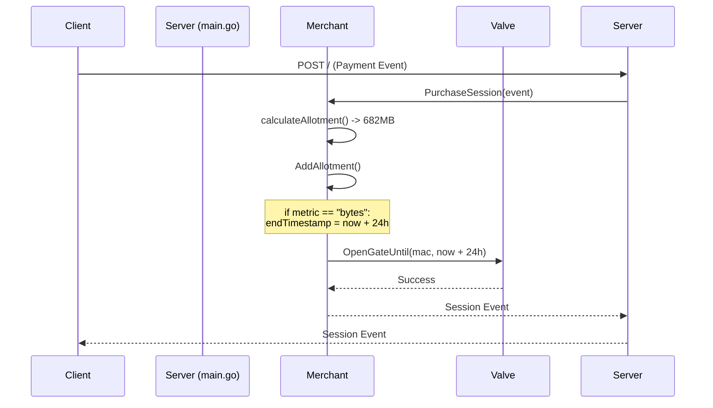
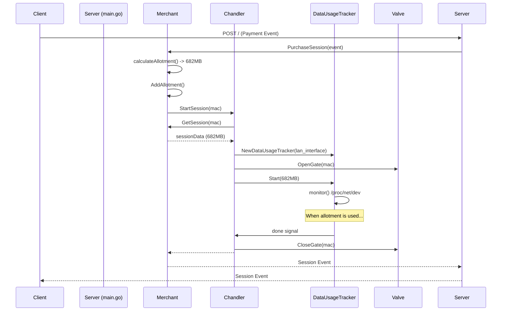

# Refactoring Session Management

This document outlines the architectural changes made to the session management logic to correctly handle data-based (`bytes`) sessions.

## The Problem

The previous implementation had a critical flaw in its architecture. The `Merchant` module was responsible for both processing payments and managing the client's network access via the `Valve`. When a data-based session was purchased, the `Merchant` would correctly calculate the data allotment but would then incorrectly open the `Valve` for a fixed 24-hour duration, completely ignoring the data limit.

This led to clients receiving a time-based session regardless of the data they purchased.

### Flawed Architectural Flow

The diagram below illustrates the incorrect flow where the `Merchant` directly and improperly controls the `Valve`.

## The Solution: Delegating Session Management

The solution is to refactor the architecture to adhere to a proper separation of concerns. The `Merchant`'s responsibility should end after processing the payment. The `Chandler` should be the sole module responsible for managing the session lifecycle, including creating the appropriate usage tracker and controlling the `Valve`.

### Corrected Architectural Flow

The corrected flow involves the `Merchant` notifying the `Chandler` after a successful payment. The `Chandler` then takes over, creating a `DataUsageTracker` which monitors `/proc/net/dev` and closes the `Valve` only when the purchased data allotment has been consumed.

This change ensures that data-based sessions are correctly enforced, and the system's architecture is more robust and maintainable.