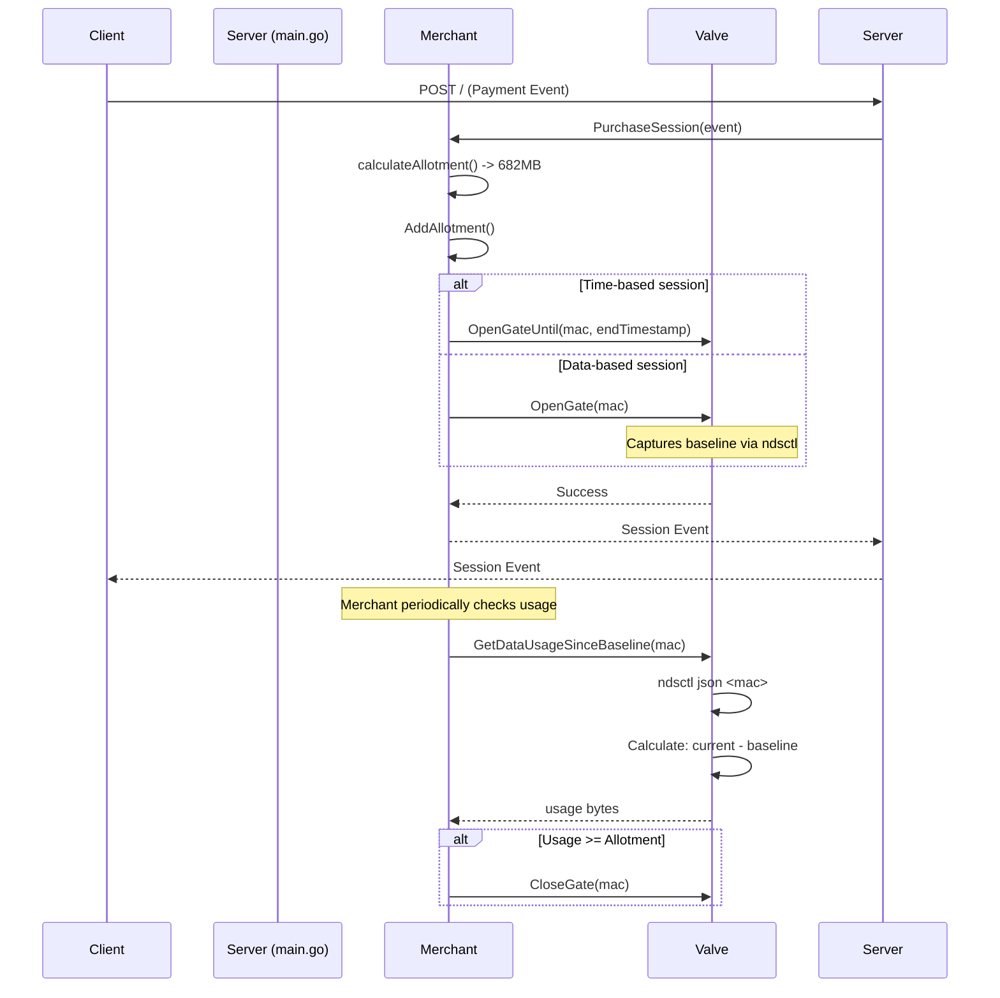

# Refactoring Session Management

This document outlines the architectural changes made to the session management logic to correctly handle data-based (`bytes`) sessions.

## The Problem

The previous implementation had multiple critical flaws:

1. **Interface-based tracking**: The system tracked data usage by monitoring `/proc/net/dev` for the entire interface (e.g., `br-lan`). This was incorrect because multiple customers share the same interface, making it impossible to track individual customer usage accurately.

2. **Incorrect architecture**: The `Merchant` module would delegate session management to the `Chandler`, creating an unnecessary dependency and violating separation of concerns.

### Flawed Approach

The old approach monitored the entire interface's data usage:
- Read `/proc/net/dev` for interface bytes
- Calculate usage as `current_bytes - start_bytes`
- **Problem**: Multiple customers on the same interface meant this tracked ALL traffic, not individual customer usage

## The Solution: Per-Customer ndsctl Tracking

The solution involves two key changes:

### 1. Per-Customer Data Tracking via ndsctl

Instead of monitoring interface-level statistics, we now use `ndsctl json <mac_address>` to get per-customer statistics directly from the captive portal (NoDogSplash):

```bash
# Get stats for a specific MAC address
ndsctl json ac:e0:10:12:2d:75
```

Returns:
```json
{
  "id": 2,
  "ip": "192.168.5.132",
  "mac": "ac:e0:10:12:2d:75",
  "added": 1576258985,
  "active": 1576264663,
  "duration": 5678,
  "token": "35dfa494",
  "state": "Authenticated",
  "downloaded": 18663,    // in kilobytes
  "avg_down_speed": 26.3,
  "uploaded": 4986,       // in kilobytes
  "avg_up_speed": 7.03
}
```

**Key advantages:**
- Accurate per-customer tracking
- Downloaded and uploaded bytes are tracked separately
- No interference from other customers on the same interface

### 2. Baseline Tracking

When opening a gate for a data-based session, we capture the current usage as a baseline:

1. Call `ndsctl json <mac>` to get current downloaded/uploaded
2. Store these values as the baseline
3. Calculate usage as: `(current_downloaded - baseline_downloaded) + (current_uploaded - baseline_uploaded)`

This ensures we only count data used during the current session, not any previous sessions.

### 3. Merchant-Controlled Session Management

The `Merchant` module now directly controls the gate without involving the `Chandler`:



## Implementation Details

### Valve Module Changes

The `Valve` module now provides:

1. **`GetClientStats(macAddress)`**: Retrieves current downloaded/uploaded from ndsctl
2. **`SetDataBaseline(macAddress)`**: Captures baseline when gate opens
3. **`GetDataUsageSinceBaseline(macAddress)`**: Returns usage since baseline
4. **`ClearDataBaseline(macAddress)`**: Cleans up baseline when gate closes

### Merchant Module Changes

The `Merchant` module now:

1. Opens gates directly based on session type (time vs. data)
2. For data-based sessions, the valve automatically captures the baseline
3. The merchant is responsible for periodically checking usage and closing the gate when the allotment is reached

This architecture ensures:
- Accurate per-customer data tracking
- Proper separation of concerns
- No unnecessary dependencies between modules
- Correct enforcement of data-based session limits