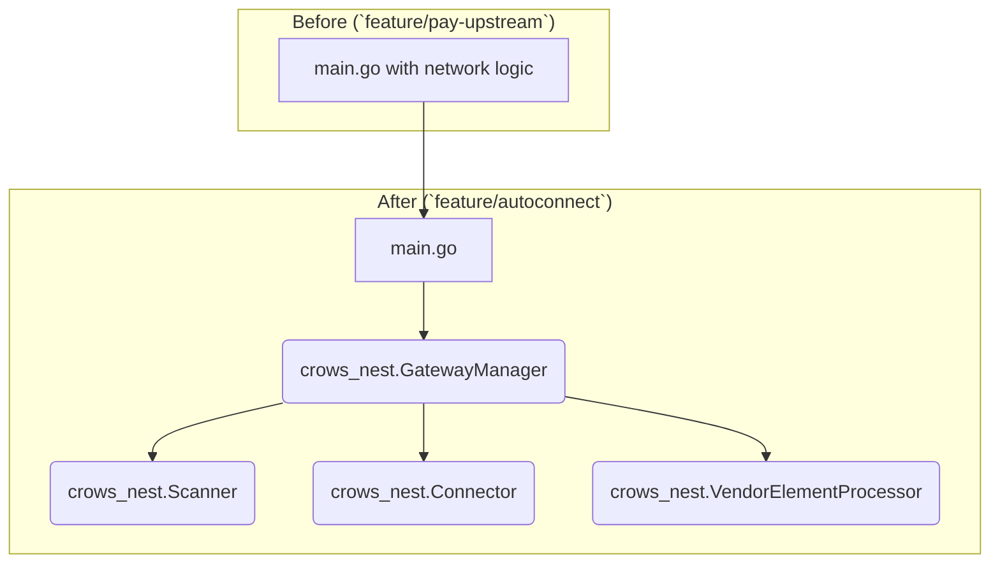
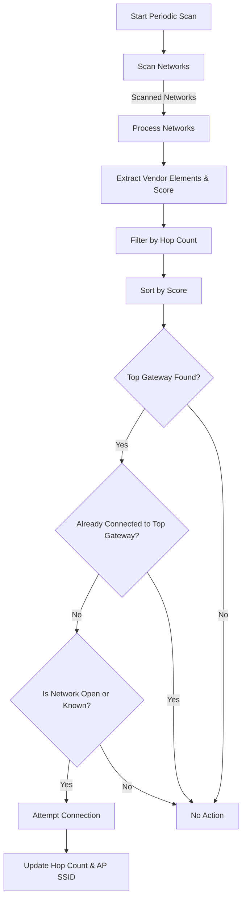

# Analysis of `feature/autoconnect` Refactoring

This document analyzes the changes introduced in the `feature/autoconnect` branch, which builds upon `feature/pay-upstream`. The primary focus of this branch is a significant architectural refactoring: moving the network management logic from a monolithic implementation in `src/main.go` into a dedicated, modular `crows_nest` package.

## Key Changes

The core changes can be summarized as follows:

1.  **Creation of the `crows_nest` Module:** A new Go module located at `src/crows_nest/` was created to encapsulate all logic related to network scanning, gateway evaluation, and connection management.
2.  **Refactoring from `main.go`:** The network management loop and helper functions that were added to `src/main.go` in `feature/pay-upstream` have been removed from `main` and are now handled by `crows_nest`.
3.  **Introduction of Key Components:** The `crows_nest` module introduces several key components with clear responsibilities:
    *   **`GatewayManager`**: The central orchestrator for the module.
    *   **`Scanner`**: Responsible for discovering nearby Wi-Fi networks.
    *   **`Connector`**: Handles the low-level `uci` commands to connect to a gateway.
    *   **`VendorElementProcessor`**: A component for parsing TollGate-specific data from Wi-Fi vendor elements.
4.  **New Documentation:** A comprehensive set of HLDD and LLDD documents were created specifically for the `crows_nest` module, detailing its architecture and implementation.

## Component-Level Changes

### Code Restructuring

This branch represents a classic and beneficial refactoring from a monolithic to a modular design.




### `src/main.go`

The `main.go` file is significantly simplified. It no longer contains the network scanning and connection loop. Instead, it initializes the `crows_nest.GatewayManager` and calls its public methods to manage the network state, delegating all the complex logic to the new module.

### `src/crows_nest/`

This new directory contains the heart of the changes:

*   **`gateway_manager.go`**: The public-facing API for the module. It coordinates the scanner and connector to find and connect to the best available gateway.
*   **`scanner.go`**: Contains the logic for executing `iw` scans and parsing the output into a structured `NetworkInfo` type.
*   **`connector.go`**: Abstracts the `uci` and system commands required to configure the wireless interface, connect to an AP, and restart the network.
*   **`vendor_element_processor.go`**: Implements the logic to find and parse custom TollGate data from vendor elements in beacon frames.
*   **`HLDD_*.md` / `LLDD_*.md`**: Detailed design documents for the new module, promoting better understanding and maintainability.

### `GatewayManager` Workflow

The `GatewayManager` is the brain of the `crows_nest` module. It runs a periodic scan to find and evaluate the best gateway, and then attempts to connect if a better option is available.




### `Scanner` Workflow

The `Scanner` is responsible for the low-level task of scanning for Wi-Fi networks and parsing the output.

```mermaid
graph TD
    A[ScanNetworks()] --> B["Get WiFi Interface Name"];
    B --> C["Execute `iw dev <iface> scan`"];
    C -- Raw Scan Output --> D["Parse Scan Output"];
    D --> E["Extract BSSID, SSID, Signal, Encryption"];
    E --> F["Parse Hop Count from SSID"];
    F -- "[]NetworkInfo" --> G[Return Parsed Networks];
```


### `Connector` Workflow

The `Connector` handles all interactions with the OpenWRT system for network configuration.

```mermaid
graph TD
    A[Connect()] --> B["Cleanup Existing STA Interfaces"];
    B --> C["Set network.wwan and wireless.wifinet0 UCI settings"];
    C --> D["Set SSID, BSSID, and Encryption"];
    D --> E["Commit UCI Changes"];
    E --> F["Reload WiFi"];
    F --> G["Verify Connection"];
```


### `VendorElementProcessor` Workflow

The `VendorElementProcessor` is responsible for extracting and scoring TollGate-specific information from vendor elements.

```mermaid
graph TD
    A[ExtractAndScore()] --> B["Parse Vendor Elements (Stubbed)"];
    B --> C["Calculate Score"];
    C -- Signal Strength --> C;
    C -- "TollGate-" SSID Prefix --> C;
    C -- Score --> D[Return Score];
```


## Summary and Recommendations

The `feature/autoconnect` branch is a critical step forward in the project's architecture. By refactoring the network management logic out of `main.go` and into the well-structured `crows_nest` module, the branch achieves:

*   **Improved Modularity:** The `crows_nest` module can be developed, tested, and maintained independently.
*   **Separation of Concerns:** `main.go` is now focused on orchestrating the application's top-level components, while `crows_nest` handles the specifics of network management.
*   **Better Testability:** The individual components of `crows_nest` (Scanner, Connector) can be unit-tested more easily than the previous monolithic code.
*   **Clearer Documentation:** The addition of dedicated HLDD/LLDD files for the module makes the design explicit and easier to understand.

This branch is an essential evolutionary step between the initial implementation in `feature/pay-upstream` and the addition of more advanced features like `feature/hopcount`.