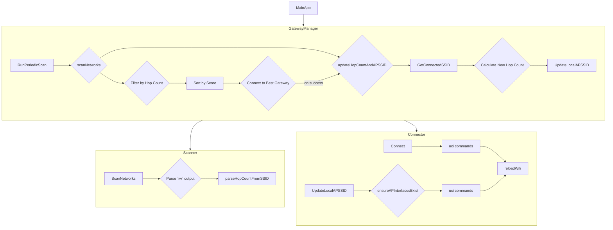

# Analysis of `feature/hopcount` Additions to `feature/autoconnect`

This document analyzes the new functionality added by the `feature/hopcount` branch, which builds upon the `feature/autoconnect` branch. The primary focus of this feature branch is the implementation of a hop count mechanism to prevent routing loops in the TollGate mesh network. The changes represent a clear addition of features.

> **Note:** The diagrams in this document were generated from the MermaidJS source code using the following command:
> ```bash
> docker run --rm --user "$(id -u):$(id -g)" -v "$(pwd)":/data minlag/mermaid-cli -i /data/docs/refactoring/hopcount_analysis.md -o /data/docs/refactoring/images/hopcount_analysis/diagram.pdf
> ```

## Key Changes

The core changes can be summarized as follows:

1.  **SSID-based Hop Count:** The hop count is now encoded in the SSID of the TollGate access points, following the format `TollGate-[ID]-[Frequency]-[HopCount]`.
2.  **Hop Count Filtering:** The `GatewayManager` now filters available gateways, only allowing connections to networks with a hop count strictly lower than the device's own.
3.  **Dynamic SSID Updates:** The local AP's SSID is dynamically updated to advertise the new hop count after a successful connection to an upstream gateway.
4.  **Refactoring from Shell to Go:** The logic for hop count management, previously handled in shell scripts, has been migrated into the `crows_nest` Go module.
5.  **Robust AP Interface Management:** The `Connector` can now ensure that the default AP interfaces exist, creating them if necessary with a consistent naming scheme.

## Component-Level Changes

### `crows_nest` Go Module

The `crows_nest` module has undergone significant changes to incorporate the hop count logic.




#### `gateway_manager.go`

*   The `GatewayManager` struct now includes `currentHopCount` to track its own hop count.
*   The `scanNetworks` function is the most heavily modified. It now:
    1.  Updates its own hop count at the beginning of every scan cycle.
    2.  Filters the list of discovered gateways, removing any with a hop count greater than or equal to its own.
*   A new function, `updateHopCountAndAPSSID`, has been added to calculate the current hop count based on the upstream connection and update the local AP's SSID accordingly.
*   The `ConnectToGateway` function now triggers `updateHopCountAndAPSSID` upon a successful connection.

#### `scanner.go`

*   The `NetworkInfo` struct now includes a `HopCount` field.
*   A new function, `parseHopCountFromSSID`, has been added to extract the hop count from the SSID string.
*   The `parseScanOutput` function now calls `parseHopCountFromSSID` for each discovered network.

#### `connector.go`

*   The `restartNetwork` function has been replaced with `reloadWifi` to avoid dropping the upstream connection.
*   A new function, `UpdateLocalAPSSID`, has been added to change the local AP's SSID to advertise the new hop count.
*   A new "self-healing" function, `ensureAPInterfacesExist`, has been added to create the default AP interfaces if they are missing. This function is called by `UpdateLocalAPSSID`.

### Design Documents

The HLDD and LLDD documents for `crows_nest` and the overall gateway selection process have been updated to reflect the new hop count mechanism, including updated diagrams and component descriptions.

### Shell Scripts

The logic for hop count has been removed from the shell scripts, as it is now handled by the Go module. The scripts are now simpler and delegate more responsibility to the `crows_nest` module.

## Summary and Recommendations

The `feature/hopcount` branch introduces a critical mechanism for preventing routing loops in the mesh network. The implementation is robust, with changes spanning the data model, business logic, and system configuration layers. The migration of this logic from shell scripts to Go is a significant improvement in terms of maintainability and testability.

It is recommended to merge `feature/hopcount` as the final feature set on top of `feature/autoconnect` before merging into `main`.