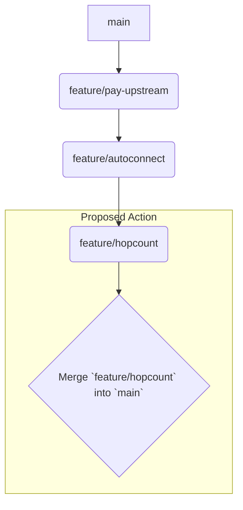

# Refactoring and Merge Plan

This document outlines the plan for merging the feature branches into `main`.

## Analysis Summary

1.  **`feature/pay-upstream`**: This branch introduced the initial, monolithic implementation for connecting to an upstream gateway. It laid the foundation for automated network connections. See [`docs/refactoring/payupstream_analysis.md`](docs/refactoring/payupstream_analysis.md) for details.
2.  **`feature/autoconnect`**: This branch refactored the logic from `feature/pay-upstream`, creating the modular `crows_nest` component for improved maintainability and separation of concerns. See [`docs/refactoring/autoconnect_analysis.md`](docs/refactoring/autoconnect_analysis.md) for details.
3.  **`feature/hopcount`**: This branch built upon `feature/autoconnect`, adding a critical hop count mechanism to prevent routing loops in the mesh network. See [`docs/refactoring/hopcount_analysis.md`](docs/refactoring/hopcount_analysis.md) for details.

## Proposed Merge Strategy

The branches represent a clear, linear development path. The merge strategy should reflect this progression.

## Detailed Plan

1.  **Confirm Branch History:** Ensure the git history reflects the linear development: `main` -> `feature/pay-upstream` -> `feature/autoconnect` -> `feature/hopcount`. If the branches have diverged, they will need to be rebased into a clean, linear history first.
2.  **Checkout `main` branch.**
3.  **Merge `feature/hopcount` into `main`.** Since `feature/hopcount` contains all the preceding changes from the other branches, a direct merge (or rebase and merge) is all that is required.
4.  **Delete the feature branches.** Once merged, `feature/pay-upstream`, `feature/autoconnect`, and `feature/hopcount` can be deleted.
5.  **Review and test the new `main` branch.** Ensure that all functionality from the three branches works as expected.

This approach will result in a clean `main` branch that incorporates all the new features in their correct historical and functional order.