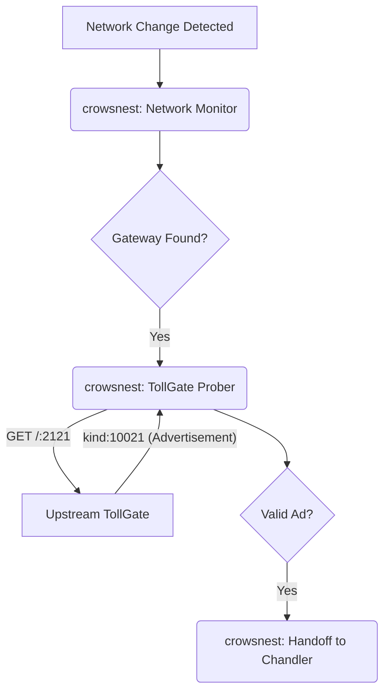
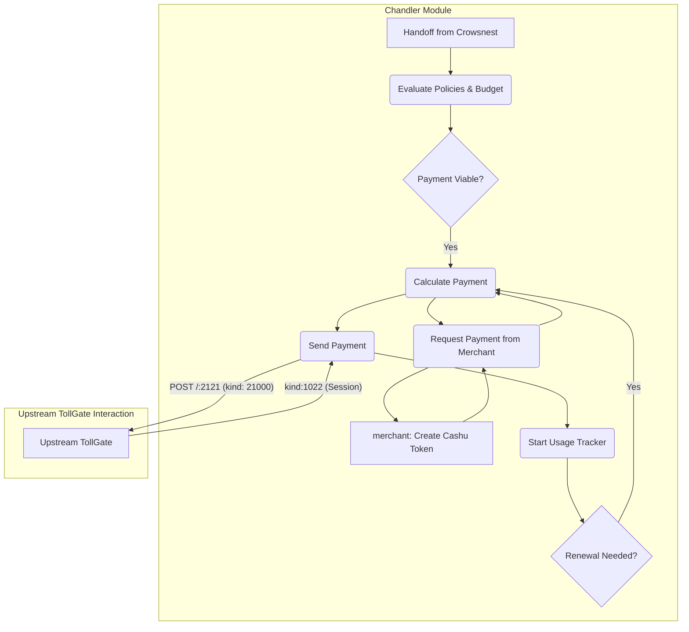

# Analysis of `feature/pay-upstream` vs. `main`

This document provides a detailed analysis of the changes introduced in the `feature/pay-upstream` branch. This feature represents a major architectural evolution, enabling a TollGate device to act as a client and pay for connectivity from an upstream TollGate provider.

## High-Level Summary

The `feature/pay-upstream` branch introduces two primary Go modules, `crowsnest` and `chandler`, which work in tandem to discover, connect to, and pay for upstream TollGate services. The entire process is governed by a newly defined communication protocol based on Nostr events, documented in a series of TollGate Implementation Possibilities (TIPs).

### Key Architectural Changes

-   **Modular Design**: The introduction of `crowsnest` (for discovery) and `chandler` (for payment and session management) creates a clear separation of concerns.
-   **Protocol-Driven**: The interaction between the client and the upstream provider is formalized in the new TIPs, ensuring interoperability.
-   **Event-Driven**: The system is highly event-driven, reacting to network changes and session lifecycle events in real-time.
-   **Configuration-Centric**: The behavior of the new modules is controlled by extensive new configuration sections in the `config_manager`.

## Detailed Component Analysis

### 1. `crowsnest`: The Discovery Module

The `crowsnest` module is responsible for discovering upstream TollGate providers on the network.

-   **Network Monitoring**: It uses `netlink` to listen for network interface and address changes, providing an efficient, event-driven mechanism for detecting potential upstream connections.
-   **TollGate Probing**: When a new gateway is detected, the `tollGateProber` sends an HTTP `GET` request to port `2121` to retrieve a TollGate advertisement.
-   **Discovery Tracking**: The `discovery_tracker` prevents redundant probing and ensures that a given gateway is only processed once.
-   **Handoff to `chandler`**: Once a valid TollGate is discovered and validated against the protocol, `crowsnest` packages the information and hands it off to the `chandler` module.

### 2. `chandler`: The Payment and Session Module

The `chandler` module is the financial and session management core of the `pay-upstream` feature.

-   **Policy Enforcement**: It enforces trust policies (allow/blocklists) and budget constraints defined in the configuration.
-   **Payment Logic**: It contains sophisticated logic to determine the optimal payment amount, considering available funds, provider pricing, and configured session preferences.
-   **Payment Execution**: It interfaces with the `merchant` module to create and send Cashu tokens for payment.
-   **Session Lifecycle**: It manages the entire session lifecycle, from initial creation to renewal and termination.
-   **Usage Tracking**: It instantiates a `UsageTracker` (either time-based or data-based) to monitor the session and trigger renewals when the allotment runs low.

### 3. TollGate Implementation Possibilities (TIPs)

The `pay-upstream` feature introduces a formal protocol for client-provider communication, defined in the TIPs.

-   **Discovery (`kind: 10021`)**: Defines the structure of the TollGate advertisement, including pricing, metrics, and supported mints.
-   **Payment (`kind: 21000`)**: Specifies the format of the payment event, which includes the Cashu token and the device's MAC address.
-   **Session (`kind: 1022`)**: Details the session confirmation event, which confirms the allotment of the purchased resource.
-   **HTTP Server**: The protocol is served over an HTTP server on port `2121`, with defined endpoints for discovery (`GET /`) and payment (`POST /`).

### 4. Core Module Modifications

-   **`config_manager`**: Heavily extended to include detailed configuration for `crowsnest` and `chandler`, including trust policies, budget limits, and session renewal thresholds.
-   **`merchant`**: Refactored to support MAC-address-based sessions and to provide an interface for the `chandler` to create payment tokens.
-   **`tollwallet`**: Updated to support creating payment tokens with overpayment capabilities.
-   **`valve`**: Modified to open the gate for a specific MAC address until a specified end time.
-   **`main.go`**: Updated to initialize and start the new `crowsnest` and `chandler` modules.

## Architectural Flow Diagrams

### 1. Crowsnest: Discovery Flow

This diagram illustrates the process of discovering an upstream TollGate provider.

### 2. Chandler: Payment and Session Flow

This diagram shows the process after a valid TollGate has been discovered and handed off to the `chandler`.

## Conclusion

The `feature/pay-upstream` branch is a well-architected and significant addition to the TollGate project. It transforms the device from a pure provider into a client capable of participating in a larger TollGate ecosystem. The modular design, protocol-driven approach, and robust configuration options provide a solid foundation for future development.