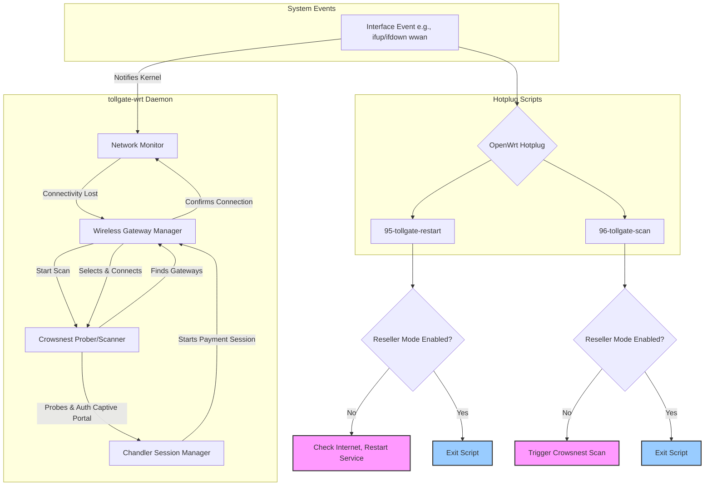

# Tollgate-WRT Control Flow Diagram

This diagram illustrates the different logic paths for handling network events in `tollgate-wrt`, contrasting the standard (gateway) mode with the reseller (client) mode.

## Analysis of Current Issue

The logs show a race condition:
1.  The `wwan` interface comes up (`ifup`).
2.  The `tollgate-wrt` daemon's `Wireless Gateway Manager` begins its complex process: connect, get IP, get route, probe gateway, **trigger captive portal**, and start payment.
3.  Simultaneously, the `95-tollgate-restart` hotplug script is triggered. It does **not** currently check for reseller mode. It waits 5 seconds and runs its own simple `ping 8.8.8.8` check.
4.  This ping check happens *before* the daemon has completed the captive portal authorization. The ping fails, and the script logs `WAN up but no connectivity...`.
5.  The daemon, unaware of the script's failure, successfully completes its process and establishes a payment session. However, other services that might depend on the hotplug script are not correctly notified/restarted.

The core issue is that `95-tollgate-restart` is interfering with the `Wireless Gateway Manager`, which should have sole authority over the `wwan` interface in reseller mode.
