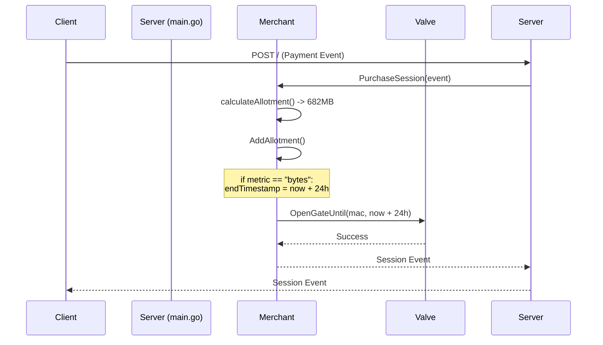
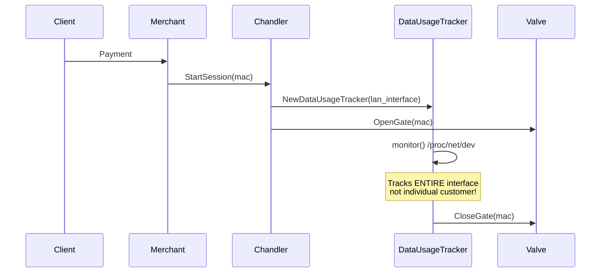
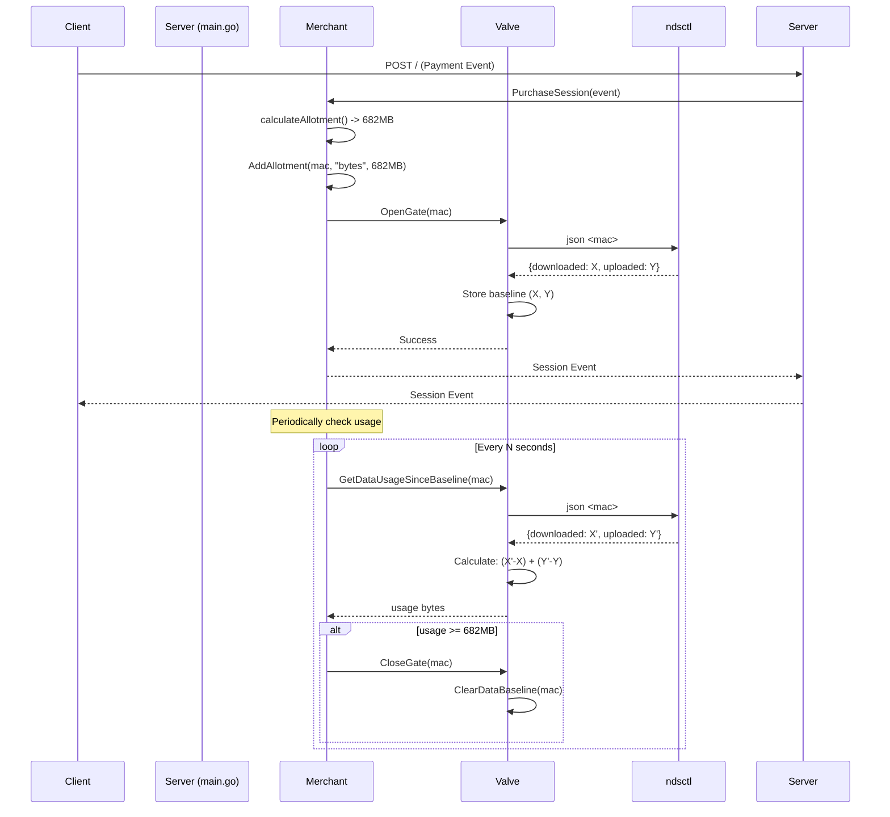

# Session Purchase Flow Diagram

This document illustrates the evolution of data-based session handling, from the flawed approach to the correct implementation.

## Original Flawed Flow (Fixed)

The original implementation had the `Merchant` opening the gate for a fixed 24-hour period for data-based sessions, completely ignoring the data allotment.

**Problem**: Data allotment was calculated but never enforced.

## Second Attempt (Also Flawed)

The second approach tried to fix this by using interface-level data tracking via `/proc/net/dev`.

**Problems**:
1. Tracked entire interface (`br-lan`) instead of individual customer
2. Multiple customers on same interface caused incorrect measurements
3. Unnecessary dependency: Merchant → Chandler

## Current Correct Implementation

The correct implementation uses per-customer tracking via `ndsctl` and proper separation of concerns.

**Key Improvements**:
1. **Per-customer tracking**: Uses `ndsctl json <mac>` for accurate individual customer data
2. **Baseline tracking**: Captures initial usage when gate opens, only counts new usage
3. **Proper separation**: Merchant handles session logic, Valve handles gate control
4. **No Chandler dependency**: Merchant works independently for downstream customers

This architecture ensures accurate data tracking and proper enforcement of data-based session limits.