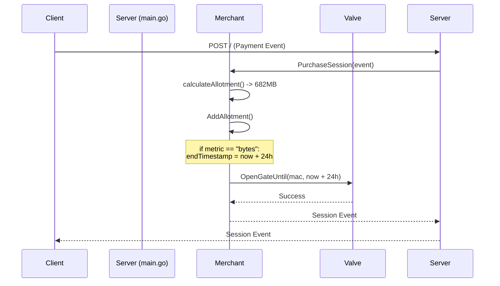
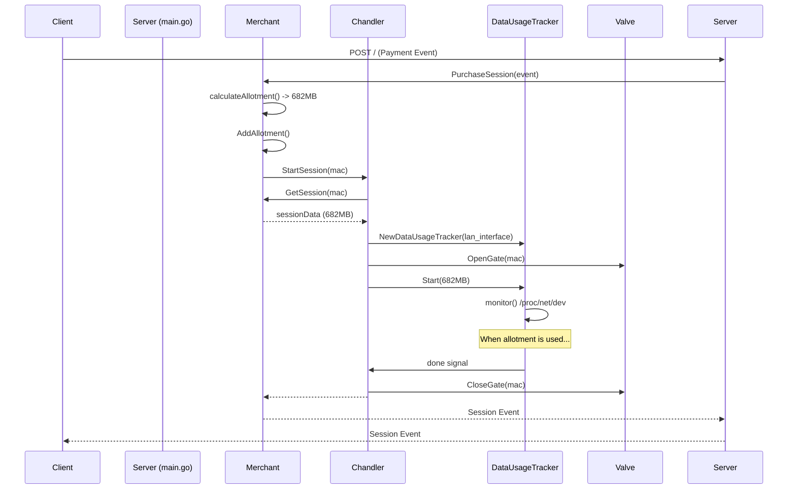

# Session Purchase Flow Diagram

This document illustrates the incorrect and correct flows for handling a data-based session purchase.

## Current Flawed Flow

The current implementation has the `Merchant` module directly calling the `Valve` to open the gate for a fixed 24-hour period when it sees a data-based (`bytes`) metric. It completely ignores the calculated data allotment for the purpose of gate control.

## Corrected Flow

The correct implementation involves the `Merchant` notifying the `Chandler` after a successful payment. The `Chandler` is responsible for creating the correct session tracker (`DataUsageTracker`), opening the gate indefinitely, and then closing the gate only when the data allotment is consumed.

The core problem is that the `Merchant` is performing session management tasks that belong to the `Chandler`. I will now prepare the fix to correct this architectural flaw.