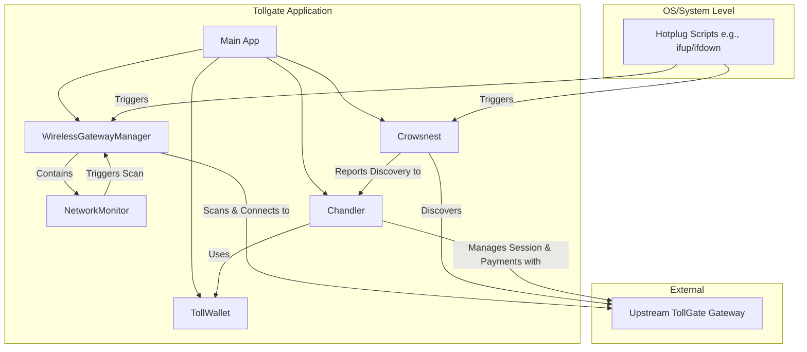

# Tollgate System Architecture

This document provides a high-level overview of the Tollgate system architecture.

## Component Interaction Diagram



## Detailed Sequence Diagram

```mermaid
sequenceDiagram
    participant Client as Tollgate Client Device
    participant OS as Operating System
    participant WGM as WirelessGatewayManager
    participant NM as NetworkMonitor
    participant Crowsnest
    participant Chandler
    participant Gateway as Upstream TollGate Gateway

    OS->>+WGM: Hotplug event (e.g., ifup/ifdown)
    WGM->>WGM: Start Scan for Wi-Fi Networks
    WGM-->>Gateway: Scans Wi-Fi signals
    Gateway-->>WGM: Responds with SSID, signal strength
    WGM->>WGM: Selects best TollGate Gateway
    WGM->>OS: Request to connect to Gateway's Wi-Fi
    OS-->>Gateway: Wi-Fi Association
    Gateway-->>OS: Wi-Fi Associated
    OS-->>Client: Network interface is up

    Crowsnest->>Gateway: Probe for TollGate advertisement (HTTP request)
    Gateway-->>Crowsnest: Return TollGate advertisement
    Crowsnest->>Chandler: Forward advertisement

    Chandler->>Gateway: Send payment (Cashu tokens)
    Gateway-->>Chandler: Return session token (proof of payment)
    Chandler->>Chandler: Start session monitoring

    loop Connectivity Check
        NM->>Gateway: Check internet connectivity (e.g., ping 8.8.8.8)
        alt Connection OK
            Gateway-->>NM: Ping reply
        else Connection Failed
            Gateway-->>NM: No reply
            NM->>WGM: Trigger force scan after threshold
        end
    end
