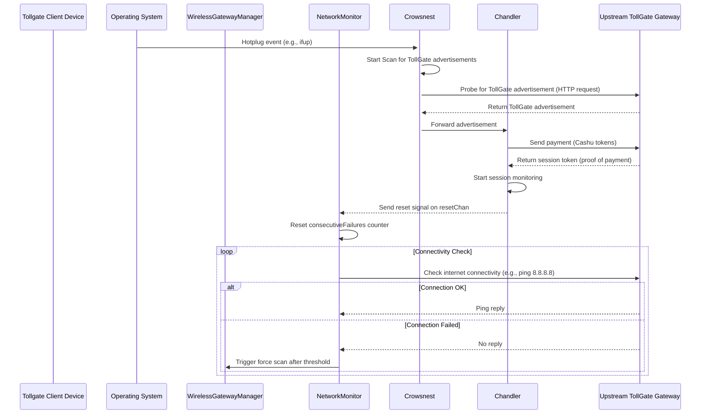

# Tollgate System Architecture

This document provides a high-level overview of the Tollgate system architecture.

## Component Interaction Diagram

```mermaid
graph TD
    subgraph OS/System Level
        A[Hotplug Scripts e.g., ifup/ifdown]
    end

    subgraph Tollgate Application
        B[WirelessGatewayManager]
        C[NetworkMonitor]
        D[Crowsnest]
        E[Chandler]
        F[TollWallet]
        G[Main App]
    end

    subgraph External
        H[Upstream TollGate Gateway]
    end

    G --> B
    G --> D
    G --> E
    G --> F

    A -- Triggers --> D

    B -- Contains --> C
    C -- Triggers Scan --> B

    B -- Scans & Connects to --> H
    D -- Discovers --> H
    D -- Reports Discovery to --> E

    E -- Manages Session & Payments with --> H
    E -- Uses --> F
    E -.-> C: Signals Reset
```

## Detailed Sequence Diagram

