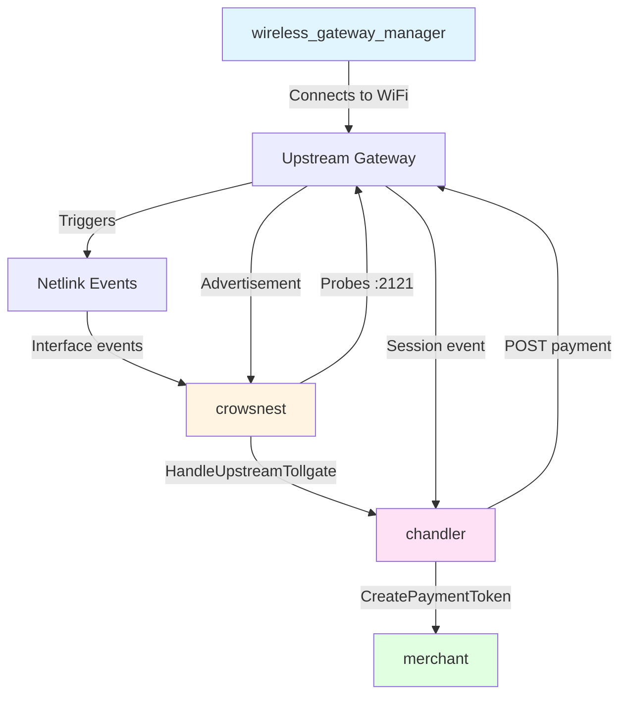
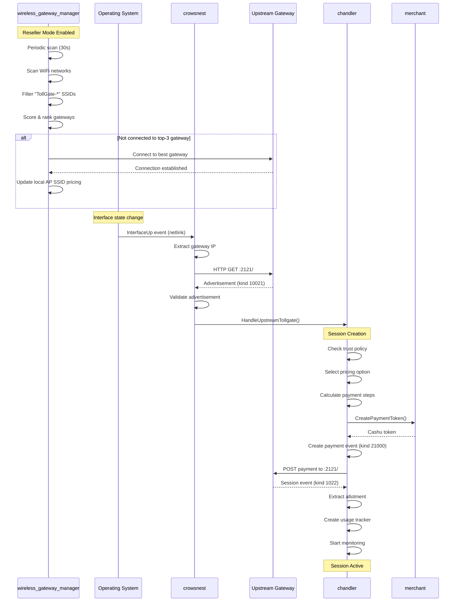
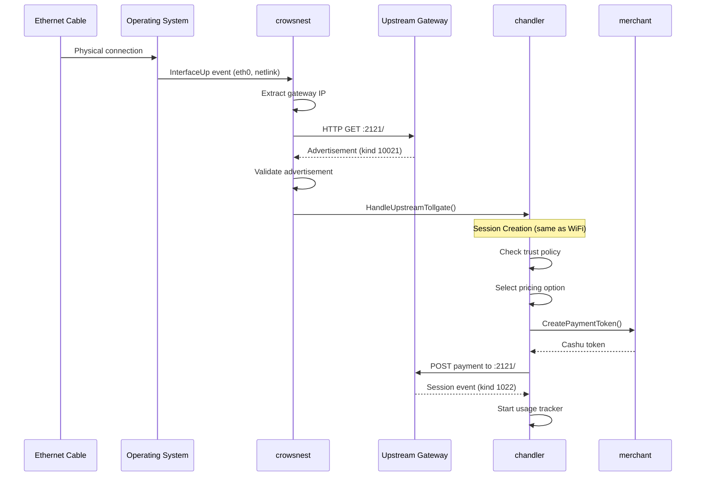
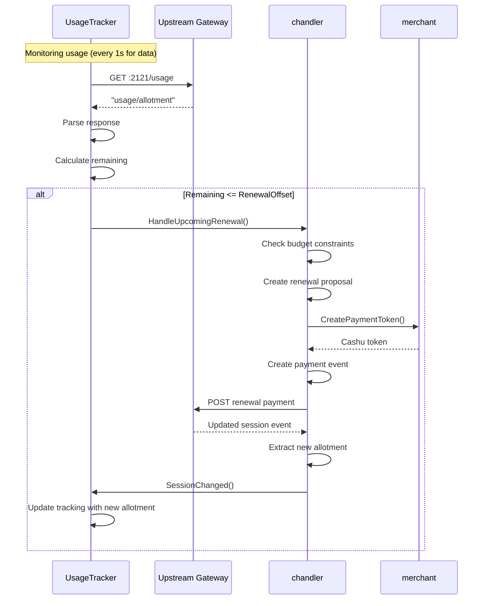

# Upstream Gateway Connection Flow

## Overview

This document describes how a TollGate device discovers, connects to, and maintains sessions with upstream TollGate gateways. The system supports both **wireless** (WiFi) and **wired** (Ethernet) upstream connections, with automatic detection, session creation, and renewal.

## Component Responsibilities

### High-Level Component Roles

| Component | Primary Responsibility | Upstream Role |
|-----------|----------------------|---------------|
| **wireless_gateway_manager** | WiFi network scanning and connection | Scans for and connects to upstream TollGate WiFi networks (reseller mode) |
| **crowsnest** | Network change detection and TollGate discovery | Detects new network connections and probes gateways for TollGate advertisements |
| **chandler** | Upstream session management | Creates and maintains payment sessions with upstream TollGates |
| **merchant** | Wallet and payment provider | Provides wallet functionality for chandler to make upstream payments |

### Component Interaction Map



## Complete Upstream Connection Flow

### Sequence Diagram: WiFi Connection to Session Creation



### Sequence Diagram: Wired Connection to Session Creation



## Session Renewal Flow

### Sequence Diagram: Automatic Session Renewal



## Behavioral Flow Descriptions

### 1. WiFi Gateway Discovery and Connection

**Trigger**: Periodic scan timer (30 seconds) when reseller mode is enabled

**Flow**:
1. `wireless_gateway_manager` scans for WiFi networks
2. Filters networks with SSID prefix "TollGate-"
3. Extracts pricing from SSID and vendor elements
4. Scores gateways based on signal strength and price
5. Checks if currently connected to top-3 ranked gateway
6. If not, connects to highest-ranked gateway
7. Updates local AP SSID to reflect upstream pricing (with margin)

**State Changes**:
- WiFi interface connects to new network
- Local AP SSID updated with new pricing
- Config file updated with new pricing

### 2. Network Connection Detection

**Trigger**: Netlink interface events (InterfaceUp, AddressAdded)

**Flow**:
1. `crowsnest` receives netlink event for interface state change
2. Extracts interface information (name, MAC, IP addresses)
3. Determines gateway IP for the interface
4. Checks `discoveryTracker` to prevent duplicate attempts
5. Records discovery attempt as "pending"
6. Probes gateway on port 2121 for TollGate advertisement
7. Validates advertisement signature and structure
8. Creates `UpstreamTollgate` object
9. Records discovery as "success"
10. Calls `chandler.HandleUpstreamTollgate()`

**State Changes**:
- Discovery attempt recorded in tracker
- Interface marked as having TollGate gateway

### 3. Session Creation

**Trigger**: `chandler.HandleUpstreamTollgate()` called by crowsnest

**Flow**:
1. Extract advertisement information (metric, step_size, pricing options)
2. Validate trust policy (allowlist/blocklist/default)
3. Find compatible pricing option (matching mint)
4. Check available balance in merchant wallet
5. Calculate payment steps based on preferred increments
6. Validate budget constraints (max price per unit)
7. Generate unique customer private key for session
8. Request payment token from merchant
9. Create payment event (kind 21000) with token
10. POST payment to upstream gateway
11. Receive and validate session event (kind 1022)
12. Extract actual allotment from session
13. Create appropriate usage tracker (time or data)
14. Start usage monitoring
15. Store session in active sessions map

**State Changes**:
- New session created in chandler
- Usage tracker started
- Merchant wallet balance decreased
- Session stored with status "Active"

### 4. Session Renewal

**Trigger**: Usage tracker detects usage approaching allotment limit

**Flow**:
1. Usage tracker monitors current usage
2. When usage >= (total_allotment - renewal_offset), trigger renewal
3. `chandler.HandleUpcomingRenewal()` called
4. Check if advertisement has changed (log warning if so)
5. Create renewal payment proposal
6. Validate budget constraints
7. Request payment token from merchant
8. Create renewal payment event
9. POST to upstream gateway
10. Receive updated session event
11. Extract new total allotment
12. Update session metadata
13. Notify usage tracker of session change
14. Continue monitoring with updated allotment

**State Changes**:
- Session allotment increased
- Payment count incremented
- Total spent updated
- Last renewal timestamp updated

### 5. Disconnection Handling

**Trigger**: Netlink InterfaceDown or AddressDeleted event

**Flow**:
1. `crowsnest` receives interface down event
2. Cancels any active probes for the interface
3. Clears discovery tracker for the interface
4. Calls `chandler.HandleDisconnect(interfaceName)`
5. Chandler finds all sessions on that interface
6. Stops usage trackers for those sessions
7. Marks sessions as "Expired"
8. Removes sessions from active sessions map

**State Changes**:
- Discovery tracker cleared for interface
- Sessions marked as expired
- Usage trackers stopped
- Sessions removed from memory

## Edge Cases & State Issues

### Issue 1: Connected but No Session Created

**Scenario**: Device connects to upstream WiFi but chandler fails to create session

**Possible Causes**:
- Trust policy rejection (pubkey not in allowlist)
- Budget constraints exceeded
- Insufficient wallet balance
- Payment processing failure
- Network timeout during payment POST

**Current Behavior**:
- Connection remains active
- No session created
- No automatic retry mechanism
- Periodic check won't help (only runs when no active sessions)

**Detection**:
- Check logs for "Trust policy validation failed" or "Budget constraints not met"
- Interface is up but no active session in chandler

**Potential Fix Areas**:
- Add retry mechanism in chandler with exponential backoff
- Implement session creation monitoring
- Add health check that verifies session exists for connected interfaces

### Issue 2: Discovery Deduplication Prevents Retry

**Scenario**: Initial TollGate probe fails but connection is valid

**Possible Causes**:
- Temporary network issue during probe
- Gateway temporarily unavailable
- Timeout during advertisement fetch

**Current Behavior**:
- Discovery marked as "error" in tracker
- No retry until interface goes down and back up
- `ShouldAttemptDiscovery()` returns false for same interface/gateway

**Detection**:
- Discovery tracker shows "error" result
- Interface connected but no session

**Potential Fix Areas**:
- Implement time-based retry for failed discoveries
- Clear error discoveries after timeout period
- Add manual retry trigger

### Issue 3: Wireless Manager and Crowsnest Coordination

**Scenario**: Wireless manager connects to new gateway but crowsnest doesn't detect it

**Possible Causes**:
- Netlink events not fired
- Event processing delay
- Interface already "up" so no InterfaceUp event

**Current Behavior**:
- WiFi connected
- Local AP SSID updated
- No TollGate discovery triggered
- Periodic check might eventually discover (if no other sessions)

**Detection**:
- WiFi connected to TollGate network
- No crowsnest discovery logs
- No active session

**Potential Fix Areas**:
- Wireless manager could trigger explicit discovery after connection
- Add connection state change monitoring beyond just interface up/down
- Implement forced re-scan on wireless connection change

### Issue 4: Session Renewal Failure

**Scenario**: Usage tracker triggers renewal but payment fails

**Possible Causes**:
- Insufficient wallet balance
- Budget constraints exceeded
- Network connectivity lost
- Upstream gateway unavailable

**Current Behavior**:
- Session marked as "Paused"
- Usage tracker stopped
- No automatic recovery
- User continues using until allotment exhausted

**Detection**:
- Session status = "Paused"
- Logs show "Renewal budget constraints not met"

**Potential Fix Areas**:
- Implement session pause notification
- Add automatic resume when balance available
- Graceful degradation before complete exhaustion

### Issue 5: Periodic Check Limitations

**Scenario**: Session expires but interface stays connected

**Possible Causes**:
- Session allotment fully consumed
- Session marked as expired
- Interface still physically connected

**Current Behavior**:
- Periodic check only runs when `len(activeSessions) == 0`
- If session exists but is expired/paused, periodic check won't run
- No automatic session recreation

**Detection**:
- Active sessions map contains expired/paused sessions
- No new session creation attempts

**Potential Fix Areas**:
- Modify periodic check to run when no "Active" sessions (not just empty map)
- Add session health monitoring
- Implement automatic cleanup of expired sessions

### Issue 6: Race Condition: Merchant Payout vs Chandler Payment

**Scenario**: Merchant payout routine drains wallet while chandler tries to pay upstream

**Possible Causes**:
- Payout routine runs every 1 minute
- No coordination between merchant payout and chandler payments
- Balance check happens before payment creation

**Current Behavior**:
- Chandler checks balance
- Merchant payout drains wallet
- Chandler payment creation fails
- Session creation/renewal fails

**Detection**:
- "Insufficient funds" error in chandler
- Merchant payout logs show successful payout
- Timing correlation between payout and payment failure

**Potential Fix Areas**:
- Implement wallet reservation system
- Add mutex/locking around balance operations
- Coordinate payout timing with active session needs

### Issue 7: Startup with Existing Connection and Unknown Session State

**Scenario**: TollGate starts/restarts while already connected to upstream, but doesn't know if session exists

**Possible Causes**:
- System reboot or TollGate restart
- Interface already connected to upstream TollGate
- May have active session on upstream (from before restart)
- Chandler has no persistent session storage

**Current Behavior**:
- Crowsnest discovers upstream via initial scan
- Chandler creates NEW session (new payment)
- If old session existed on upstream, it's abandoned (wasted payment)
- No session recovery mechanism

**Detection**:
```bash
# After restart, check if already connected
ip link show wlan0  # UP

# Check upstream for existing session
curl http://[gateway_ip]:2121/usage
# Returns: "1234567/10485760" (session exists!)
# OR: "-1/-1" (no session)

# But chandler creates new session anyway
```

**Potential Fix Areas**:
- Check `:2121/usage` before creating new session
- Implement session recovery if session exists
- Only create new payment if no session found
- Add session persistence for restart recovery

### Issue 8: Advertisement Changes Not Detected

**Scenario**: Upstream changes advertisement (pricing, terms) but chandler uses stale data

**Possible Causes**:
- Advertisement fetched once at discovery
- Never refreshed during session lifetime
- Upstream may change pricing or mints
- No polling mechanism for updates

**Current Behavior**:
- Advertisement stored at discovery time
- Used for all renewal decisions
- If upstream changes, chandler unaware
- May cause renewal failures

**Detection**:
```bash
# Check logs for advertisement change warnings
logread | grep "WARNING: Upstream advertisement changed"

# Manually compare advertisements
curl http://[gateway_ip]:2121/  # Current
# Compare with session data
```

**Potential Fix Areas**:
- Poll advertisement every 60 seconds
- Update session if changed and compatible
- Terminate session if incompatible
- Also helps overcome temporary connectivity issues

**Additional Benefits**:
- Detects if upstream still reachable
- Recovers from temporary network issues
- Provides health check for upstream connection

## Component Interaction Summary

### Module Communication Patterns

| From | To | Method | Purpose |
|------|-----|--------|---------|
| wireless_gateway_manager | (none) | - | Operates independently, triggers netlink events |
| netlink | crowsnest | Events channel | Network state changes |
| crowsnest | chandler | `HandleUpstreamTollgate()` | New upstream discovered |
| crowsnest | chandler | `HandleDisconnect()` | Interface disconnected |
| chandler | merchant | `CreatePaymentToken()` | Request payment token |
| chandler | merchant | `GetBalanceByMint()` | Check available balance |
| usage_tracker | chandler | `HandleUpcomingRenewal()` | Renewal threshold reached |
| chandler | usage_tracker | `SessionChanged()` | Session allotment updated |

### Critical Handoff Points

1. **WiFi Connection → Netlink Event**: Wireless manager connects, must trigger netlink
2. **Netlink Event → Crowsnest Detection**: Event must be received and processed
3. **Crowsnest Discovery → Chandler Handoff**: Advertisement must be valid and handed off
4. **Chandler → Merchant Payment**: Balance must be available and token created
5. **Payment → Session Creation**: Upstream must accept payment and return session
6. **Session → Usage Tracking**: Tracker must start and monitor correctly
7. **Usage Threshold → Renewal**: Renewal must trigger before exhaustion

## References to Other Documents

- **[wireless_gateway_manager.md](wireless_gateway_manager.md)**: Detailed WiFi scanning, gateway selection, and connection logic
- **[crowsnest.md](crowsnest.md)**: Network monitoring, TollGate discovery, and advertisement validation
- **[chandler.md](chandler.md)**: Session management, payment creation, and renewal logic
- **[merchant.md](merchant.md)**: Wallet management and payment token creation for upstream payments

---

## Technical Implementation Details

### Key Functions and Call Paths

#### WiFi Connection Path
```
wireless_gateway_manager.ScanWirelessNetworks()
  → wireless_gateway_manager.connector.Connect()
    → wireless_gateway_manager.updatePriceAndAPSSID()
      → wireless_gateway_manager.connector.UpdateLocalAPSSID()
      → config_manager.UpdatePricing()
```

#### Discovery Path
```
crowsnest.eventLoop()
  → crowsnest.handleNetworkEvent()
    → crowsnest.handleInterfaceUp()
      → crowsnest.attemptTollGateDiscovery()
        → crowsnest.tollGateProber.ProbeGatewayWithContext()
        → tollgate_protocol.ValidateAdvertisementFromBytes()
        → chandler.HandleUpstreamTollgate()
```

#### Session Creation Path
```
chandler.HandleUpstreamTollgate()
  → tollgate_protocol.ExtractAdvertisementInfo()
  → chandler.ValidateTrustPolicy()
  → chandler.selectCompatiblePricingOption()
  → merchant.GetBalanceByMint()
  → chandler.createAndSendPayment()
    → merchant.CreatePaymentToken()
    → chandler.createPaymentEvent()
    → HTTP POST to upstream:2121
  → chandler.extractAllotment()
  → chandler.createUsageTracker()
```

#### Renewal Path
```
usage_tracker.checkUsage() [periodic]
  → chandler.HandleUpcomingRenewal()
    → chandler.ValidateBudgetConstraints()
    → chandler.createAndSendPayment()
      → merchant.CreatePaymentToken()
      → HTTP POST to upstream:2121
    → chandler.extractAllotment()
    → usage_tracker.SessionChanged()
```

### Data Structures

#### UpstreamTollgate
```go
type UpstreamTollgate struct {
    InterfaceName string       // "wlan0", "eth0"
    MacAddress    string       // Local interface MAC
    GatewayIP     string       // Upstream gateway IP
    Advertisement *nostr.Event // kind 10021
    DiscoveredAt  time.Time
}
```

#### ChandlerSession
```go
type ChandlerSession struct {
    UpstreamTollgate   *UpstreamTollgate
    CustomerPrivateKey string
    Advertisement      *nostr.Event
    AdvertisementInfo  *tollgate_protocol.AdvertisementInfo
    SelectedPricing    *tollgate_protocol.PricingOption
    SessionEvent       *nostr.Event // kind 1022
    TotalAllotment     uint64
    UsageTracker       UsageTrackerInterface
    RenewalOffset      uint64
    Status             SessionStatus
    // ... metadata fields
}