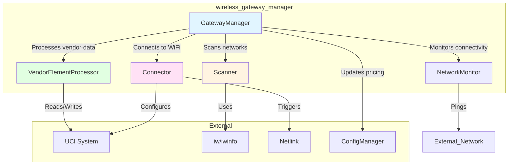
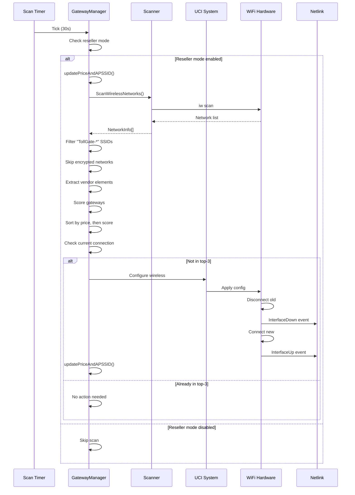
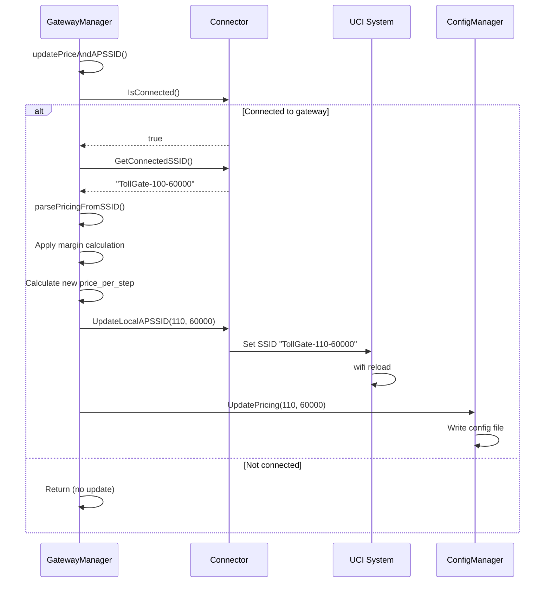

# Wireless Gateway Manager

## Overview

The `wireless_gateway_manager` module manages WiFi network operations for TollGate devices operating in **reseller mode**. It handles two primary responsibilities:

1. **Upstream Gateway Management**: Scanning for, selecting, and connecting to upstream TollGate WiFi networks
2. **Local AP Management**: Updating the local Access Point SSID to advertise pricing based on upstream costs

This module operates independently from other components, triggering network state changes that are detected by [`crowsnest`](crowsnest.md) through netlink events.

## Component Architecture



## Behavioral Flow Descriptions

### 1. Periodic Network Scanning (Reseller Mode)

**Trigger**: Timer tick every 30 seconds (when reseller mode enabled)

**Purpose**: Continuously monitor available TollGate networks and switch to better options

**Flow**:
1. Check if reseller mode is enabled in config
2. If disabled, skip scanning and return
3. Update current price and AP SSID before scanning
4. Scan all available WiFi networks using `iw` commands
5. Filter networks to only those with SSID prefix "TollGate-"
6. For each TollGate network:
   - Skip if encrypted (reseller mode only connects to open networks)
   - Extract vendor elements from beacon frames
   - Parse pricing information from SSID
   - Calculate gateway score based on signal and price
7. Sort gateways by price (ascending) then score (descending)
8. Check if currently connected to one of top-3 ranked gateways
9. If not connected to top-3, connect to highest-ranked gateway
10. After successful connection, update local AP SSID with new pricing

**State Changes**:
- `availableGateways` map updated with current scan results
- WiFi connection may change to different network
- Local AP SSID updated to reflect new pricing
- Config file updated with new pricing values

**Key Decision Points**:
- Reseller mode enabled? (if not, skip entirely)
- Network encrypted? (skip encrypted networks)
- Connected to top-3? (if yes, no action needed)

### 2. Gateway Scoring and Selection

**Trigger**: After network scan completes

**Purpose**: Rank available gateways to select the best option

**Scoring Algorithm**:
```
Base Score = Signal Strength Score (from vendor elements)
Price Penalty = 20 * log10(price_per_step * step_size)
Final Score = Base Score - Price Penalty
```

**Selection Logic**:
1. Sort by `price_per_step` (ascending) - cheaper is better
2. Then sort by `score` (descending) - higher score is better
3. Select top-ranked gateway
4. Only connect if not already in top-3

**Rationale**: Prioritizes cheaper gateways while considering signal quality

### 3. WiFi Connection Process

**Trigger**: Decision to connect to new gateway

**Purpose**: Establish WiFi connection to selected upstream TollGate

**Flow**:
1. Retrieve gateway details (SSID, BSSID)
2. Set password to empty string (open network in reseller mode)
3. Execute UCI commands to configure wireless interface:
   ```
   uci set wireless.@wifi-iface[1].network='wan'
   uci set wireless.@wifi-iface[1].mode='sta'
   uci set wireless.@wifi-iface[1].ssid='<gateway_ssid>'
   uci set wireless.@wifi-iface[1].encryption='none'
   uci set wireless.@wifi-iface[1].disabled='0'
   uci commit wireless
   wifi reload
   ```
4. Wait for connection to establish
5. Trigger `updatePriceAndAPSSID()` on success

**State Changes**:
- UCI wireless configuration modified
- WiFi interface reconnects to new network
- Netlink events triggered (InterfaceDown, then InterfaceUp)

**Error Handling**:
- Log connection failures
- Continue with current connection if new connection fails
- Next scan cycle will retry

### 4. Local AP SSID Update

**Trigger**: After successful upstream connection or pricing change

**Purpose**: Advertise current pricing to downstream customers

**Flow**:
1. Check if connected to upstream gateway
2. If not connected, return (stay in current state)
3. Get connected SSID from system
4. Parse pricing from SSID format: `TollGate-<price>-<stepsize>`
5. If pricing found in SSID:
   - Apply configured margin: `ourPrice = gatewayPrice * (1 + margin)`
   - Calculate new `price_per_step` based on our `step_size`
6. If no pricing in SSID (or price is 0):
   - Use maximum price from config's accepted mints
7. Update local AP SSID via UCI:
   ```
   uci set wireless.@wifi-iface[0].ssid='TollGate-<price>-<stepsize>'
   uci commit wireless
   wifi reload
   ```
8. Update config file with new pricing values

**Pricing Calculation Example**:
```
Upstream: TollGate-100-60000 (100 sats per 60000 ms)
Gateway price = 100 * 60000 = 6,000,000
Margin = 0.1 (10%)
Our price = 6,000,000 * 1.1 = 6,600,000
Our step_size = 60000 (from config)
Our price_per_step = 6,600,000 / 60000 = 110
Result: TollGate-110-60000
```

**State Changes**:
- Local AP SSID updated
- Config file pricing updated
- Downstream customers see new pricing

### 5. Network Connectivity Monitoring

**Trigger**: Periodic ping check (separate goroutine)

**Purpose**: Detect upstream connectivity loss and enter safe mode

**Flow**:
1. Ping 8.8.8.8 periodically
2. Track consecutive failures and successes
3. If consecutive failures >= threshold:
   - Mark as "in safe mode"
   - Could trigger AP shutdown (implementation dependent)
4. If consecutive successes >= threshold:
   - Mark as "connected"
   - Resume normal operation

**State Changes**:
- `isInSafeMode` flag toggled
- May affect AP availability

**Note**: This monitoring is separate from the main scanning loop

### 6. Vendor Element Processing

**Trigger**: During network scan for each TollGate network

**Purpose**: Extract Bitcoin/Nostr metadata from WiFi beacon frames

**Flow**:
1. Parse raw Information Elements (IEs) from beacon
2. Look for vendor-specific elements
3. Extract and decode Bitcoin/Nostr related data
4. Calculate signal-based score
5. Return vendor elements map and score

**Extracted Data** (potential):
- Signal strength metrics
- Gateway capabilities
- Additional pricing information
- Network metadata

## Sequence Diagrams

### Complete Scan-to-Connection Flow



### Pricing Update Flow



## Events Sent to Other Components

### Indirect Events (via Netlink)

The wireless_gateway_manager doesn't directly call other TollGate modules, but triggers system events:

| Event | Trigger | Detected By | Purpose |
|-------|---------|-------------|---------|
| InterfaceDown | WiFi disconnect during reconnection | crowsnest | Cleanup old connection |
| InterfaceUp | WiFi connection established | crowsnest | Trigger TollGate discovery |
| AddressAdded | DHCP assigns IP address | crowsnest | Confirm connectivity |

### Configuration Updates

| Update | Target | Purpose |
|--------|--------|---------|
| `UpdatePricing()` | ConfigManager | Store current pricing in config file |
| `UpdateLocalAPSSID()` | UCI System | Advertise pricing to downstream customers |

## Edge Cases & State Issues

### Issue 1: Scan Triggers Connection but Crowsnest Misses Event

**Scenario**: Wireless manager connects to new gateway but crowsnest doesn't detect it

**Root Cause**:
- WiFi connection happens via UCI/wifi reload
- If interface was already "up", may not trigger InterfaceUp event
- Only AddressAdded event might fire
- Crowsnest might miss or delay processing the event

**Current Behavior**:
- Wireless manager successfully connected
- Local AP SSID updated with new pricing
- No TollGate discovery triggered
- No session created with upstream
- Device is "connected but not paying"

**Detection**:
```bash
# Check WiFi connection
iwinfo wlan0 info  # Shows connected to TollGate-X-Y

# Check crowsnest logs
logread | grep crowsnest  # No "TollGate advertisement found" message

# Check chandler sessions
tollgate-cli network status  # No active upstream session
```

**Potential Fixes**:
1. Add explicit discovery trigger after wireless connection
2. Implement connection state change monitoring beyond interface up/down
3. Add forced re-scan in crowsnest after wireless changes
4. Wireless manager could directly notify crowsnest (breaks independence)

### Issue 2: Rapid Gateway Switching

**Scenario**: Gateway scores fluctuate, causing frequent reconnections

**Root Cause**:
- Signal strength varies
- Price changes in SSID
- Top-3 ranking changes frequently
- Each scan (30s) might trigger reconnection

**Current Behavior**:
- Frequent WiFi disconnects/reconnects
- Multiple InterfaceDown/Up events
- Potential session disruption
- Unstable connectivity

**Detection**:
- Logs show frequent "attempting to connect" messages
- Multiple different SSIDs in short time period
- Session creation/termination cycles

**Potential Fixes**:
1. Add hysteresis to gateway selection (require significant improvement)
2. Increase scan interval when stable
3. Add minimum connection time before allowing switch
4. Implement connection quality tracking over time

### Issue 3: Encrypted Network Handling

**Scenario**: Best gateway is encrypted but reseller mode only supports open networks

**Root Cause**:
- Reseller mode skips encrypted networks
- Best available gateway might be encrypted
- Falls back to lower-ranked open network or no connection

**Current Behavior**:
- Encrypted TollGate networks ignored
- May connect to suboptimal gateway
- May not connect at all if only encrypted networks available

**Detection**:
- Logs show "Skipping encrypted TollGate network"
- Connected to lower-ranked gateway
- Not connected despite TollGate networks available

**Potential Fixes**:
1. Support encrypted TollGate networks with pre-shared keys
2. Add configuration for known encrypted networks
3. Implement WPS or other auto-configuration
4. Document limitation clearly

### Issue 4: Pricing Update Race Condition

**Scenario**: Pricing update happens while scan is in progress

**Root Cause**:
- `updatePriceAndAPSSID()` called at start of scan
- Scan takes time to complete
- Connection might change during scan
- Pricing update might use stale data

**Current Behavior**:
- Potential inconsistency between actual connection and advertised pricing
- Brief period where local AP shows wrong pricing
- Next scan cycle will correct it

**Detection**:
- Local AP SSID doesn't match upstream pricing
- Temporary pricing mismatch in logs

**Potential Fixes**:
1. Lock during scan and pricing update
2. Update pricing only after connection confirmed
3. Add pricing validation step
4. Implement atomic scan-connect-update operation

### Issue 5: No Upstream Available

**Scenario**: No TollGate networks found in scan

**Root Cause**:
- Out of range of TollGate networks
- All TollGate networks encrypted
- WiFi hardware issues
- Interference or signal problems

**Current Behavior**:
- Scan completes with empty gateway list
- No connection attempt
- Stays on current connection (if any)
- Local AP pricing unchanged

**Detection**:
- Logs show "No available TollGate gateways to connect to"
- `availableGateways` map is empty
- No connection changes

**Potential Fixes**:
1. Implement fallback behavior (safe mode pricing)
2. Add alert/notification for no upstream available
3. Increase scan range or power
4. Support wired upstream as fallback

### Issue 6: UCI Configuration Persistence

**Scenario**: WiFi configuration changes lost after reboot

**Root Cause**:
- UCI changes committed but not persisted
- Config file corruption
- Filesystem issues

**Current Behavior**:
- After reboot, reverts to previous WiFi configuration
- May connect to wrong network
- Pricing information lost

**Detection**:
- After reboot, different WiFi connection than before
- Config file doesn't match runtime state

**Potential Fixes**:
1. Verify UCI commit success
2. Add configuration backup/restore
3. Implement startup validation
4. Add configuration health check

## Integration with Other Components

### Relationship with Crowsnest

**Connection**: Indirect via netlink events

**Flow**:
```
wireless_gateway_manager connects to WiFi
  → Triggers netlink InterfaceUp event
    → crowsnest detects event
      → crowsnest probes gateway
        → crowsnest hands off to chandler
```

**Gap**: No direct communication, relies on system events

**Potential Issue**: Event loss or delay breaks the chain

### Relationship with ConfigManager

**Connection**: Direct function calls

**Flow**:
```
wireless_gateway_manager.updatePriceAndAPSSID()
  → configManager.UpdatePricing(price, stepSize)
    → Writes to config.json
```

**Purpose**: Persist pricing for downstream customers

### Relationship with Local AP

**Connection**: Via UCI system

**Flow**:
```
wireless_gateway_manager.updatePriceAndAPSSID()
  → connector.UpdateLocalAPSSID(price, stepSize)
    → UCI commands to update SSID
      → wifi reload
```

**Purpose**: Advertise current pricing to customers

## Configuration

### Reseller Mode Settings

```json
{
  "reseller_mode": true,
  "margin": 0.1,
  "step_size": 60000,
  "accepted_mints": [...]
}
```

**Key Parameters**:
- `reseller_mode`: Enable/disable upstream gateway scanning
- `margin`: Profit margin to add to upstream pricing (0.1 = 10%)
- `step_size`: Our step size for pricing calculations

### Scan Interval

**Default**: 30 seconds

**Location**: Hardcoded in `wireless_gateway_manager.go`

```go
scanInterval: 30 * time.Second
```

**Consideration**: Could be made configurable for different use cases

---

## Technical Implementation Details

### Key Functions

#### ScanWirelessNetworks()
```go
func (gm *GatewayManager) ScanWirelessNetworks(ctx context.Context)
```

**Purpose**: Main scanning and connection logic

**Call Path**:
```
RunPeriodicScan() [goroutine]
  → ScanWirelessNetworks()
    → scanner.ScanWirelessNetworks()
    → vendorProcessor.ExtractAndScore()
    → connector.GetConnectedSSID()
    → connector.Connect()
    → updatePriceAndAPSSID()
```

**Key Operations**:
1. Check reseller mode
2. Scan networks
3. Filter and score
4. Select best gateway
5. Connect if needed
6. Update pricing

#### updatePriceAndAPSSID()
```go
func (gm *GatewayManager) updatePriceAndAPSSID()
```

**Purpose**: Update local AP SSID with current pricing

**Call Path**:
```
updatePriceAndAPSSID()
  → networkMonitor.IsConnected()
  → connector.GetConnectedSSID()
  → parsePricingFromSSID()
  → connector.UpdateLocalAPSSID()
  → configManager.UpdatePricing()
```

**Key Operations**:
1. Check connection status
2. Get current SSID
3. Parse pricing
4. Apply margin
5. Update AP SSID
6. Update config

#### parsePricingFromSSID()
```go
func parsePricingFromSSID(ssid string) (pricePerStep int, stepSize int)
```

**Purpose**: Extract pricing from SSID format

**Format**: `TollGate-<price>-<stepsize>`

**Example**: `TollGate-100-60000` → price=100, stepSize=60000

### Data Structures

#### Gateway
```go
type Gateway struct {
    BSSID          string
    SSID           string
    Signal         int
    Encryption     string
    PricePerStep   int
    StepSize       int
    Score          int
    VendorElements map[string]string
}
```

#### NetworkInfo
```go
type NetworkInfo struct {
    BSSID        string
    SSID         string
    Signal       int
    Encryption   string
    PricePerStep int
    StepSize     int
    RawIEs       []byte  // Raw Information Elements
}
```

### UCI Commands Used

**WiFi Configuration**:
```bash
uci set wireless.@wifi-iface[1].network='wan'
uci set wireless.@wifi-iface[1].mode='sta'
uci set wireless.@wifi-iface[1].ssid='<ssid>'
uci set wireless.@wifi-iface[1].encryption='none'
uci set wireless.@wifi-iface[1].disabled='0'
uci commit wireless
wifi reload
```

**SSID Update**:
```bash
uci set wireless.@wifi-iface[0].ssid='TollGate-<price>-<stepsize>'
uci commit wireless
wifi reload
```

**Note**: Index [0] is local AP, index [1] is client/station mode