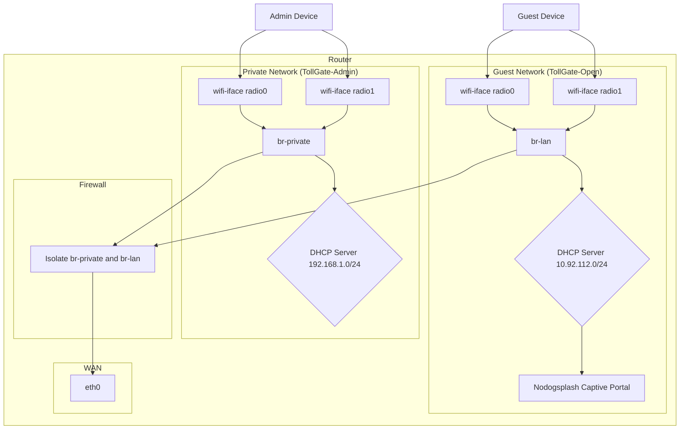

# Private SSID Design Document

## 1. Overview

This document outlines the plan to create a new password-protected SSID on the TollGate router. This SSID will provide secure, direct internet and administrative access for the router owner, bypassing the captive portal that manages the public-facing open SSIDs.

## 2. Known Requirements

*   **Private SSID Name:** `TollGate-Admin`
*   **Password:** `securepassword123`
*   **Wireless Bands:** 2.4GHz and 5GHz
*   **Network Access:** Direct internet and router administration access.
*   **Security:**
    *   WPA2/WPA3 security.
    *   The private network must be isolated from the guest network.

## 3. Research Findings

### 3.1 Network Interface Configuration

The private network should have its own bridge interface, separate from the guest network. In OpenWRT, this is managed in `/etc/config/network` using UCI.

**Key Points:**
- Multiple SSIDs can be mapped to different network interfaces by setting the `network` option in each `wifi-iface` section.
- Each bridge device (e.g., `br-lan` for guest, `br-private` for admin) must be defined in the network config.
- The private network should use a different subnet than the guest network (e.g., `192.168.1.0/24`), as using the same subnet will cause routing conflicts[2].

**Reference:** [OpenWRT Forum: Creating recovery SSID][2]

---

### 3.2 Captive Portal Isolation

Nodogsplash binds to a specific interface using the `gatewayinterface` option. Your config shows:
```
option gatewayinterface 'br-lan'
```
**Key Points:**
- Nodogsplash only intercepts traffic on the interface specified in `gatewayinterface`.
- By creating a separate bridge (e.g., `br-private`) for the admin SSID and ensuring nodogsplash remains bound to `br-lan`, the private network will bypass the captive portal.
- No additional nodogsplash config is needed beyond verifying it remains bound to `br-lan`.

**Reference:** Your current `/etc/config/nodogsplash` and OpenWRT captive portal documentation.

---

### 3.3 Dual-Band SSID Configuration

OpenWRT supports multiple `wifi-iface` sections per radio. Each radio (`radio0` for 2.4GHz, `radio1` for 5GHz) can host multiple SSIDs.

**Key Points:**
- Each `wifi-iface` section must have a unique name.
- Both SSIDs on the same radio can point to different network interfaces via the `network` option.
- The `disabled` option must be set to `'0'` to enable the SSID.
- WPA2/WPA3 security is set with `option encryption 'sae'` (WPA3-SAE) or `option encryption 'psk2'` (WPA2-PSK).

**Example:**
```
config wifi-iface 'admin_radio0'
    option device 'radio0'
    option network 'private'
    option mode 'ap'
    option ssid 'TollGate-Admin'
    option encryption 'sae'
    option key 'securepassword123'
    option disabled '0'
```

**Reference:** [OpenWRT Forum: Creating recovery SSID][2]

---

### 3.4 Firewall Configuration

OpenWRT's firewall uses zones to group interfaces and define rules.

**Key Points:**
- Create a new firewall zone for the private network.
- Set zone defaults:
  - **Input:** Accept (for router admin)
  - **Output:** Accept
  - **Forward:** Accept (for internet access)
- Allow forwarding from `private` to `wan` (internet).
- Block forwarding between `private` and `guest` (isolation).
- Add rules for DNS (port 53) and DHCP (port 67) if using router-based services.

**Reference:** [YouTube: OpenWRT Guest WiFi Setup][1]

---

## 4. Proposed Architecture



## 5. Implementation Plan

1.  **Research and Finalize Network Configuration:**
    *   Confirm the best approach for creating a new network interface and bridge for the private SSID.
    *   Decide on a final, non-conflicting IP address range for the private network.
    *   Investigate how to configure the firewall to isolate the two networks.
    *   Determine how to exclude the new private network from the `nodogsplash` captive portal.
2.  **Modify Wireless Configuration (`/etc/config/wireless`):**
    *   Add new `wifi-iface` sections for the "TollGate-Admin" SSID on both `radio0` (2.4GHz) and `radio1` (5GHz).
    *   Set the `network` option for these new interfaces to a new network name (e.g., `private`).
    *   Configure WPA2/WPA3 encryption and the password.
3.  **Modify Network Configuration (`/etc/config/network`):**
    *   Create a new `interface` section for the private network (e.g., `private`).
    *   Create a new bridge device (`br-private`) for the private network.
    *   Assign a static IP address and netmask to the new interface (e.g., `192.168.1.1`, `255.255.255.0`).
    *   Configure a DHCP server for the new private network.
4.  **Modify Firewall Configuration:**
    *   Create a new firewall zone for the private network.
    *   Add rules to allow traffic from the private network to the WAN (for internet access).
    *   Add rules to allow administrative access to the router from the private network.
    *   Add rules to prevent traffic between the private and guest networks.
5.  **Verify Nodogsplash Configuration (`/etc/config/nodogsplash`):**
    *   Ensure `nodogsplash` is only bound to the guest network interface (`br-lan`).
6.  **Testing and Verification:**
    *   Apply the changes and reboot the router.
    *   Connect to the "TollGate-Admin" SSID and verify internet access.
    *   Confirm that the captive portal is not active on the private SSID.
    *   Connect to the open "TollGate" SSIDs and verify that the captive portal is still working correctly.
    *   Verify that devices on the private and guest networks cannot communicate with each other.

---

**References:**

[1]: https://www.youtube.com/watch?v=pGlEmqiTcck "YouTube: OpenWRT Guest WiFi Setup"
[2]: https://forum.openwrt.org/t/create-recovery-wireless-ssid/240904 "OpenWRT Forum: Creating recovery SSID"