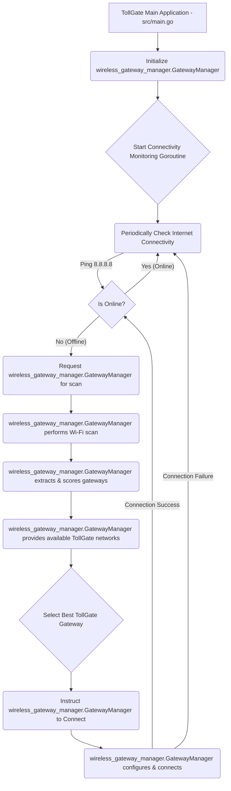

# New High-Level Design Document (HLDD): TollGate Core Network Connectivity Management

## 1. Introduction

This document outlines the high-level design for implementing robust network connectivity management within the TollGate main application (`src/main.go`). Its primary goal is to ensure continuous internet access by periodically verifying online status and, if disconnected, autonomously discovering and connecting to suitable Wi-Fi gateways, particularly those broadcasting "TollGate" SSIDs.

## 2. System Overview

The TollGate main application will incorporate a dedicated goroutine responsible for supervising network connectivity. This goroutine will:
1.  **Periodically ping a reliable external endpoint** (e.g., 8.8.8.8) to ascertain internet reachability.
2.  **Upon detecting an offline state**, it will initiate a discovery process using the `wireless_gateway_manager.GatewayManager` to scan for available Wi-Fi networks.
3.  **Prioritize and select** the most appropriate "TollGate" branded gateway based on predefined criteria (e.g., signal strength, vendor elements).
4.  **Orchestrate the connection** to the chosen gateway, leveraging the `wireless_gateway_manager.GatewayManager`'s connection capabilities.
5.  **Maintain continuous monitoring**, re-initiating the discovery and connection process if connectivity is lost again.

## 3. Component Interaction and Data Flow

The primary interaction will be between `src/main.go` and the `wireless_gateway_manager.GatewayManager` module.

*   **`src/main.go` (Connectivity Orchestrator):** Coordinates the overall network management.
    *   Initializes `wireless_gateway_manager.GatewayManager`.
    *   Runs a periodic health check (ping).
    *   If offline, calls `GatewayManager` for scanning and connection.
    *   Manages the state of connectivity (online/offline).
*   **`wireless_gateway_manager.GatewayManager`:** Provides the underlying Wi-Fi scanning, gateway identification (including "TollGate" SSID and vendor element processing), and connection functionalities.
    *   Exposes `ScanWirelessNetworks()`, `GetAvailableGateways()`, and `ConnectToGateway()` APIs.

### 3.1. Data Flow Diagram

## 4. API Definitions / Interface Contracts (TollGate Main Application)

The `main` package will introduce an internal network management loop.

*   **`func isOnline() bool`:** A helper function to perform a simple internet connectivity check (e.g., pinging 8.8.8.8).
*   **`func initNetworkManager(ctx context.Context)`:** (To be called from `main()`) Initializes the `GatewayManager` and starts the continuous monitoring goroutine.

## 5. Future Extensibility Considerations

*   **Configurable Scan Interval:** Allow the connectivity check and scan interval to be configured.
*   **Multiple Connectivity Check Endpoints:** Use a list of endpoints for robust internet connectivity detection.
*   **Connection Retry Logic:** Implement more sophisticated retry logic for gateway connections.
*   **User Notification:** Provide feedback to the user via logs or a web interface about connection status and actions.
*   **Advanced Gateway Selection:** Integrate more complex logic from future `wireless_gateway_manager` enhancements (e.g., throughput testing, authentication status).

## 6. Testing

The testing strategy will focus on ensuring the main application correctly utilizes the `wireless_gateway_manager.GatewayManager` and restores connectivity when offline.

*   **Unit Tests:** For `isOnline()` and any other small helper functions in `main.go`.
*   **Integration Tests:**
    *   Simulate offline conditions and verify that the `GatewayManager` is called and attempts connections.
    *   Simulate the presence of various "TollGate" SSIDs and verify correct gateway selection.
    *   Run on actual OpenWRT hardware to confirm UCI interactions and real-world network behavior.
*   **Manual Testing:** Observe logs during network disruptions and verify automated reconnection.