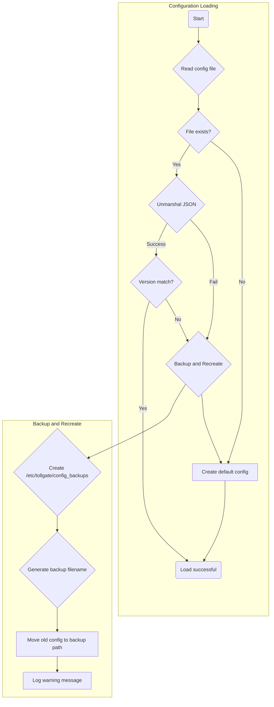

# HLDD: Configuration Management Refactor

## 1. Overview

This document outlines the high-level design for refactoring the `config_manager` module. The primary goals of this refactoring are:

- **Simplify Configuration:** Reduce the complexity of `config.json` by separating identity and installation-specific data into their own files.
- **Improve Maintainability:** Break down the monolithic `config_manager.go` file into smaller, more focused files, each responsible for a single configuration file.
- **Decouple Modules:** Remove the `bragging` module, which is no longer required.
- **Introduce Dedicated Identity Management:** Create a new `identities.json` file to manage all user and system identities in a structured way.

## 2. New Configuration Structure

The configuration will be split across three files located in `/etc/tollgate/`:

### 2.1. `config.json` (Simplified)

This file will contain the core operational parameters for the Tollgate service.

```json
{
  "config_version": "v0.0.4",
  "accepted_mints": [],
  "profit_share": [],
  "step_size": 600000,
  "metric": "milliseconds",
  "relays": [],
  "show_setup": true
}
```

### 2.2. `janitor.json`

This file will continue to store installation-specific information. Its structure remains the same.

```json
{
  "config_version": "v0.0.2",
  "package_path": "",
  "enabled": false,
  "ip_address_randomized": true,
  "release_channel": "stable"
}
```

### 2.3. `identities.json` (New)

This new file will manage all cryptographic and public identities used by the system.

```json
{
  "config_version": "v0.0.1",
  "owned_identities": [
    {
      "name": "merchant",
      "privatekey": "..."
    }
  ],
  "public_identities": [
    {
      "name": "developer",
      "lightning_address": "..."
    },
    {
      "name": "trusted_maintainer_1",
      "pubkey": "..."
    },
    {
      "name": "owner",
      "pubkey": "[placeholder]",
      "lightning_address": "..."
    }
  ]
}
```

## 3. Component Architecture

The `config_manager` Go package will be refactored from a single `config_manager.go` file into a more modular structure.

```mermaid
graph TD
    A[config_manager] --> B[config_manager_config.go];
    A --> C[config_manager_install.go];
    A --> D[config_manager_identities.go];
    A --> E[config_manager.go (main)];

    subgraph "Responsibilities"
        B -- manages --> F[config.json];
        C -- manages --> G[janitor.json];
        D -- manages --> H[identities.json];
        E -- coordinates & provides unified API --> B;
        E --> C;
        E --> D;
    end
```

- **`config_manager.go`:** Will contain the main `ConfigManager` struct and act as the primary entry point for the package, coordinating the other files.
- **`config_manager_config.go`:** Will handle all logic related to `config.json` (loading, saving, defaults).
- **`config_manager_install.go`:** Will handle all logic related to `janitor.json`.
- **`config_manager_identities.go`:** Will handle all logic related to the new `identities.json`.

## 4. API Changes

The public API of the `config_manager` will be updated to reflect the new structure. Key functions will include:

- `NewConfigManager(filePath string) (*ConfigManager, error)`
- `LoadAllConfigs() error`
- `GetConfig() *Config`
- `GetInstallConfig() *InstallConfig`
- `GetIdentities() *IdentitiesConfig`
- `GetIdentity(name string) (*PublicIdentity, error)`
- `GetOwnedIdentity(name string) (*OwnedIdentity, error)`

## 5. Bragging Module Removal

The `bragging` module and its associated code will be completely removed from the codebase. This includes:
- Deleting the `src/bragging` directory.
- Removing the `BraggingConfig` struct from `config_manager`.
- Removing any calls to the bragging module from other parts of the application.

## 6. Configuration Resilience

To ensure system stability during updates, a robust configuration handling mechanism will be implemented. If any configuration file (`config.json`, `janitor.json`, or `identities.json`) is found to be malformed or has a version mismatch, it will be automatically backed up and replaced with a default configuration. This prevents the service from crashing due to incompatible configuration formats.

### 6.1. Backup and Recovery Process

The process will be triggered within the `EnsureDefault...` function for each configuration file.



### 6.2. Key Logic
1.  **Detection**: The process is triggered if:
    - The JSON file is malformed and cannot be unmarshalled.
    - The `config_version` field in the file does not match the `config_version` defined in the code for that configuration type.
2.  **Backup**:
    - A backup directory will be created at `/etc/tollgate/config_backups` if it doesn't exist.
    - The problematic configuration file will be moved (renamed) to this directory.
    - The backup filename will follow the format: `[type]_[timestamp]_[code_version].json`, for example: `config_2025-09-07T16:45:00Z_v0.0.4.json`.
3.  **Re-creation**:
    - A new configuration file with the default values will be created in the original location (`/etc/tollgate/`).
4.  **Logging**:
    - A warning will be logged indicating that the configuration file was invalid, has been backed up, and a new default file has been created. This will provide visibility for debugging.

This process will apply to `config.json`, `janitor.json`, and `identities.json` to ensure a consistent and resilient configuration environment.
