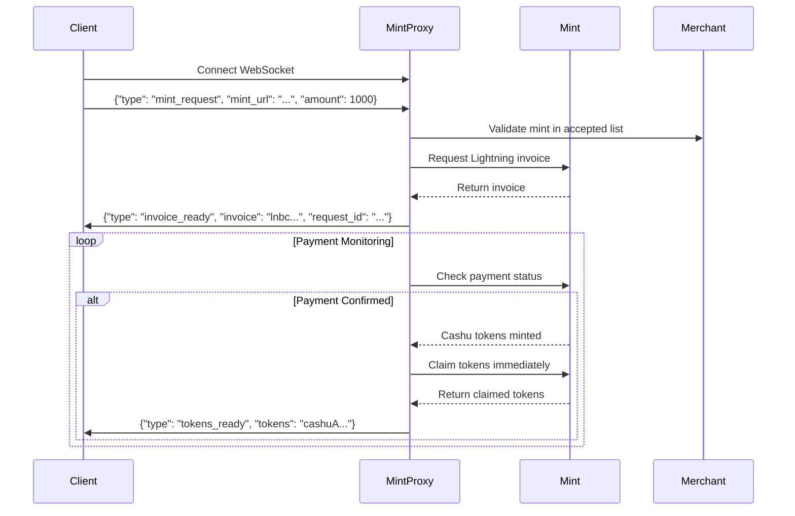

# mint_proxy Module - High Level Design Document

## Overview

The mint_proxy module is a standalone WebSocket service that allows users to make web requests for Lightning invoices and receive Cashu tokens once payments are completed. It acts as an intermediary between users and Cashu mints, handling the Lightning payment → Cashu token minting process.

## Architecture

### Core Components

- **WebSocket Server**: Handles real-time bidirectional communication with clients
- **State Manager**: Maintains MAC address-based state for tracking user requests
- **Mint Client**: Interfaces with Cashu mint APIs for invoice generation and token retrieval
- **Merchant Integration**: Validates mints against the tollgate's accepted mint list

### Integration Points

- **MAC Address Detection**: Reuses existing `getIP()` and `getMacAddress()` functions from main.go
- **Merchant Integration**: Accesses `merchantInstance.GetAcceptedMints()` for validation
- **Configuration**: Leverages existing `configManager` for mint_proxy settings
- **Logging**: Uses existing logrus setup with module-specific fields

## Message Flow



## WebSocket Message Types

### Client → MintProxy Messages

#### Mint Request
```json
{
  "type": "mint_request",
  "mint_url": "https://mint.example.com",
  "amount": 1000
}
```


### MintProxy → Client Messages

#### Invoice Ready
```json
{
  "type": "invoice_ready",
  "request_id": "uuid-123",
  "invoice": "lnbc1000n1...",
  "expires_at": 1692547200
}
```

#### Tokens Ready
```json
{
  "type": "tokens_ready",
  "request_id": "uuid-123", 
  "tokens": "cashuAeyJ0eXAiOiJ..."
}
```

#### Error Response
```json
{
  "type": "error",
  "code": "invalid_mint",
  "message": "Mint not in accepted list"
}
```

## State Management

### MAC Address-Based Storage
- **In-memory storage** tied to MAC addresses with automatic cleanup
- **TTL-based expiration** for pending requests (30 minutes default)
- **Thread-safe operations** for concurrent WebSocket connections

### State Structure
```go
type MintRequest struct {
    RequestID    string
    MACAddress   string
    MintURL      string
    Amount       uint64
    Invoice      string
    Status       string // "pending", "paid", "tokens_delivered"
    Tokens       string
    CreatedAt    time.Time
    ExpiresAt    time.Time
}
```

## Module Structure

```
src/mint_proxy/
├── go.mod
├── mint_proxy.go          # Main service and initialization
├── websocket_handler.go   # WebSocket connection management
├── mint_client.go         # Mint API interaction
├── state_manager.go       # MAC address-based state management
├── message_types.go       # JSON message definitions
├── mint_proxy_test.go     # Unit tests
└── docs/
    ├── HLDD_mint_proxy.md     # This document
    └── API_usage_examples.md  # Usage examples and integration guide
```

## Error Handling Strategy

### Error Types
- `invalid_mint`: Requested mint not in accepted list
- `mint_unavailable`: Mint API unavailable or timeout
- `invoice_expired`: Lightning invoice has expired
- `payment_failed`: Payment could not be completed
- `token_claim_failed`: Unable to claim tokens from mint
- `request_not_found`: Invalid or expired request ID

### Timeout Handling
- **Invoice Timeout**: 30 minutes (configurable)
- **Payment Monitoring**: Poll every 10 seconds for 30 minutes
- **State Cleanup**: Remove expired requests every 5 minutes

## Security Considerations

- **MAC Address Validation**: Ensure requests are tied to the correct client
- **Rate Limiting**: Prevent abuse by limiting requests per MAC address
- **Mint Validation**: Only accept mints from the merchant's approved list
- **WebSocket Authentication**: Optional authentication mechanism for enhanced security

## Performance Considerations

- **Concurrent Connections**: Support multiple WebSocket connections per MAC address
- **Memory Management**: Regular cleanup of expired state entries
- **Mint API Caching**: Cache mint metadata to reduce API calls
- **Connection Pooling**: Reuse HTTP connections for mint API calls

## Integration with Existing System

The mint_proxy module integrates with the existing tollgate system by:

1. **Startup Integration**: Initialize mint_proxy service in main.go alongside other modules
2. **Configuration Sharing**: Use existing config_manager for mint_proxy settings
3. **Merchant Validation**: Access merchant's accepted mints list for validation
4. **Logging Integration**: Use existing logrus configuration with mint_proxy module tags
5. **Network Utilities**: Reuse MAC address detection functionality

## Future Enhancements

- **REST API Fallback**: Optional HTTP endpoints for clients that don't support WebSockets
- **Token Auto-Addition**: Option to automatically add tokens to user's tollgate session
- **Multi-Mint Support**: Handle payments across multiple mints in a single request
- **Persistent State**: Optional database backend for state persistence across restarts